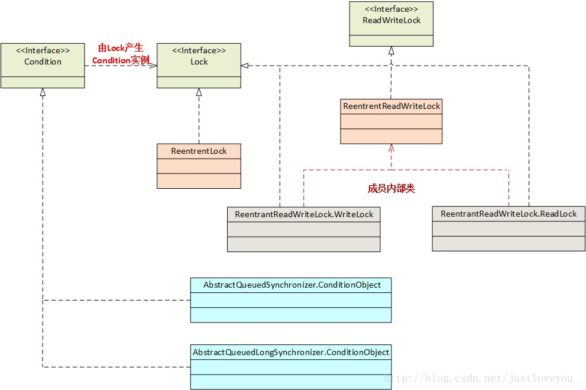

# Java实现线程的方式 ✅

可以自己重写Thread类，也重写Runnable or Callable两个接口

### 继承Thread类 

```java
public class MyThread extends Thread{
    public void run(){sout("通过继承thread类实现多线程");}
    
    public static void main(String args[]){
        MyThread thread1 = new MyThread();
        MyThread thread2 = new MyThread();

		thread1.start();
        thread2.start();
    }
}
```

### 实现Runnable接口

```java
public class MyRunnable implements Runnable{
    @Override
    public void run(){sout("通过实现Runnable接口实现多线程");}
    
    public static void main(String args[]){
        MyRunnable myRunnable1 = new MyRunnable();
        MyRunnable myRunnable2 = new MyRunnable();
        Thread thread1 = new Thread(myRunnable1);
        Thread thread2 = new Thread(myRunnable2);
		thread1.start();
		thread2.start();
    }
}
```

​	实现Runnable接口与继承Thread类本质上都是实现或重写了run()方法，再由Thread.start()方法开辟一个新线程。


### 带返回值的实现方式

​	我们发现上面提到的不管是继承Thread类还是实现Runnable接口，发现有两个问题，第一个是无法抛出更多的异常，第二个是线程执行完毕之后并无法获得线程的返回值。那么下面的这种实现方式就可以完成我们的需求。这种方式的实现就是我们后面要详细介绍的Future模式，只是在jdk5的时候，官方给我们提供了可用的API，我们可以直接使用。但是使用这种方式创建线程比上面两种方式要复杂一些，步骤如下：

1. 创建一个类实现Callable接口，实现call方法。这个接口类似于Runnable接口，但比Runnable接口更加强大，增加了异常和返回值。
2. 创建一个FutureTask，指定Callable对象，做为线程任务。
3. 创建线程，指定线程任务。
4. 启动线程


​	**注意将上述过程与实现Runnable接口对比，两者十分相似！**


```java
//Callable 竟然是个对象，作为多线程任务
public static void main(String args[]){
    Callable<Integer> callable = new Callable<>(){
    	@Override
        public Integer call(){
            System.out.println("thread start .. ");
			return 1;
        }
    };
    
    FutureTask<Integer> ft = new FutureTask<>(callable);//但是runnable接口不需要指定线程任务
    //无非就是把重写runnable接口的地方 
    Thread t = new Thread(ft);
    t.start();
}
```

### 通过线程池实现

​	线程池的详细解析见线程池章节，此处只给出实例代码：

```java
public static void main(String args[]){
    ExecutorService pool = Executors.newFixedThreadPool(10);
    while(true){
        pool.execute(new Runnable(){
            @Override
            public void run(){
                System.out.println(Thread.currentThread().getName() + " is running ..");
                try {
                    Thread.sleep(3000);
                } catch (InterruptedException e) {
                    e.printStackTrace();
                }
            }
        });
    }
}
```

```java
//输出
pool-1-thread-4 is running ..
pool-1-thread-1 is running ..
pool-1-thread-6 is running ..
pool-1-thread-2 is running ..
pool-1-thread-8 is running ..
pool-1-thread-3 is running ..
pool-1-thread-5 is running ..
pool-1-thread-9 is running ..
pool-1-thread-10 is running ..
pool-1-thread-7 is running ..
```

### **额外补充：通过线程池实现有返回值的线程**：

​	**注意是通过Future对象来接收 submit() 方法的返回值。**

```java
public static void main(String args[])  throws ExecutionException, InterruptedException {
    ExecutorService pool = Executors.newFixedThreadPool(10);
    
    Future<Integer> result1 = pool.submit(new Callable<Integer>() {
        @Override
        public Integer call() throws InterruptedException {
            System.out.println(Thread.currentThread().getName() + " is running ..");
            Thread.sleep(1000);
            System.out.println(Thread.currentThread().getName() + " wake up ..");
            return 1;
        }
    });

    Future<Integer> result2 = pool.submit(new Callable<Integer>() {
        @Override
        public Integer call() throws InterruptedException {
            System.out.println(Thread.currentThread().getName() + " is running ..");
            Thread.sleep(200);
            System.out.println(Thread.currentThread().getName() + " wake up ..");
            return 2;
        }
    });

    int resultValue1 = result1.get();
    System.out.println("线程 1 获得返回值："+resultValue1);
    int resultValue2 = result2.get();
    System.out.println("线程 2 获得返回值："+resultValue2);
}
```

```java
//输出
pool-1-thread-1 is running ..
pool-1-thread-2 is running ..
pool-1-thread-2 wake up ..
pool-1-thread-1 wake up ..
线程 1 获得返回值：1
线程 2 获得返回值：2
```

# Thread类解析  ✅

Thread类是java下实现多线程的核心类。

关于线程：

### Java分为两种线程：用户线程和守护线程

##### 什么是守护线程

Thread.setDaemon(true)的方法来实现，daemon，在使用守护线程的时候需要注意以下几点，一个是

thread.setDaemon(true)必须在thread.start()之前设置，否则会抛出一个illegalThreadStateException的异常。你不能把正在运行的常规线程设置为守护线程。

守护线程中新产生的线程也是Daemon的

守护线程应该永远不去访问固有资源，如文件，数据库等，因为他可能在任何一个操作的中间发生中断

所谓守护线程是指在程序运行的时候在后台提供一种通用服务的线程，比如垃圾回收线程，就是一个很称职的守护线程，并且这种线程并不属于程序中不可或缺的部分，因此当所有的非守护线程结束了，程序也就停止了，同时会杀死进程中所有的守护线程，反过来说，如果说，任何非守护线程还在运行，程序就不会停止

守护线程和用户线程本质没啥区别，唯一的不同之处就在于虚拟机的离开，如果用户线程已经


### start()与run()

- start()方法是Thread类中的方法，核心是其中调用了private native void start0()方法，该方法是native方法，底层有jvm实现。最后由jvm创建新的线程并调用run()方法，实现真正的创建线程操作。其调用结构图如下：

  

- run()方法是Runnable接口中的唯一方法，Thread类实现Runnable接口。使用该方法有两点注意：

  所以 对Thread重写run()方法，因为Thread实现了 Runnable接口，和对Runnable接口中的 run()进行重写，其实一致的

  - 如果直接人为调用，则没有经过jvm创建新线程，与普通方法无异。
  - 如果通过start()方法来启动run()方法，需要将run()方法重写，否则最后jvm调用run()方法什么也不会发生。

  

start()与run()方法的代码测试结果如下：

```java
	private void startAndRun0(){
        System.out.println("current thread : "+Thread.currentThread().getName());
    }

    public void startAndRun(){
        System.out.println("main thread start : "+Thread.currentThread().getName());
        Thread thread = new Thread(){
            @Override
            public void run(){
                startAndRun0();
            }
        };
        //和对 Runnable接口重写,是一样的
        Thread thread = new Thread(new Runnable(){
            @Override
            public void run(){
                
            }
        });

        //以下是测试start()和run()
        System.out.println("run()");
        thread.run();

        System.out.println("start()");
        thread.start();
    }

	@Test
    public void startAndRunTest(){
        ThreadTest threadTest = new ThreadTest();
        threadTest.startAndRun();
    }
```

运行结果如下：

```java
main thread start : main
run()
current thread : main		//直接调用run()方法没有创建新的线程
start()
current thread : Thread-0	//调用start()方法创建了新的线程，调用start，重写了run方法，才会创建新线程，新线程会自动调用run()方法
```

### Thread和Runnable

##### Thread和Runnable的区别

由于Thread是和

​	Runnable为接口，其中只包含一个run()方法，Thread是实现Runable接口的类，run()方法支持多线程。

- Thread方法 不能支持线程间的共享
- 但是Runnable接口，多个线程可以执行同一个Runnable接口 实现数据共享(记得给run()方法 加synchronized关键字，所以还是并发的方法)

​	另外，在实际业务开发中，推荐多使用Runable接口，将业务封装在run()方法中，使得代码结构更清晰。示例代码如下：

补充

```java
/**
 * 测试Thread与Runnable的关系
 */
public class MyRunnable implements Runnable {
    private String name;

    public MyRunnable(String name){this.name = name;}

    @Override
    public void run() {
        for(int i = 0; i < 10; i++)
            System.out.println("Thread start : "+this.name + ", i="+i);
    }//继承Runnable接口 重写run方法 调用start()

    public static void main(String[] args) {
        MyRunnable mr1 = new MyRunnable("thread1");
        MyRunnable mr2 = new MyRunnable("thread2");
        Thread thread1 = new Thread(mr1);
        Thread thread2 = new Thread(mr2);
        thread1.start();
        thread2.start();
    }
}

// output
Thread start : thread1, i=0
Thread start : thread2, i=0
Thread start : thread1, i=1
Thread start : thread2, i=1
...
```

```java
/**
 * 测试Thread与Runnable的关系
 */
public class MyThread extends Thread {
    private String name;

    public MyThread(String name){this.name = name;}

    @Override
    public void run() {
        for(int i = 0; i < 10; i++){
            System.out.println("Thread start : "+this.name + ", i="+i);
        }
    }

    public static void main(String[] args) {
        MyThread mt1 = new MyThread("Thread1");
        MyThread mt2 = new MyThread("Thread2");
        mt1.start();
        mt2.start();
    }
}

// output
Thread start : Thread2, i=0
Thread start : Thread2, i=1
Thread start : Thread2, i=2
Thread start : Thread1, i=0
...
```

### 如何给run()函数传参

​	三种方式：

##### 构造函数传参

​	见ThreadAndRunnable部分的代码

##### 成员变量传参 

直接用类中的成员变量做run的参数，run本身应该是无参方法

##### 回调函数传参

### 如何实现处理线程返回值

​	主要有三种实现方式：

##### 主线程等待法

​	即在主线程中设置等待条件，等待子线程执行完后再继续向下走，代码如下：

```java
public class SubThreadReturnValue implements Runnable {
    private int i;

    @Override
    public void run() {
        try {
            for(i=0;i<2;i++)
               Thread.currentThread().sleep(500);
        } catch (InterruptedException e) {
            e.printStackTrace();
        }
    }

     // 主线程等待法
    public static void getSubThreadReturnValue1() throws InterruptedException {
        SubThreadReturnValue s = new SubThreadReturnValue();
        Thread t = new Thread(s);
        t.start();
        //System.out.println(s.value); //0
        while(s.i!=2)
            Thread.currentThread().sleep(100);
        System.out.println(s.i);		//2
    }
}
```

​	该方法的缺点是每次需要手动判断子线程是否跑完，如果等待返回的变量较多，则代码会十分臃肿，并且循环多久不确定，无法做到精准的控制（子线程结束了可能主线程还在sleep）。

##### join()阻塞法

​	fork( )/join()框架吧，fork()将任务拆分成一个个小的子任务，join则把他们结果连接起来，其实应该是子任务也有一个结果队列？然后到队列中去取值

​	使用Thread类中的**join()**方法阻塞当前线程以等待子线程处理完毕。该方法的实现简单并且可以做到较为精准的控制（子线程一结束就可以执行主线程），但依旧无法做到十分精准的控制，如想让 i 在等于1的时候停止。

```java
    /**
     * 使用join()方法
     * @throws InterruptedException
     */
    public static void getSubThreadReturnValue2() throws InterruptedException {
        SubThreadReturnValue s = new SubThreadReturnValue();
        Thread t = new Thread(s);
        t.start();
        
        t.join();
        
        System.out.println(s.i);	//2
    }
```

##### 通过Callable接口

​	通过Callable接口实现：Callable接口中只有一个 "V call()" 方法，通过该接口有两种实现方式：FutureTask和线程池。

​	Callable 接口中 有一个call()方法，返回一个String 带返回值的方法 

##### Future和FutureTask的关系

Future是一个接口，FutureTask是Future的实现类

- FutureTask：具体要注意的细节见下面的代码

  ```java
  public class MyCallable implements Callable<String> {
      @Override
      public String call() throws InterruptedException {
          System.out.println("ready to work");
          Thread.currentThread().sleep(1000);
          String value = "mycallable test";
          System.out.println("task done");
          return value;
      }
  }
  
  public class FutureTaskTest {
      public static void main(String[] args) throws Exception {
          // FutureTask的构造函数可以接收Callable接口下实现类的实例
          FutureTask<String> futureTask = new FutureTask<>(new MyCallable());
          // FutureTask实现RunnableFuture 接口，RunnableFuture接口继承Runnable和Future
          // 所以此处Thread的构造函数可以接收 FutureTask 的实例
          new Thread(futureTask).start();
          // futureTask.isDone方法用来判断 Callable接口实现类中的call方法是否已经执行完成
          if(!futureTask.isDone())
              System.out.println("task has not finished, please wait");
          //futureTask.get()方法阻塞当前调用的线程，直到Callable实现类的call方法执行完毕
          System.out.println("task return : "+ futureTask.get());
      }
  }
  
  //output
  task has not finished, please wait
  ready to work
  task done
  task return : mycallable test
  ```

- 线程池

  线程池的在此体现的好处是可以统一管理，后续还会详细介绍线程池。

- ```java
  public class ThreadPoolTest{
      public static void main(String[] args){
          ExcutorService newCachedThreadPool = Excutor.newCachedThreadPool();
          Future<String> future = newCachedThreadPool.submit(new MyCallable());
          if(!future.isDone())
              System.out.println("task has not finished, please wait");
          try{
              System.out.println("task return : "+ future.get());
          } catch (Exception e){
              // ...
          } finally{
              newCachedThreadPool.shutdown();
          }
      }
  }
  ```

### 线程的状态

​	Thread类下有一个枚举类型state，其中定义了六种线程的状态：

##### 1. 新建(NEW)

​	已经创建的尚未启动的线程处于这种状态，即未调用start()方法。

##### 2 运行(RUNNABLE)

​	运行状态(RUNNABLE)包含运行态(Running)和就绪态(Ready)两种状态，处于Running状态的线程位于可运行线程之中，分配到CPU时间后便开始运行。处于Ready状态的线程位于线程池中，其在获得cpu使用权后就变成了Running状态的线程。

##### 3. 无限等待(WAITING)

​	处于该状态的线程不会被分配cpu时间，需要显式唤醒( Object.notify() / Object.notifyAll() )。以下情况下线程会处于无限期等待(Waiting)状态下：

- 没有设置timeout的Object.wait()方法
- 没有设置timeout的Thread.join()方法
- LockSupport.park()方法

##### 4. 限期等待( TIMED-WAITING )

​	一定时间后被系统自动唤醒 限期等待

​	在一定时间后会被系统自动唤醒，以下情况下线程处于限期等待状态：

- Thread.sleep()
- 设置timeout的Object.wait()方法
- 设置timeout的Thread.join()方法
- LockSupport.parkNanos()
- LockSupport.parkUntil()

##### 5. 阻塞(BLOCKED)

​	线程处于阻塞状态停止运行，等待获取排它锁。比如当某块代码有sychronized关键字修饰时，一个线程进入后，别的线程就无法进入，处于阻塞状态，直到已经进入的线程释放资源。

​	阻塞状态停止运行 这个无法人为操控

##### 6. 终结(TEMINATED)

​	线程已经结束状态，即run()方法已经运行完。处于终结状态的线程不可以再使用，否则会抛出IllegalThreadStateException异常。

​	处于终结状态的线程不可再用，否则会跑出IllegalThreadStateException的异常

### 补充：ThreadLocal是什么

##### 对ThreadLocal的理解

ThreadLocal，线程本地变量，对共享变量在线程中创建副本，每个线程可以访问自己内部的副本变量，并且ThreadLocal是弱引用的，下一次GC发生时一定会被GC掉

##### ThreadLocal类中的方法

- get()方法

  ```java
  public T get(){
  	Thread t = Thread.currentThread();
    ThreadLocalMap map = getMap(t);
    //通过getMap方法，获得t中的ThreadLocalMap，键就是当前的Thread t
    if(map!=null){
      ThreadLocalMap.Entry e = map.getEntry(this);
      //获取ThreadLocalMap中的键值对
      if(e!=null){
        return (T)e.value; 
      }
    }
  }
  ```

  

- set()方法

1. 实际的通过ThreadLocal创建的副本是存储在每个线程自己的threadLocals中的；

2. 为何threadLocals的类型ThreadLocalMap的键值为ThreadLocal对象，因为每个线程中可有多个threadLocal变量，就像上面代码中的longLocal和stringLocal；

一个ThreadLocals中可以有好几个ThreadLocal变量，由于一个ThreadLocal只存一个变量，所以不需要查找，就是一个键值对罢了。

# Java锁的分类及优化 ✅

### Java锁的分类

```
其实对于 Java 锁的分类没有严格意义的规则，
我们常说的分类一般都是依据锁的特性、锁的设计、锁的状态等进行归纳整理的
```

##### 公平锁、非公平锁

```
1.公平锁、非公平锁：
公平锁是指多个线程按照锁的顺序来获取锁，非公平锁就是没有顺序完全随机，不能先来先得，没有优先级
所以非公平锁会造成优先级反转或者饥饿现象
比如：sychronized 内置锁，对象锁就是非公平锁，ReentrantLock(使用CAS和AQS实现)通过构造函数可以决定是公平锁还是非公平锁，默认构造是公平锁，非公平锁的吞吐量性能比公平锁好。
```

##### 可重入锁

```
2.可重入锁：
又名递归锁，指在同一个线程在外层方法获取锁的时候在进入内层方法的时候会自动获取锁，就是获得锁的方法，是层层调用的，其中会call其他方法。这个没什么好说的，应该可重入
所以synchronized和ReentrantLock都是可重入锁，可重入锁可以在一定程度上避免死锁。
```

##### 独享锁、共享锁

```
3.独享锁，共享锁：独享锁是指该锁一次只能被一个线程持有，共享锁指该锁可以被多个线程持有；
synchronized和ReentrantLock都是独享锁，ReadWtireLock的读锁是共享锁，写锁是独占锁
ReentrantLock的独享锁和共享锁也是通过AQS来实现的
```

##### **互斥锁、自旋锁、读写锁**

4. 互斥锁，读写锁：其实就是独享锁、共享锁的具体说法，互斥锁的实质就是ReentrantLock，读写锁实质就是ReadWriteLock

自旋锁。就是一个线程获取锁后，会让其他尝试获取锁的线程，会一直尝试循环获取，而不是阻塞，这样会减少线程上下文切换的时间，但是会增加CPU的负担

自旋锁其实是相对于互斥锁的概念，互斥锁线程会进入Waiting状态和Runnable状态，涉及上下文切换，自旋锁的线程一直是runnable状态的，一直在循环检测锁的标记位，机制不可重复，但是自旋锁加锁全程消耗cpu，起始开销低于互斥锁，但是随着持锁时间增长，而开销增加

##### 乐观锁、悲观锁(数据库中也有相关概念)

```
5.乐观锁，悲观锁：这个分类不是具体锁的分类，而是看待并发同步的角度；
乐观锁其实就是，不加锁没事，我重复写就好了
悲观锁就是，我不加锁一定有事，并发操作的时候 一定会发生脏读，所以就...

悲观锁认为对于同一个数据的并发操作，一定是会发生修改的，哪怕没有修改，也会认为修改。
因此对于同一个数据的并发操作，悲观锁采取加锁的形式。
悲观的认为，不加锁的并发操作一定会出问题。
乐观锁则认为对于同一个数据的并发操作，是不会发生修改的。
在更新数据的时候，会采用尝试更新，不断重新的方式更新数据。//就是多次尝试，和TLAB的方法一样 乐观锁
乐观的认为，不加锁的并发操作是没有事情的。

从上面的描述我们可以看出，悲观锁适合写操作非常多的场景，
乐观锁适合读操作非常多的场景，不加锁会带来大量的性能提升。

悲观锁在Java中的使用，就是利用各种锁。
乐观锁在Java中的使用，是
无锁编程，常常采用的是CAS算法，典型的例子就是原子类，通过CAS自旋实现原子操作的更新。
```

##### 分段锁(ConcurrentHashMap)

```
6.分段锁，其实就是为了细化粒度
分段锁其实是一种锁的设计，并不是具体的一种锁，对于ConcurrentHashMap而言，其并发的实现就是通过分段锁的形式来实现高效的并发操作。

我们以ConcurrentHashMap来说一下分段锁的含义以及设计思想，ConcurrentHashMap中的分段锁称为Segment，它即类似于HashMap（JDK7与JDK8中HashMap的实现）的结构，即内部拥有一个Entry数组，数组中的每个元素又是一个链表；
同时又是一个ReentrantLock（Segment继承了ReentrantLock)。

1.当需要put元素的时候，并不是对整个hashmap进行加锁，这句是重点，所以可以实现并发添加提高效率，
仅仅对分段 对桶进行加锁，细化了锁的粒度。
2.而是先通过hashcode来知道他要放在那一个分段中，然后对这个分段进行加锁，所以当多线程put的时候，只要不是放在一个分段中，就实现了真正的并行的插入。
3.但是，在统计size的时候，可就是获取hashmap全局信息的时候，就需要获取所有的分段锁才能统计。
分段锁的设计目的是细化锁的粒度，当操作不需要更新整个数组的时候，就仅仅针对数组中的一项进行加锁操作。
```


#### 锁优化技术

##### 自旋锁 自适应自旋锁

```
锁优化技术的目的在于线程之间更高效的共享数据，解决竞争问题，更好提高程序执行效率。
1.自旋锁(上下文切换代价大)：互斥锁 -> 阻塞 –> 释放CPU，线程上下文切换代价较大 + 共享变量的锁定时间较短 == 让线程通过自旋等一会儿，
如果锁占用的时间很短，自旋等待的效果就很好；如果锁占用的时间较长，自旋等待反而会白白浪费CPU资源，会带来性能上的浪费。

自旋次数的默认值是10次，用户可以使用参数preBlockSpin来更改。但不同锁的等待时间可能不一致，统一设置PreBlockSpin参数较为困难，JDK1.6版本引入了自适应自旋锁，自适应的情况下自旋的时间不固定，主要由以下两个元素决定：
1.前一次在同一个锁上的自旋时间
2.锁的拥有者的状态

如果在同一个锁对象上，自旋等待刚刚成功获得过锁，并且持有锁的线程正在运行中，那么虚拟机就会认为这次自旋也很有可能再次成功，进而它将允许自选等待持续相对更长的时间。
```

比如偏向锁也是这个道理，根据锁的拥有者的状态，还有LRU也是，这是一种设计思想


##### 锁粗化

```
2.锁粗化(一个大锁优于若干小锁)：一系列连续操作对同一对象的反复频繁加锁/解锁会导致不必要的性能损耗，建议粗化锁 
一般而言，同步范围越小越好，这样便于其他线程尽快拿到锁，但仍然存在特例。
如果虚拟机侦测到有这样一串操作，将会把加锁同步的范围扩展到整个操作序列的外部。
```

##### 偏向锁

```
3.偏向锁(有锁但当前情形不存在竞争)：消除数据在无竞争情况下的同步原语，提高带有同步但无竞争的程序性能。
```

##### 锁消除

```java
4.锁消除(有锁但不存在竞争，锁多余)：JVM编译优化，将不存在数据竞争的锁消除
锁可以升级但不能降级，意味着偏向锁升级成轻量级锁后无法降为偏向锁，这种升级无法降级的策略目的就是为了提高获得锁和释放锁的效率。
public String concatString(String s1, String s2){
    StringBuffer sb = new StringBuffer();
    sb.append(s1);
    sb.append(s2)
    return sb.toString();
}
以上代码中，StringBuffer.append()方法实际是一个同步方法(synchronized关键字修饰)，但虚拟机观察变量sb发现它的作用域永远都被限制在concatString()方法的内部，也就是说，sb的所有引用永远不会被非当前线程的线程访问，不存在线程安全问题。在及时编译之后，这段代码就会忽略掉所有的同步而直接执行了。
```


# Synchronized的锁转换 ✅

### Synchronized实现的锁状态

这四种锁是指锁的状态，并且是针对Synchronized。在Java 5通过引入锁升级的机制来实现高效Synchronized。java 1.6以后引入的

##### 无锁

即共享数据没有被加锁，此时的共享数据没有被任何一条线程占用

##### 偏向锁

偏向锁是指一段同步代码一直被一个线程所访问，那么该线程会自动获取锁。降低获取锁的代价。

##### 轻量级锁

轻量级锁是指当锁是偏向锁的时候，被另一个线程所访问，偏向锁就会升级为轻量级锁，其他线程会通过自旋的形式尝试获取锁，不会阻塞，提高性能。（自旋锁的由来，这样虽然会占用系统资源

##### 重量级锁

重量级锁是指当锁为轻量级锁的时候，另一个线程虽然是自旋，但自旋不会一直持续下去，当自旋一定次数的时候，还没有获取到锁，就会进入阻塞，该锁膨胀为重量级锁。

自旋，自旋久了就变成了重量级锁了。
重量级锁会让其他申请的线程进入阻塞，性能降低。

### 可中断锁

synchronized 是不可中断的，Lock 是可中断的，这里的可中断建立在阻塞等待中断，运行中是无法中断的。

阻塞了怎么中断，就很奇怪

# Synchronized的核心

synchronized锁的都是对象，不是代码。恰当合理地给一个对象上锁，是解决线程安全问题的关键。

有锁互斥，所以可以顺序执行，顺序执行其实就是串行执行

### Synchronized的实现原理

加了 synchronized 关键字的代码段，生成的字节码文件会多出 monitorenter 和 monitorexit 两条指令（利用javap -verbose 字节码文件可看到关，关于这两条指令的文档如下：

**monitorenter**
Each object is associated with a monitor. A monitor is locked if and only if it has an owner. The thread that executes monitorenter attempts to gain ownership of the monitor associated with objectref, as follows:
• If the entry count of the monitor associated with objectref is zero, the thread enters the monitor and sets its entry count to one. The thread is then the owner of the monitor.
• If the thread already owns the monitor associated with objectref, it reenters the monitor, incrementing its entry count.
• If another thread already owns the monitor associated with objectref, the thread blocks until the monitor's entry count is zero, then tries again to gain ownership.

**monitorexit**
The thread that executes monitorexit must be the owner of the monitor associated with the instance referenced by objectref.
The thread decrements the entry count of the monitor associated with objectref. If as a result the value of the entry count is zero, the thread exits the monitor and is no longer its owner. Other threads that are blocking to enter the monitor are allowed to attempt to do so.

加了 synchronized 关键字的方法，生成的字节码文件中会多一个 ACC_SYNCHRONIZED 标志位，当方法调用时，调用指令将会检查方法的 ACC_SYNCHRONIZED 访问标志是否被设置，如果设置了，执行线程将先获取monitor，获取成功之后才能执行方法体，方法执行完后再释放monitor。在方法执行期间，其他任何线程都无法再获得同一个monitor对象。 其实本质上没有区别，只是方法的同步是一种隐式的方式来实现，无需通过字节码来完成。

##### 补充：Monitor ，对象和锁

这三种锁的状态是通过对象监视器在对象头中的字段来表明的。//对象监视器？Monitor 因此ReentrantLock不可用，MonitorEnter 和 MonitorExit两个编译器字段

Java中每个对象都以用来实现一个同步锁
线程在进入同步代码块之前会自动获取锁，并且在退出同步代码块时自动释放锁，无论是通过正常路径退出，还是通过代码块中抛出异常退出。获得内置锁的唯一途径就是进入由这个锁保护的同步方法或代码块。
synchronized是JVM层面的，从JVM规范里可以看到synchronized在JVM里的实现原理，JVM基于进入和退出Monitor对象来实现方法同步和代码块同步，但两者的实现细节不一样

原理，synchronized的原理是monitorenter和monitorexit
monitorenter 指令是在编译后插入到同步代码块的开始位置， 
而 monitorexit 是插入到方法结束处和异常 处， 
JVM 要保证每个 monitorenter 必须有对应的 monitorexit 与之配对。 
任何对象都有一个monitor 与之关联， 当且一个 monitor 被持有后， 它将处于锁定状态。 
（正对应了synchronized是jvm层的实现，是java内置的规范
线程执行到 monitorenter 指令时， 
将会尝试获取对象所对应的 monitor 的所有权， 即尝试获得对象的锁。

##### 补充：Java对象头

详见Java 对象组成详解

##### 补充：Monitor监视器是什么

Java对象头和Monitor是实现synchronized基础。

​	HotSpot对象在内存中的布局分为三部分：对象头、实例数据、对其填充。

- 对象头

  对象头的结构：对象的内存结构详细解析见 JVM/对象内存部分 。

  MarkWord 和类型指针，当然可能不只这么简单

  MarkWord又包含hashCode，分代年龄，锁类型，锁标志位

  

  

  

- Monitor：管程，每个对象天生自带的锁，Monitor对象存在于每个对象的对象头中。

  

- 详细流程

  ​	在执行monitorenter指令时，首先要尝试获取对象的锁，如果这个对象没被锁定，或者当前线程已经拥有了那个对象的锁，把锁的计数器加一，相应的，在执行monitorexit指令时会将锁计数器减一。当计数器为零时，所就会被释放。如果获取对象锁失败，那当前线程就要等待，知道对象锁被另外一个线程释放为止。

  **注意点**：

  1. synchronized同步块对同一线程来说是可重入的，不会出现把自己锁死的情况。
  2. 同步块在已进入的线程执行完之前，会阻塞后面其它线程的进入。
  3. **synchronized是一个重量级锁**，在jdk1.6之前，java的线程是银蛇到操作系统的原生线程之上的，如果要唤醒或者阻塞一个线程，都需要操作系统来帮忙完成，这就需要从用户态转到核心态中，因此状态转换需要耗费很多的处理器时间。jdk1.6版本对锁做了很多优化措施，使得synchronized的效率提高。


### Synchronized用法  对象锁

##### 同步代码块

```java
是一个修饰符，可以用来修饰方法或者代码块，又叫同步块
synchronized获取对象锁，它修饰的对象有
1.修饰一个代码块，被修饰的代码块称为同步语句块，其作用的范围就是调用这个代码块的对象。
例子()也可以写要锁的 类的实例对象||this
	synchronized(this){};
	SyncThread syncThread = new SyncThread();
	Thread thread1 = new Thread(syncThread,"1");
	Thread thread2 = new Thread(syncThread,"2");
```

##### 修饰一个非静态的方法

```
2.修饰一个方法，被修饰的方法称为同步方法，其作用的范围是整个方法，作用的对象是调用这个方法的对象。

	上面代码中countAdd是一个synchronized的，printCount是非synchronized的。从上面的结果中可以看出一个线程访问一个对象的synchronized代码块时，别的线程可以访问该对象的非synchronized代码块而不受阻塞。
	在AccountOperator 类中的run方法里，我们用synchronized 给account对象加了锁。这时，当一个线程访问account对象时，其他试图访问account对象的线程将会阻塞，直到该线程访问account对象结束。也就是说谁拿到那个锁谁就可以运行它所控制的那段代码。
	当有一个明确的对象作为锁时，就可以用类似下面这样的方式写程序。
	
	public void method3(SomeObject obj)
	{
   		synchronized(obj){
   		  	 //obj 锁定的对象
          	 // todo
   		}
    } 
	当没有明确的对象作为锁，只是想让一段代码同步时，可以创建一个特殊的对象来充当锁：
	


```

##### 修饰静态方法和类

```java
3.修饰一个静态的方法，其作用范围是整个静态方法，作用的对象是这个类的所有对象（因为是类中的静态方法）
/**
     * 通过同步代码块(synchronized(类.class))，获得类锁
     */
    private void syncClassBlock1(){
        synchronized (ClassLockAndObjLock.class){
            try {
                System.out.println(Thread.currentThread().getName() + "_SyncClassBlock1_Start（通过同步代码块(synchronized(类.class))，获得类锁）: "
                        + new SimpleDateFormat("HH:mm:ss").format(new Date()));
                Thread.sleep(1000);
                System.out.println(Thread.currentThread().getName() + "_SyncClassBlock1_End（通过同步代码块(synchronized(类.class))，获得类锁）: "
                        + new SimpleDateFormat("HH:mm:ss").format(new Date()));
            } catch (InterruptedException e) {
                e.printStackTrace();
            }
        }
    }
    
    /**
     * 通过同步静态方法，获得类锁
     */
    private static synchronized void syncClassMethod1(){
        try {
            System.out.println(Thread.currentThread().getName() + "_SyncClassMethod1_Start（通过同步静态方法，获得类锁）: "
                    + new SimpleDateFormat("HH:mm:ss").format(new Date()));
            Thread.sleep(1000);
            System.out.println(Thread.currentThread().getName() + "_SyncClassMethod1_End（通过同步静态方法，获得类锁）: "
                    + new SimpleDateFormat("HH:mm:ss").format(new Date()));
        } catch (InterruptedException e) {
            e.printStackTrace();
        }
    }
4.修饰一个类，其作用范围是synchronized后面括号括起来的部分，作用的对象是这个类的所有对象。
```


### 修饰方法时要注意

就是对于synchronized 修饰方法的时候要注意

1. 当一个线程正在访问一个对象的synchronized方法，那么其他线程不能访问该对象的其他synchronized方法，这个原因很简单，因为调用synchronized方法 还是要获取对象锁，当一个线程获取了该对象的锁之后，其他线程无法获取该对象的锁，所以无法访问该对象的其他synchronized方法。
2. 当一个线程正在访问一个对象的 synchronized 方法，那么其他线程能访问该对象的非 synchronized 方法。这个原因很简单，访问非 synchronized 方法不需要获得该对象的锁，假如一个方法没用 synchronized 关键字修饰，说明它不会使用到临界资源，那么其他线程是可以访问这个方法的
3. 如果一个线程 A 需要访问对象 object1 的 synchronized 方法 fun1，另外一个线程 B 需要访问对象 object2 的 synchronized 方法 fun1，即使 object1 和 object2 是同一类型），也不会产生线程安全问题，因为他们访问的是不同的对象，所以不存在互斥问题。
   访问不同对象，即时同一个类的对象，也不会出现问题，因为不是同一个对象锁


### 代码块VS非静态方法

从上面代码可以看出，synchronized代码块 比 synchronized方法 的粒度更细一些，使用起来也灵活得多。因为也许一个方法中只有一部分代码只需要同步，
如果此时对整个方法用synchronized进行同步，会影响程序执行效率。而使用synchronized代码块就可以避免这个问题，synchronized代码块可以实现只对需要同步的地方进行同步。 

### 类锁VS对象锁

```
synchronized修饰的方法在执行的时候就会获取该对象的锁，但是对于静态方法，没有实例对象，就要获取该class的锁
特别地，每个类也会有一个锁，静态的 synchronized方法 就是以Class对象作为锁。另外，它可以用来控制对 static 数据成员 （static 数据成员不专属于任何一个对象，是类成员） 的并发访问。
同时 类锁和对象锁是不互斥的，正如不同对象的对象锁之间不互斥
```

##### 补充：Synchronized的问题

会让没有得到锁的资源进入Block状态，争夺到资源之后又转为Running状态，这个过程涉及到操作系统用户模式和内核模式的切换，代价比较高。Java1.6为 synchronized 做了优化，增加了从偏向锁到轻量级锁再到重量级锁的过度，但是在最终转变为重量级锁之后，性能仍然较低。


# ReentrantLock 

### Synchronized和Lock概述

synchronized 是java的关键字 是 java的内置特性，在JVM层面实现了对临界资源的同步互斥访问，但是synchronized粒度有些大，在处理时机问题时有诸多局限性，比如响应中断等。
Lock提供了比synchronized更广泛的锁操作，它能以更优雅的方式处理线程问题。
synchronized和Lock的对比为切入点，对java中Lock框架的枝干部分进行了介绍。

### Synchronized的局限性和Lock的优点：

对于Synchronized来说：
占有锁的线程执行完了会释放
waiting了会释放比如 在线程内调用wait元素
或者发生异常了会释放，但是

1.在长时间io或者线程内调用sleep的时候不会释放
2.读与写，写与写是互斥的很好理解，但是读与读应该是可以共享的，这里就体现了synchronized锁粒度大的问题，应当设计一种机制来使得多个线程都是读操作的时候，线程之间不会发生冲突。Lock 的 ReentrantReadWriteLock就出现了
3.我们也可以通过Lock的值

### Synchronized和Lock的具体区别

1.synchronized是Java的关键字，因此是Java的内置特性，是基于JVM层面实现的，
其经过编译之后，会在同步块的前后分别形成 monitorenter 和 monitorexit 两个字节码指令；
而Lock是一个Java接口，是基于JDK层面实现的，通过这个接口可以实现同步访问；

2.采用synchronized方式不需要用户去手动释放锁，当synchronized方法或者synchronized代码块执行完之后，系统会自动让线程释放对锁的占用；而 Lock则必须要用户去手动释放锁 (发生异常时，不会自动释放锁)，如果没有主动释放锁，就有可能导致死锁现象。
3.可中断，响应中断，Lock可以让等待锁的线程响应中断，Lock锁就不会一直傻等下去，线程可以不用一直等待就结束了，而使用synchronized时，等待的线程会一直等待下去，不能够响应中断

就是阻塞队列中的线程，是乐观循环获取的

4.立即返回
5.读共享，读写锁
6.可以实现公平锁
7.显式获取和释放，前者无法判断是否获取锁的状态，Lock可以判断是否获取到锁
synchronized在发生异常时，会自动释放线程占有的锁，因此不会导致死锁现象发生；

而Lock在发生异常时，如果没有主动通过unLock()去释放锁，则很可能造成死锁现象，因此使用Lock时需要在finally块中释放锁；一定要在finally中释放锁

#### Lock接口与实现关系



```
可以看到lock有由lock产生的condition实例接口
```

#### Lock对象

而Lock是一个Java接口(API如下图所示)，是基于JDK层面实现的，通过这个接口可以实现同步访问，

它提供了比synchronized关键字更灵活、更广泛、粒度更细的锁操作，底层是由AQS实现的。


#### 关于Condition

- 弱引用与强引用？软引用，虚引用？

  ```
  
  ```

  

- Java中的死锁（DeadLock）其实和操作系统中的死锁区别不大✅

  ```
  死锁是指两个以上的线程永远阻塞的情况，这种情况产生至少需要两个以上的线程和两个以上的资源
  多个线程多个资源，占用不释放，循环请求，循环等待就构成了死锁
  
  分析死锁，我们需要查看Java应用程序的线程转储。我们需要找出那些状态为BLOCKED的线程和他们等待的资源。每个资源都有一个唯一的id，用这个id我们可以找出哪些线程已经拥有了它的对象锁。下面列举了一些JDK自带的死锁检测工具：
  Jconsole
  Jstack
  VisualVM
  ```


# 并发编程的实现问题

### 什么是线程池，如何创建一个线程池

ThreadPoolExecutor 继承了AbstractExecutorService 并且AbstractExecutorService实现了ExecutorService接口，并且ExecutorService实现了Executor接口

一个线程池管理了一组工作线程，同时它还包括一个用于放置等待执行的任务的队列。
线程池可以避免线程的频繁创建与销毁，降低资源消耗，提高系统反应速度。
java.util.concurrent.Executors 提供了几个Java.Util.concurrent.Executor接口的实现，用于创建线程池，其主要涉及四个角色

线程池：Executor
工作线程Worker线程，Worker的run()方法执行Job的run()方法
任务Job：Runable 和 Callable
阻塞队列：BlockingQueue，用过这个容器接口了

##### 线程池Executor

- Executor及其实现类是用户级的线程调度器，也是对任务执行机制的抽象，其将任务的提交与任务的执行分离开来，核心实现类包括ThreadPoolExecutor(用来执行被提交的任务)和ScheduledThreadPoolExecutor  (可以在给定的延迟后执行任务或者周期性执行任务)。

- Executor的实现继承链条为：(父接口)Executor -> (子接口)ExecutorService -> (实现类)[ ThreadPoolExecutor + ScheduledThreadPoolExecutor ]

  md原来这里有写啊

##### 任务Runnable/Callable

- Runnable（run）和Callable（call）都是对任务的抽象，但是Callable可以返回任务执行的结果或者抛出异常

  在Thread板块，有对Callable和Runnable的详细讲解，还有Runnable和Thread的区别
  
  实现线程有三种方法，一种是 继承Thread类 重写run方法 ，用start进行调用
  
  一种是构造一个runnable对象 对run方法进行重写，或者自己写一个runnable对象 实现Runnable接口
  
  另一种是构造一个callable对象 然后把callable对象封装在一个futureTask中 

##### 任务执行状态future

- Future是对任务执行状态和结果的抽象，核心实现类是futureTask（所以它既可以作为Runnable被线程执行，又可以作为Future得到Callable的返回值）

##### 四种常用线程池

线程池的构造函数 除了

corePoolSize之外 还有maximumPoolSize规定上界 还有KeepAliveTime  每一个线程活跃的时间》

ThreadFactory 还有含有ThreadFactory的 比如 可以用setNameFormat方法 对名称进行重写

还有RejectedExecutionHandler

1.FixedThreadPool
用于创建使用固定线程数的ThreadPool，corePoolSize = maximumPoolSize = n(固定的含义)，阻塞队列为LinkedBlockingQueue。
public static ExecutorService newFixedThreadPool(int nThreads) {
        return new ThreadPoolExecutor(nThreads, nThreads,
                                      0L, TimeUnit.MILLISECONDS,
                                      new LinkedBlockingQueue<Runnable>());
    }
2.SingleThreadExecutor
用于创建一个单线程的线程池，corePoolSize = maximumPoolSize=1 阻塞队列为LinkedBlockingQueue
3.CachedThreadPool
4.ScheduledThreadPoolExecutor
用于创建一个大小无限的线程池，此线程池支持定时以及周期性执行任务的需求

所以阻塞队列为DelayedWorkQueue();
public ScheduledThreadPoolExecutor(int corePoolSize) {
        super(corePoolSize, Integer.MAX_VALUE, 0, TimeUnit.NANOSECONDS,
              new DelayedWorkQueue());
    }

### 线程池的饱和策略

饱和策略其实就是 一个是等待队列的选择

等待队列有哪几种？

饱和策略就是等待队列也满了怎么办？

所以就有 RejectionHandler.abortion 等

### 补充：三种阻塞队列

java线程池需要传入一个Queue参数(workQueue)用来存放执行的任务，而对Queue的不同选择，线程池有完全不同的行为

##### SynchronousQueue

是一个无容量的等待队列，一个线程insert操作必须等待另一线程的remove操作，采用这个Queue线程池将会为每个任务分配一个新线程

##### LinkedBlockingQueue

无界队列，采用该Queue，线程池将忽略maximumPoolSize参数，仅用corePoolSize 的线程处理所有的任务，尾处理的任务便在LinkedBlockingQueue中排队

##### ArrayBlockingQueue

有界队列，在有界队列和maximumPoolSize的作用下，线程很难被调优，更大的Queue和小的maximumPoolSize将导致CPU的低负载；小的Queue和大大池

### 线程池调优


### 使用线程池的原因

1. 降低资源消耗：重用存在的线程，减少对象创建、消亡的开销，性能佳。
2. 可有效控制最大并发线程数，提高系统资源利用率，同时可以避免过多的资源竞争，避免阻塞。
3. 提高线程可管理性：提供定时执行、定期执行、单线程、并发数控制等功能。

### 五大线程池

1. Executors.newFixedThreadPool(int nThreads)：指定工作线程数量的线程池。

2. Executors.newCachedThreadPool()：处理短时间工作任务的线程池，其有如下特点：
   - 试图缓存线程并重用，当无缓存线程可用时，就会创建新的工作线程。
   - 如果线程闲置的时间超过阈值（一般60s），则会被终止并移出缓存，这样就保证了在系统长时间闲置的时候，其不会消耗什么资源。
   
3. Executors.newSingleThreadExecutor()：创建唯一的工作者线程来执行任务，如果线程异常结束，会有另一个线程来取代它。

4. Executors.newSingleThreadScheduledExcutor()与Executors.newSheduledThreadPool(int poolSize)：定时或周期性的工作调度，两者的区别在于应用于单一工作线程和多个工作线程。

5. Executors.newWorkStealingPool()：内部会构建ForkJoinPool()，利用working-stealing算法，并行地处理任务，不保证处理顺序//因此需要线程池内部线程无序

   ForkJoinPool() Work-Stealing 算法？并行的处理任务？


第五大线程池就是WorkStealingPool

newCachedThreadPool 将创建一个可缓存的线程池，如果线程池当前的规模超过了处理需求的时候，那么将回收空闲的线程，而当需求增加的时候可以无上限的添加新的线程，线程池也就是不设置maximum 

### 线程池类图结构


### J.U.C三个接口

##### Executor 接口

​	运行新任务的简单接口，将任务提交和任务执行细节解耦。其中只包含 void execute(Runnable command)方法。

```java
// 测试代码如下

//传统方式
Thread t = new Thread();
t.start();

//通过Executor接口
Thread t = new Thread();
ExecutorService.newSingleExecutorService().execute(t);
```

##### ExecutorService 接口

​	ExecutorService扩展了Executor接口，添加了一些管理和生命周期控制相关的方法，提交任务机制更完善。

​	重点方法：

- <T> Future<T> submit(Callable<T> task)，该方法获得线程返回值

  即如何通过线程池构造带返回值的线程，也是通过FurtureTask，在构造参数里指定一个callable对象，

  然后作为线程的任务

##### ScheduledExecutorService 

​	支持Future和定期执行任务。


### ThreadPoolExecutor详解

​	ThreadPoolExecutor继承自AbstractExecutorService，AbstractExecutorService实现自ExecutorService。

Fixed 核心线程和最大线程一致

single只有一个 

cached 最大线程数 很大，核心线程以外的线程不会被立即销毁，二是 等待时间超过KeepAliveTime才会销毁

##### 构造函数参数

- corePoolSize：核心线程数量，可以理解为长期驻留的线程数目。

  ​	在不同种类的ThreadPool中会有很大的区别，如在Executors.newFixedThreadPool(int nThreads)中，返回的是一个corePooSize = maximumPoolSize = nThreads的线程池，而在Executors.newCachedThreadPool( )方法中，返回的是一个corePooSize = 0，maximumPoolSize = Integer.MAX_VALUE的线程池。

- maximumPoolSize：线程池中最大线程数量，该值同样在不同的线程池中具体的值会有很大的区别。具体见上述内容。

- workQueue：等待任务队列。不同的工作队列对优先级的分配有不同的实现。

- keepAliveTime：线程池维护线程所允许的空闲时间。

  ​	当线程池中的线程数量大于corePoolSize时，如果没有新的任务提交，核心线程外的线程不会被立即销毁，直到等待时间超过keepAliveTime才会被销毁。

- Timeunit：与keepAliveTIme配套使用，keepAliveTime参数指明等待时间的量化值，timeUnit指明量化值单位。例如keepAliveTime=1，timeUnit为TimeUnit.MINUTES，代表空闲线程的回收阀值为1分钟。

- threadFactory：创建新线程使用的工厂，默认使用的是Executors.defaultThreadFactory()，使用该工厂创建线程会使创建的线程具有相同的priority，并且是非守护线程，同时也设置了线程名称。

  守护线程与非守护线程

- handler：线程池饱和策略。当阻塞队列满了并且有新的任务提交时，就需要采取一种饱和策略来处理该任务。线程池当前提供了四种策略：

  - AbortPolicy：直接抛出异常，这是默认策略
  - CallerRunsPolicy：用调用者所在的线程来执行任务
  - DiscardOldestPolicy：丢弃队列中最靠前的任务，并执行当前任务
  - DiscardPolicy：直接丢弃任务
  - 此外，还可以通过实现RejectedExecutionHandler接口来自定义Handler

##### 新任务提交execute()执行流程

1. 如果线程池中运行的线程小于corePoolSize，则创建新线程来处理任务，即使线程池中其它线程是空闲的；

2. 如果线程池中运行的线程的数量大于corePoolSize且小于maximumPoolSize，则只有当workQueue满时才会创建新线程去处理任务；

3. 当线程池中已经运行了maximumPoolSize数量的线程，还有新任务提交时，如果workQueue未满，则将任务放入workQueue中，若满了，则通过handler策略来处理任务。

   handler策略来处理任务
   
   其大致流程如下图所示：


### 线程池的状态

- RUNNING：能接收新提交的任务，并且也能处理阻塞队列中的任务；
- SHUTDOWN：不接受新提交的任务，但还可以继续处理阻塞队列中的任务和线程池中正在进行中的任务；
- STOP：不接受提交任务，也不接受阻塞队列中的任务，仍然会执行完当前线程池中的线程；
- TIDYING：所有任务都已经终止，此时workCount(有效线程数)为0；
- TERMINATED：线程池调用terminate()方法后进入该状态，该状态是作为一个结束标志。

状态转换图如下：


工作线程的生命周期

​	该部分主要用于帮助理解源码，图像如下：


# 单例模式与多线程

- 饿汉模式线程安全
- 懒汉模式是非线程安全的
- 多线程环境下如何创建线程安全的单例

为什么有单例模式，整个系统只需要一个全局对象，有利于我们协调系统整体的行为
单例模式就是为确保一个类只有一个实例，并为整个系统提供一个全局访问点的方法

- 单线程下两种经典的实现模式
饿汉模式 私有构造，静态取用方法，私有静态实例 bean也是如此，bean就是遵循统一类的模版
懒汉模式 需时加载

- 从速度和反应时间来说，饿汉式要好一些；从资源利用效率上来说，懒汉式又好一些

- 单例模式的优点
- 使用单例模式的时候，必须使用单例类提供的公有工厂方法得到单例对象，而不应该用反射机制

