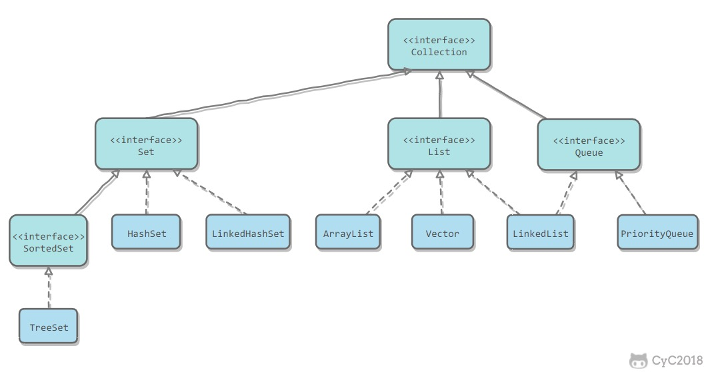

# 容器继承关系图



主要就是 Map Set List Queue 这几个接口


# 容器中的设计模式

### 迭代器模式

collection继承了iterator接口，其中的iterator()

Collection 继承了 Iterable 接口，其中的 iterator() 方法能够产生一个 Iterator 对象，通过这个对象就可以迭代遍历 Collection 中的元素。

从 JDK 1.5 之后可以使用 foreach 方法来遍历实现了 Iterable 接口的聚合对象

### 适配器模式

可以把数组转换成list类型

应该注意的是 asList() 的参数为泛型的变长参数，不能使用基本类型数组作为参数，只能使用相应的包装类型数组。

```java
List list = Arrays.asList(1, 2, 3);
```

##### 

# Collection中的Comparable和Comparator

Comparable可以认为是一个内比较器，实现了Comparable接口的类有一个特点，就是这些类可以和自己比较？至于具体实现Comparable的类如何比较，则依赖compareTo的方法的实现，compareTo方法也被称为自然比较方法？

如果开发者用一个collection对象想要用Collections工具类的sort方法帮你进行自动排序的话，那么这个接口必须实现Comparable接口，compareTo方法返回的值是int

大于的话，返回正整数

等于 返回0

小于返回负整数

```java
public class Domain implements Comparable<Domain>
{
private String str;
public Domain(String str){
this.str=str;
}
public int compareTo(Domain domian){
if(this.str.compareTo(domian.str)>0)
return 1;
else if(this.str.compareTo(domain.str)==0)
return 0;

}
//其实就是两个str进行比较，因为str也implement了comparable的接口
}
```


# Vector

##### 线程的安全性不同

vector是线程安全的,在vector的大多数方法都使用synchronized关键字修饰，arrayList是线程不安全的（可以通过Collections.synchronizedList（）实现线程安全）

##### 效率也有问题

vector 效率很低，因为要获取同步锁和释放锁，所以执行过程中效率会低于ArrayList，另外，性能还体现在底层的Object数组上，

同时vector的增量不是乘，二是加，如果不传入增量，就会按二倍进行扩容

可以看出来，arrayList多了一个transient关键字，这个关键字的作用是防止序列化，然后在ArrayList中重写了了readObject和writeObject方法，这样是为了在传输时提高效率。

##### 每次扩容是2倍 而ArrayList是1.5

# ArrayList

##### 补充：RandomAccess 接口标志着接受随机访问

​	线程不安全。底层实现原理为动态数组扩容，但要额外注意对各种异常情况的考虑。

​	基础功能实现代码：

##### 补充：迭代器的Fail-Fast Fail-Fast什么意思

modCount 用来记录 ArrayList 结构发生变化的次数。结构发生变化是指添加或者删除至少一个元素的所有操作，或者是调整内部数组的大小，仅仅只是设置元素的值不算结构发生变化。

在进行序列化或者迭代等操作时，需要比较操作前后 modCount 是否改变，如果改变了需要抛出 ConcurrentModificationException。


已经没什么好底层的了，已经底层到连续物理内存空间的分配了，还有什么更底层的？汇编？

- add操作的时候 回对数组长度进行检测，

  如果发现满了，就会扩容成 （size+1）*2，原来的两倍

  并且 arraycopy这个一个时间复杂度为n的操作，可以指定哪个数组向哪个数组复制

- remove是时间为O(n)的，如果remove(null)的话，也是可以的，会检测每一个元素的值是不是为null

  然后移除，当然不会重复移除，找到一个就回立即返回了，并且这里用的是equals方法，重写equals一定要重写hashcode()

  

```java
public class MyArrayList {
    private int size;
    private Object[] elementData;

    public MyArrayList(){this(10);}

    public MyArrayList(int initialCapacity){
        if(initialCapacity < 0)
            try{
                throw new Exception("initialCapacity should not be less than 0");
            } catch (Exception e){
                e.printStackTrace();
            }
        elementData = new Object[initialCapacity];
    }

    public void add(Object obj){
        //数组已满，进行扩容
        if(size==elementData.length){
            Object[] newElementData = new Object[(size+1)*2];//扩容就是size+1 *2
            //size是现在的元素长度  
            System.arraycopy(elementData, 0, newElementData, 0, size);
            elementData = newElementData;
        }
        elementData[size++] = obj;
    }

    public Object get(int index){rangeCheck(index);return elementData[index];}

    public Object remove(int index){
        rangeCheck(index);

        Object oldValue = elementData[index];
        int numMoved = size - index - 1;
        //numMoved 是remove涉及到的所有元素
        if(numMoved > 0){
            System.arraycopy(elementData, index+1, elementData, index, numMoved);
            
            //把index+1后的所有元素，都移动到相同数组的index位置，这样不需要删除index，只会把index覆盖掉，然后把数组最后一位释放掉
        }
        elementData[--size] = null;

        return oldValue;
    }

    public boolean remove(Object o){
        if(o == null){
            for(int i = 0; i<size; ++i){
                if(elementData[i]==null) {
                    remove(i);
                    return true;
                }
            }
        }
        else{
            for(int i = 0; i<size; ++i){
                if(elementData[i].equals(o)) {
                    remove(i);
                    return true;
                }
            }
        }

        return false;
    }

    private void rangeCheck(int index){
        if(index < 0 || index >= size){
            try {
                throw new IndexOutOfBoundsException(""+index);
            }catch (Exception e){
                e.printStackTrace();
            }
        }
    }
}

```


# LinkedList

就是链表，前者拥有后者的一个引用，我现在就可以手写一个给你看，ListNode只需要 val 和 ListNode next两个值就可以了

​	线程不安全。

# HashSet

​	HashSet的底层实现就是HashMap，不过将set中存储的对象以key的形式存储在map中（key对应的value是一个定义好的final对象），由于map中key不能重复，以此实现set中元素不重复,且不存在null key 不然会报空指针错误


# HashMap

​	HashMap和TreeMap都是Map接口下的实现类。**Map底层实现是数组+链表。(原因会在后面的代码中说明)**

​	**HashTable 与HashMap功能类似，但HashTable效率较低、线程安全；HashMap效率较高、线程不安全。**

### 手动实现HashMap简略版

自定义实现HashMap类及其中的常用方法，代码如下：

```java
/**
 * 自定义实现HashMap功能
 * 未对遍历进行优化
 *
 * Map：存放 key-value 形势下的键值对，key不能重复，否则会覆盖
 *
 * 本次实现的功能有：
 * int size()
 * boolean isEmpty()
 * Object put(Object key, Object Value)
 * Object get(Object key)
 * boolean containsKey(Object key)
 * boolean containsValue(Object value)
 * Object remove(Object key)
 * void putAll(MyHashMap1 map)
 * void clear()
 */
public class MyHashMap1 {
    private int size = 0;
    private MyEntry[] myEntries = new MyEntry[20];

    public Object put(Object key, Object value){
        //先检查键值是否已经存在
        for(MyEntry myEntry : myEntries){
            if (myEntry.getKey().equals(key))
                myEntry.setValue(value);
                return value;
        }

        MyEntry myEntry = new MyEntry(key, value);
        myEntries[size++] = myEntry;
        return value;
    }

    public int size(){return size;}
    public boolean isEmpty(){return size == 0;}
    public Object get(Object key){//与put中检查key是否存在代码类似}
    public boolean containsKey(Object key){// 与get()代码类似}
    public boolean containsValue(Object value){// 与get()代码类似}
    public void clear(){this.size = 0;}
}

class MyEntry{
    private Object key;
    private Object value;

    //construct function & getter/setter functions
}
```

​	由上述代码可以看到，在存取Entry的过程中，多次出现了对Entry数组的遍历，效率十分低下。**由此引入哈希表（也称散列表）的思想来优化以上代码，在已有Entry的基础上直接获取其 HashCode，根据HashCode将其存储在指定位置（哈希表）**，这样无论是存取都可以快速找到Entry的位置。

​	HashCode 主要是通过Hash函数来获得，一般hash函数就除一个数获取余数，难免会产生冲突，这里就要求对哈希表的实现更加仔细，如何来避免这样的冲突？

​	哈希表有多种实现方法，在此我们使用常用的一种方法——拉链法，来避免上述的冲突，其结构如下：


这时，上面的代码变为：

```java
/**
 * 自定义实现HashMap功能
 * 升级版：利用数组+链表（HashTable拉链法实现） 提高查询效率、避免循环遍历
 *
 * Map：存放 key-value 形势下的键值对，key不能重复，否则会覆盖
 *
 * 本次实现的功能有：
 * void put(Object key, Object Value)
 * Object get(Object key)
 */
public class MyHashMap2 {
    private int size = 0;

    private LinkedList[] linkedLists = new LinkedList[999]; //存放LinkedList的数组

    public void put(Object key, Object value){
        int keyHashCode = key.hashCode()%linkedLists.length;    //自定义的hashCode

        //哈希表中对应hashcode位置为空的情况：直接创建list加入数组中
        //所以 
        if(linkedLists[keyHashCode] == null){   
            MyEntry entry = new MyEntry(key, value);
            LinkedList list = new LinkedList();
            list.add(entry);
            linkedLists[keyHashCode] = list;
        }
        //哈希表中对应hashCode不为空的情况：先获取该list，再逐个元素进行比较，若entry的key已经存在，则覆盖，否则在list后加入，
        //先hashcode()获得hashcode值，然后调用equals方法，逐个元素比较
        else{
            LinkedList list = linkedLists[keyHashCode];
            for(int i = 0; i < list.size(); ++i){
                MyEntry existedEntry = (MyEntry)list.get(i);
                if (existedEntry.getKey().equals(key)){
                    existedEntry.setValue(value);
                    return;
                }
            }
            MyEntry entry = new MyEntry(key, value);
            list.add(entry);
        }
        //只有在已经存在相同key的情况下会return;，其余添加元素都不会return，都能执行到++size
        ++size;
    }

    //keyhashcode 成为了数组的索引，当然这个索引也可以用 红黑树实现，为每一个
    //其实说白了，这就是hash索引，用的是索引技术，而之后hash冲突的解决是用的
    //链地址法，这是一层表，然后
    public Object get(Object key){
        int keyHashCode = key.hashCode()%linkedLists.length;
        //若存在哈希索引，则先获取索引所对应的list，再遍历，逐个比较key值
        if(linkedLists[keyHashCode] != null){
            LinkedList list = linkedLists[keyHashCode];
            for(int i = 0; i < list.size(); ++i){
                MyEntry existedEntry = (MyEntry) list.get(i);
                if(existedEntry.getKey().equals(key))
                    return existedEntry.getValue();
            }
        }
        return null;
    }
}
//遍历list 用
```

### HashMap in JDK1.7

​	HashMap 是最简单的，一来我们非常熟悉，二来就是它不支持并发操作，所以源码也非常简单。

​	首先，我们用下面这张图来介绍 HashMap 的结构：


这个仅仅是示意图，因为没有考虑到数组要扩容的情况，具体的后面再说。

大方向上，HashMap 里面是一个数组，然后数组中每个元素是一个单向链表。

上图中，每个绿色的实体是嵌套类 Entry 的实例，Entry 包含四个属性：key, value, hash 值和用于单向链表的 next。

- capacity：当前数组容量，始终保持 2^n，可以扩容，扩容后数组大小为当前的 2 倍。

  //capacity为数组容量，仅仅是桶的个数多少。

- loadFactor：负载因子，默认为 0.75。装载因子用来衡量HashMap满的程度。计算HashMap的实时装载因子的方法为：size/capacity，而不是占用桶的数量去除以capacity（桶的数量除以capacity是1）。使用负载因子的主要原因如下：
  - 在时间和空间成本上寻求一种折衷。加载因子过高虽然减少了空间开销，但同时也增加了查找某个条目的时间
  - 降低哈希冲突发生的概率

- threshold：扩容的阈值，等于 capacity * loadFactor，threshold表示当HashMap的size大于threshold时会执行resize操作。 容量*负载因子

##### put 过程分析 ✅

还是比较简单的，跟着代码走一遍吧。

```java
public V put(K key, V value) {
    // 当插入第一个元素的时候，需要先初始化数组大小
    if (table == EMPTY_TABLE) {
        inflateTable(threshold);
    }
    // 如果 key 为 null，感兴趣的可以往里看，最终会将这个 entry 放到 table[0] 中
    if (key == null)
        return putForNullKey(value);
    // 1. 求 key 的 hash 值
    int hash = hash(key);
    // 2. 找到对应的数组下标
    int i = indexFor(hash, table.length);
    // 3. 遍历一下对应下标处的链表，看是否有重复的 key 已经存在，
    //    如果有，直接覆盖，put 方法返回旧值就结束了
    for (Entry<K,V> e = table[i]; e != null; e = e.next) {
        Object k;
        if (e.hash == hash && ((k = e.key) == key || key.equals(k))) {
            V oldValue = e.value;
            e.value = value;
            e.recordAccess(this);
            return oldValue;
        }
    }
 
    modCount++;
    // 4. 不存在重复的 key，将此 entry 添加到链表中，细节后面说
    addEntry(hash, key, value, i);
    return null;
}
```

具体过程拆解如下：

1. 判断数组是否需要初始化，若需要，则进行初始化
2. 计算hash值
3. 插入前判断数组是否需要扩容，若需要，则进行扩容
4. 插入值

##### 数组初始化

在第一个元素插入 HashMap 的时候做一次数组的初始化，就是先确定初始的数组大小，并计算数组扩容的阈值。

```java
private void inflateTable(int toSize) {
    // 保证数组大小一定是 2 的 n 次方。
    // 比如这样初始化：new HashMap(20)，那么处理成初始数组大小是 32 
    //HashMap的数组大小一定是2的 n 次方
    int capacity = roundUpToPowerOf2(toSize);
    // 计算扩容阈值：capacity * loadFactor
    threshold = (int) Math.min(capacity * loadFactor, MAXIMUM_CAPACITY + 1);
    // 算是初始化数组吧
    table = new Entry[capacity];//创建Entry个数，根据capacity
    initHashSeedAsNeeded(capacity); //ignore
}
```

这里有一个将数组大小保持为 2 的 n 次方的做法，Java7 和 Java8 的 HashMap 和 ConcurrentHashMap 都有相应的要求，只不过实现的代码稍微有些不同，后面再看到的时候就知道了。

##### 计算具体数组位置

这个简单，我们自己也能 YY 一个：使用 key 的 hash 值对数组长度进行取模就可以了。

这里是与操作，与操作取模，有点骚啊，怪不得取模操作这么多

```java
static int indexFor(int hash, int length) {
    // assert Integer.bitCount(length) == 1 : "length must be a non-zero power of 2";
    return hash & (length-1);
}
```

这个方法很简单，简单说就是取 hash 值的低 n 位。如在数组长度为 32 的时候，其实取的就是 key 的 hash 值的低 5 位，作为它在数组中的下标位置。

length一定大小为2的n次方-1所以就11111所以取的是key的hash值的低5位，

如此来进行index的计算

##### 添加节点到链表中

找到数组下标后，会先进行 key 判重，如果没有重复，就准备将新值放入到链表的表头。

```java
void addEntry(int hash, K key, V value, int bucketIndex) {
    // 如果当前 HashMap 大小已经达到了阈值，并且新值要插入的数组位置已经有元素了，那么要扩容
    if ((size >= threshold) && (null != table[bucketIndex])) {
        // 扩容，后面会介绍一下
        resize(2 * table.length);
        // 扩容以后，重新计算 hash 值
        hash = (null != key) ? hash(key) : 0;
        // 重新计算扩容后的新的下标
        bucketIndex = indexFor(hash, table.length);
    }
    // 往下看
    createEntry(hash, key, value, bucketIndex);
}
// 这个很简单，其实就是将新值放到链表的表头，然后 size++
void createEntry(int hash, K key, V value, int bucketIndex) {
    Entry<K,V> e = table[bucketIndex];
    table[bucketIndex] = new Entry<>(hash, key, value, e);
    size++;
}
```

这个方法的主要逻辑就是先判断是否需要扩容，需要的话先扩容，然后再将这个新的数据插入到扩容后的数组的相应位置处的链表的表头。

##### 补充：头插法与尾插法

这里也有一个为什么放在表头的问题，而不是表尾，表尾的话每次插入都要轮寻链表一遍

因为index是针对数组长度的取模，所以数组长度变化后，index也要重新hash一下，算长度

##### 数组扩容

前面我们看到，在插入新值的时候，如果当前的 size 已经达到了阈值，并且要插入的数组位置上已经有元素，那么就会触发扩容，扩容后，数组大小为原来的 2 倍。

```java
void resize(int newCapacity) {
    Entry[] oldTable = table;
    int oldCapacity = oldTable.length;
    if (oldCapacity == MAXIMUM_CAPACITY) {
        threshold = Integer.MAX_VALUE;
        return;
    }
    // 新的数组
    Entry[] newTable = new Entry[newCapacity];
    // 将原来数组中的值迁移到新的更大的数组中
    transfer(newTable, initHashSeedAsNeeded(newCapacity));
    table = newTable;
    threshold = (int)Math.min(newCapacity * loadFactor, MAXIMUM_CAPACITY + 1);
}
```

扩容就是用一个新的大数组替换原来的小数组，并将原来数组中的值迁移到新的数组中。

**由于是双倍扩容，迁移过程中，会将原来 table[i] 中的链表的所有节点，分拆到新的数组的 newTable[i] 和 newTable[i + oldLength] 位置上。如原来数组长度是 16，那么扩容后，肯定要rehash的，这里拆分是rehash之后的拆分，不是说平分这种骚操作！ 原来 table[0] 处的链表中的所有元素会被分配到新数组中 newTable[0] 和 newTable[16] 这两个位置**。代码比较简单，这里就不展开了。


##### get过程分析 ✅

相对于 put 过程，get 过程是非常简单的：

1. 根据 key 计算 hash 值。
2. 找到相应的数组下标：hash & (length – 1)。
3. 遍历该数组位置处的链表，直到找到相等(==或equals)的 key。

```java
public V get(Object key) {
    // 之前说过，key 为 null 的话，会被放到 table[0]，所以只要遍历下 table[0] 处的链表就可以了
    if (key == null)
        return getForNullKey();
    // 
    Entry<K,V> entry = getEntry(key);
 
    return null == entry ? null : entry.getValue();
}
```

```java
final Entry<K,V> getEntry(Object key) {
    if (size == 0) {
        return null;
    }
 
    int hash = (key == null) ? 0 : hash(key);
    // 确定数组下标，然后从头开始遍历链表，直到找到为止
    for (Entry<K,V> e = table[indexFor(hash, table.length)];
         e != null; 
         e = e.next) {
        Object k;
        if (e.hash == hash &&
            ((k = e.key) == key || (key != null && key.equals(k))))
            return e;
    }
    return null;
}
//以Entry为结点和为数组值的
```


##### 补充：HashMap1.7多线程死循环问题

- 问题引入

  ​	如果是在单线程下使用HashMap，自然是没有问题的，如果后期由于代码优化，这段逻辑引入了多线程并发执行，在一个未知的时间点，会发现CPU占用100%，居高不下，通过查看堆栈，你会惊讶的发现，线程都Hang在hashMap的get()方法上，服务重启之后，问题消失，过段时间可能又复现了。

- 原因分析

  在了解来龙去脉之前，我们先看看HashMap的数据结构。

  在内部，HashMap使用一个Entry数组保存key、value数据，当一对key、value被加入时，

  会通过一个hash算法得到数组的下标index，算法很简单，根据key的hash值，对数组的大小取模 hash & (length-1)，并且数组的长度大小都是2的n次方

  并把结果插入数组该位置，如果该位置上已经有元素了，就说明存在hash冲突，这样会在index位置生成链表。

  如果存在hash冲突，最惨的情况，就是所有元素都定位到同一个位置，形成一个长长的链表，这样get一个值时，最坏情况需要遍历所有节点，性能变成了O(n)，

  所以元素的hash值算法和HashMap的初始化大小很重要，但是在1.8解决了这个问题，当长度过长的时候，用红黑树代替链表

  当插入一个新的节点时，如果不存在相同的key，则会判断当前内部元素是否已经达到阈值（默认是数组大小的0.75），如果已经达到阈值，会对数组进行扩容，也会对链表中的元素进行rehash。

  问题就发生在reshash部分。

  直接看扩容部分：

  ```java
  void resize(int newCapacity) {
      Entry[] oldTable = table;
      int oldCapacity = oldTable.length;
      ...
  
      Entry[] newTable = new Entry[newCapacity];
      ...
      transfer(newTable, rehash);
      table = newTable;
      threshold = (int)Math.min(newCapacity * loadFactor, MAXIMUM_CAPACITY + 1);
  }
  ```

  Transfer迁移操作

  这里会新建一个更大的数组，并通过transfer方法，移动元素。

  ```java
  void transfer(Entry[] newTable, boolean rehash) {
      int newCapacity = newTable.length;
      for (Entry<K,V> e : table) { 这事对于table中的每一个元素
          while(null != e) {
              Entry<K,V> next = e.next;
              if (rehash) {
                  e.hash = null == e.key ? 0 : hash(e.key);
              }
              int i = indexFor(e.hash, newCapacity);
              e.next = newTable[i];
              newTable[i] = e;
              e = next;
          }
      }
  }
  ```

  移动的逻辑也很清晰，遍历原来table中每个位置的链表，并对每个元素进行重新hash，在新的newTable找到归宿，并插入。

3. 案例分析

   假设HashMap初始化大小为4，插入个3节点，不巧的是，这3个节点都hash到同一个位置，如果按照默认的负载因子的话，插入第3个节点就会扩容，为了验证效果，假设负载因子是1。

   ```java
   void transfer(Entry[] newTable, boolean rehash) {
       int newCapacity = newTable.length;
       for (Entry<K,V> e : table) {
           //遍历原来table中每个位置的链表
           while(null != e) {
               Entry<K,V> next = e.next;
               
               //对每个元素进行重新hash
               if (rehash) {
                   e.hash = null == e.key ? 0 : hash(e.key);
               }
               
               //在新的newTable找到归宿，并插入
               int i = indexFor(e.hash, newCapacity);
               e.next = newTable[i];
               newTable[i] = e;
               e = next;
           }
       }
   }
   ```

   以上是节点移动的相关逻辑。

   

   插入第4个节点时，发生rehash，假设现在有两个线程同时进行，线程1和线程2，两个线程都会新建新的数组。

   

   假设 **线程2** 在执行到`Entry<K,V> next = e.next;`之后，cpu时间片用完了，这时变量e指向节点a，变量next指向节点b。

   **线程1**继续执行，很不巧，a、b、c节点rehash之后又是在同一个位置7，开始移动节点。

   第一步，移动节点a

   

   第二步，移动节点b

   

   **注意，这里的顺序是反过来的，继续移动节点c**

   

   这个时候 **线程1** 的时间片用完，内部的table还没有设置成新的newTable， **线程2** 开始执行，这时内部的引用关系如下：

   

   这时，在 **线程2** 中，变量e指向节点a，变量next指向节点b，开始执行循环体的剩余逻辑。

   因为在线程2中保留了指向b的指针，所以这里出现问题了，保留了指向b的指针

   ```java
   Entry<K,V> next = e.next;
   int i = indexFor(e.hash, newCapacity);
   e.next = newTable[i];//指向了自己其实变相设为null
   newTable[i] = e;
   e = next;
   ```

   执行之后的引用关系如下图

   

   执行后，变量e指向节点b，因为e不是null，则继续执行循环体，执行后的引用关系。

   

   变量e又重新指回节点a，只能继续执行循环体，这里仔细分析下：
    1、执行完`Entry<K,V> next = e.next;`，目前节点a没有next，所以变量next指向null；
    2、`e.next = newTable[i];` 其中 newTable[i] 指向节点b，那就是把a的next指向了节点b，这样a和b就相互引用了，形成了一个环；
    3、`newTable[i] = e` 把节点a放到了数组i位置；
    4、`e = next;` 把变量e赋值为null，因为第一步中变量next就是指向null；

   所以最终的引用关系是这样的：

   

   节点a和b互相引用，形成了一个环，当在数组该位置get寻找对应的key时，就发生了死循环。

   另外，如果线程2把newTable设置成到内部的table，节点c的数据就丢了，看来还有数据遗失的问题。

   **归根结底，原因就是1.7链表新节点采用的是头插法，这样在线程一扩容迁移元素时，会将元素顺序改变，导致两个线程中出现元素的相互指向而形成循环链表，1.8采用了尾插法，从根源上杜绝了这种情况的发生**。

##### 补充：如何避免HashMap1.7的死循环？

**归根结底，原因就是1.7链表新节点采用的是头插法，这样在线程一扩容迁移元素时，会将元素顺序改变，导致两个线程中出现元素的相互指向而形成循环链表，1.8采用了尾插法，从根源上杜绝了这种情况的发生**。

建议采用尾插法

### ConcurrentHashMap in JDK1.7

​	ConcurrentHashMap 和 HashMap 思路是差不多的，但是因为它支持并发操作，所以要复杂一些。

​	**先与HashTable对比，两者都实现线程安全，但HashTable默认锁住的是整张表，而ConcurrentHashMap则是将锁分离，通过把整个Map分为N个Segment，每个segment都是一个锁，锁住部分散列表，可以提供相同的线程安全，但是效率提升N倍，默认使用16个分段锁，效率提升16倍。**

​	整个 ConcurrentHashMap 由一个个 Segment 组成，Segment 代表”部分“或”一段“的意思，所以很多地方都会将其描述为**分段锁**。

​	简单理解就是，ConcurrentHashMap 是一个 Segment 数组，Segment 通过继承 ReentrantLock 来进行加锁，所以每次需要加锁的操作锁住的是一个 segment，这样只要保证每个 Segment 是线程安全的，也就实现了全局的线程安全。

//这样其实每个segment分到一个小数组，或者数组的一部分


​	concurrencyLevel：并行级别、并发数、Segment 数，怎么翻译不重要，理解它。默认是 16，也就是说 ConcurrentHashMap 有 16 个 Segments，所以理论上，这个时候，最多可以同时支持 16 个线程并发写，只要它们的操作分别分布在不同的 Segment 上。这个值可以在初始化的时候设置为其他值，但是一旦初始化以后，它是不可以扩容的。

​	再具体到每个 Segment 内部，其实每个 Segment 很像之前介绍的 HashMap，不过它要保证线程安全，所以处理起来要麻烦些。

其实相比于HashTable 就是提高并发效率，细化锁的粒度

##### 存储结构

```java
static final class HashEntry<K,V> {
    final int hash;
    final K key;
    volatile V value;
    volatile HashEntry<K,V> next; 
    //在value和Entry上，也是用了volatile变量，就是不能防止原子性
}
```


##### 初始化过程分析 ✅

initialCapacity：初始容量，这个值指的是整个 ConcurrentHashMap 的初始容量，实际操作的时候需要平均分给每个 Segment。

loadFactor：负载因子，之前我们说了，Segment 数组不可以扩容，所以这个负载因子是给每个 Segment 内部使用的。Segment不可扩容

```java


public ConcurrentHashMap(int initialCapacity,
                         float loadFactor, int concurrencyLevel) {
    if (!(loadFactor > 0) || initialCapacity < 0 || concurrencyLevel <= 0)
        throw new IllegalArgumentException();
    if (concurrencyLevel > MAX_SEGMENTS)
        concurrencyLevel = MAX_SEGMENTS;
    // Find power-of-two sizes best matching arguments
    int sshift = 0;
    int ssize = 1;
    // 计算并行级别 ssize，因为要保持并行级别是 2 的 n 次方
    while (ssize < concurrencyLevel) {
        ++sshift;
        ssize <<= 1;
    }
    // 我们这里先不要那么烧脑，用默认值，concurrencyLevel 为 16，sshift 为 4
    // 那么计算出 segmentShift 为 28，segmentMask 为 15，后面会用到这两个值
    this.segmentShift = 32 - sshift;
    this.segmentMask = ssize - 1;
 
    if (initialCapacity > MAXIMUM_CAPACITY)
        initialCapacity = MAXIMUM_CAPACITY;
 
    // initialCapacity 是设置整个 map 初始的大小，
    // 这里根据 initialCapacity 计算 Segment 数组中每个位置可以分到的大小
    // 如 initialCapacity 为 64，那么每个 Segment 或称之为"分段锁"可以分到 4 个
    //即只要涉及到的数组范围在4个内，就会加上这个Segment锁
    int c = initialCapacity / ssize;
    if (c * ssize < initialCapacity)
        ++c;
    // 默认 MIN_SEGMENT_TABLE_CAPACITY 是 2，这个值也有讲究，因为这样的话，对于具体的分段锁上，
    // 插入一个元素不至于扩容，插入第二个的时候才会扩容
    int cap = MIN_SEGMENT_TABLE_CAPACITY; 
    while (cap < c)
        cap <<= 1;
 
    // 创建 Segment 数组，
    // 并创建数组的第一个元素 segment[0]
    Segment<K,V> s0 =
        new Segment<K,V>(loadFactor, (int)(cap * loadFactor),
                         (HashEntry<K,V>[])new HashEntry[cap]);
    Segment<K,V>[] ss = (Segment<K,V>[])new Segment[ssize];
    // 往数组写入 segment[0]
    UNSAFE.putOrderedObject(ss, SBASE, s0); // ordered write of segments[0]
    this.segments = ss;
    
}
```

初始化完成，我们得到了一个 Segment 数组，每一个Segment数组又像一个小hash表

我们就当是用 new ConcurrentHashMap() 无参构造函数进行初始化的，那么初始化完成后：

- Segment 数组长度为 16，不可以扩容

- Segment[i] 的默认大小为 2，负载因子是 0.75，得出初始阈值为 1.5，也就是以后插入第一个元素不会触发扩容，插入第二个会进行第一次扩容

  Segment不会扩容，但是Segment里包含的Entry数组可以扩容

- 这里初始化了 segment[0]，其他位置还是 null，至于为什么要初始化 segment[0]，后面的代码会介绍

- 当前 segmentShift 的值为 32 – 4 = 28，segmentMask 为 16 – 1 = 15，姑且把它们简单翻译为移位数和掩码，这两个值马上就会用到

  其实就相当于一个二级索引，segmentShift为左移动segmentMask就是 

##### put过程分析

我们先看 put 的主流程，对于其中的一些关键细节操作，后面会进行详细介绍。

```java
public V put(K key, V value) {
    Segment<K,V> s;
    if (value == null)
        throw new NullPointerException();
    // 1. 计算 key 的 hash 值
    int hash = hash(key);
    // 2. 根据 hash 值找到 Segment 数组中的位置 j
    //    hash 是 32 位，无符号右移(>>>) segmentShift(28) 位，剩下低 4 位，
    //    然后和 segmentMask(15) 做一次与操作，即 j 是 hash 值的最后 4 位，也就是槽的数组下标
    int j = (hash >>> segmentShift) & segmentMask;
    // 刚刚说了，初始化的时候初始化了 segment[0]，但是其他位置还是 null，
    // ensureSegment(j) 对 segment[j] 进行初始化
    if ((s = (Segment<K,V>)UNSAFE.getObject          // nonvolatile; recheck
         (segments, (j << SSHIFT) + SBASE)) == null) //  in ensureSegment
        s = ensureSegment(j);
    // 3. 插入新值到 槽 s 中
    return s.put(key, hash, value, false);
}
```

第一层很简单，根据 hash 值很快就能找到相应的 Segment，之后就是 Segment 内部的 put 操作了。

Segment 内部是由 数组+链表 组成的。

```java
final V put(K key, int hash, V value, boolean onlyIfAbsent) {
    // 在往该 segment 写入前，需要先获取该 segment 的独占锁
    //    先看主流程，后面还会具体介绍这部分内容
    HashEntry<K,V> node = tryLock() ? null :
        scanAndLockForPut(key, hash, value);
    V oldValue;
    try {
        // 这个是 segment 内部的数组
        HashEntry<K,V>[] tab = table;
        // 再利用 hash 值，求应该放置的数组下标
        int index = (tab.length - 1) & hash;
        // first 是数组该位置处的链表的表头
        HashEntry<K,V> first = entryAt(tab, index);
 
        // 下面这串 for 循环很长，但也很好理解，想想该位置没有任何元素和已经存在一个链表这两种情况
        for (HashEntry<K,V> e = first;;) {
            if (e != null) {
                K k;
                if ((k = e.key) == key ||
                    (e.hash == hash && key.equals(k))) {
                    oldValue = e.value;
                    if (!onlyIfAbsent) {
                        // 覆盖旧值
                        e.value = value;
                        ++modCount;
                    }
                    break;
                }
                // 继续顺着链表走
                e = e.next;
            }
            else {
                // node 到底是不是 null，这个要看获取锁的过程，不过和这里都没有关系。
                // 如果不为 null，那就直接将它设置为链表表头；如果是null，初始化并设置为链表表头。
                if (node != null)
                    node.setNext(first);//这是头插法？ 依旧是头插法，但是由于加了锁，所以单线程安全
                else
                    node = new HashEntry<K,V>(hash, key, value, first);
 
                int c = count + 1;
                // 如果超过了该 segment 的阈值，这个 segment 需要扩容
                if (c > threshold && tab.length < MAXIMUM_CAPACITY)
                    rehash(node); // 扩容后面也会具体分析
                else
                    // 没有达到阈值，将 node 放到数组 tab 的 index 位置，
                    // 其实就是将新的节点设置成原链表的表头
                    setEntryAt(tab, index, node);
                ++modCount;
                count = c;
                oldValue = null;
                break;
            }
        }
    } finally {
        // 解锁
        unlock();
    }
    return oldValue;
}
```

整体流程还是比较简单的，由于有独占锁的保护，所以 segment 内部的操作并不复杂。至于这里面的并发问题，我们稍后再进行介绍。

到这里 put 操作就结束了，接下来，我们说一说其中几步关键的操作。

##### Put操作总结

- 初始化槽：ensureSegment，插入第一个值的时候对这个锁段进行初始化，用CAS进行并发控制，在初始化对象的时候，因为这个时候Segment才初始化，所以没有对象锁可以获取，用类锁又效率太低，不如CAS
- 获得写入锁scanAndLockForPut，首先会调用 node = tryLock() ? null : scanAndLockForPut(key, hash, value)，也就是说先进行一次 tryLock() 快速获取该 segment 的独占锁，如果失败，那么进入到 scanAndLockForPut 这个方法来获取锁。


- 初始化槽: ensureSegment

  ConcurrentHashMap 初始化的时候会初始化第一个槽 segment[0]，对于其他槽来说，在插入第一个值的时候进行初始化。

  这里需要考虑并发，因为很可能会有多个线程同时进来初始化同一个槽 segment[k]，不过只要有一个成功了就可以。

  ```java
  private Segment<K,V> ensureSegment(int k) {
      final Segment<K,V>[] ss = this.segments;
      long u = (k << SSHIFT) + SBASE; // raw offset
      Segment<K,V> seg;
      if ((seg = (Segment<K,V>)UNSAFE.getObjectVolatile(ss, u)) == null) {
          // 这里看到为什么之前要初始化 segment[0] 了，
          // 使用当前 segment[0] 处的数组长度和负载因子来初始化 segment[k]
          // 为什么要用“当前”，因为 segment[0] 可能早就扩容过了
          Segment<K,V> proto = ss[0];
          int cap = proto.table.length;
          float lf = proto.loadFactor;
          int threshold = (int)(cap * lf);
   
          // 初始化 segment[k] 内部的数组
          HashEntry<K,V>[] tab = (HashEntry<K,V>[])new HashEntry[cap];
          if ((seg = (Segment<K,V>)UNSAFE.getObjectVolatile(ss, u))
              == null) { // 再次检查一遍该槽是否被其他线程初始化了。
   
              Segment<K,V> s = new Segment<K,V>(lf, threshold, tab);
              // 使用 while 循环，内部用 CAS，当前线程成功设值或其他线程成功设值后，退出
              while ((seg = (Segment<K,V>)UNSAFE.getObjectVolatile(ss, u))
                     == null) {
                  if (UNSAFE.compareAndSwapObject(ss, u, null, seg = s))
                      break;
              }
          }
      }
      return seg;
  }
  ```

  总的来说，ensureSegment(int k) 比较简单，对于并发操作使用 CAS 进行控制。

  *我没搞懂这里为什么要搞一个 while 循环，CAS 失败不就代表有其他线程成功了吗*

  这才是CAS啊，因为一直尝试获取，所以说实现了并发下的较高效率

- 获取写入锁: scanAndLockForPut

  ​	前面我们看到，在往某个 segment 中 put 的时候，首先会调用 node = tryLock() ? null : scanAndLockForPut(key, hash, value)，也就是说先进行一次 tryLock() 快速获取该 segment 的独占锁，如果失败，那么进入到 scanAndLockForPut 这个方法来获取锁。

  ​	下面我们来具体分析这个方法中是怎么控制加锁的:

  ```java
  private HashEntry<K,V> scanAndLockForPut(K key, int hash, V value) {
      HashEntry<K,V> first = entryForHash(this, hash);
      HashEntry<K,V> e = first;
      HashEntry<K,V> node = null;
      int retries = -1; // negative while locating node
   
      // 循环获取锁
      while (!tryLock()) {
          HashEntry<K,V> f; // to recheck first below
          if (retries < 0) {
              if (e == null) {
                  if (node == null) // speculatively create node
                      // 进到这里说明数组该位置的链表是空的，没有任何元素
                      // 当然，进到这里的另一个原因是 tryLock() 失败，所以该槽存在并发，不一定是该位置
                      node = new HashEntry<K,V>(hash, key, value, null);
                  retries = 0;
              }
              else if (key.equals(e.key))
                  retries = 0;
              else
                  // 顺着链表往下走
                  e = e.next;
          }
          // 重试次数如果超过 MAX_SCAN_RETRIES（单核1多核64），那么不抢了，进入到阻塞队列等待锁
          //    lock() 是阻塞方法，直到获取锁后返回
          else if (++retries > MAX_SCAN_RETRIES) {
              lock();
              break;
          }
          else if ((retries & 1) == 0 &&
                   // 这个时候是有大问题了，那就是有新的元素进到了链表，成为了新的表头
                   //     所以这边的策略是，相当于重新走一遍这个 scanAndLockForPut 方法
                   (f = entryForHash(this, hash)) != first) {
              e = first = f; // re-traverse if entry changed
              retries = -1;
          }
      }
      return node;
  }
  ```

  ​	这个方法有两个出口，一个是 tryLock() 成功了，循环终止，另一个就是重试次数超过了 MAX_SCAN_RETRIES，进到 lock() 方法，此方法会阻塞等待，直到成功拿到独占锁。

  ​	这个方法就是看似复杂，但是其实就是做了一件事，那就是获取该 segment 的独占锁，如果需要的话顺便实例化了一下 node。

- 扩容: rehash

  重复一下，segment 数组不能扩容，扩容是 segment 数组某个位置内部的数组 HashEntry\[] 进行扩容，扩容后，容量为原来的 2 倍。

  首先，我们要回顾一下触发扩容的地方，put 的时候，如果判断该值的插入会导致该 segment 的元素个数超过阈值，那么先进行扩容，再插值，读者这个时候可以回去 put 方法看一眼。

  该方法不需要考虑并发，因为到这里的时候，是持有该 segment 的独占锁的。

  ```java
  // 方法参数上的 node 是这次扩容后，需要添加到新的数组中的数据。
  private void rehash(HashEntry<K,V> node) {
      HashEntry<K,V>[] oldTable = table;
      int oldCapacity = oldTable.length;
      // 2 倍
      int newCapacity = oldCapacity << 1;
      threshold = (int)(newCapacity * loadFactor);
      // 创建新数组
      HashEntry<K,V>[] newTable =
          (HashEntry<K,V>[]) new HashEntry[newCapacity];
      // 新的掩码，如从 16 扩容到 32，那么 sizeMask 为 31，对应二进制 ‘000...00011111’
      int sizeMask = newCapacity - 1;
   
      // 遍历原数组，老套路，将原数组位置 i 处的链表拆分到 新数组位置 i 和 i+oldCap 两个位置
      for (int i = 0; i < oldCapacity ; i++) {
          // e 是链表的第一个元素
          HashEntry<K,V> e = oldTable[i];
          if (e != null) {
              HashEntry<K,V> next = e.next;
              // 计算应该放置在新数组中的位置，
              // 假设原数组长度为 16，e 在 oldTable[3] 处，那么 idx 只可能是 3 或者是 3 + 16 = 19
              int idx = e.hash & sizeMask;
              if (next == null)   // 该位置处只有一个元素，那比较好办
                  newTable[idx] = e;
              else { // Reuse consecutive sequence at same slot
                  // e 是链表表头
                  HashEntry<K,V> lastRun = e;
                  // idx 是当前链表的头结点 e 的新位置
                  int lastIdx = idx;
   
                  // 下面这个 for 循环会找到一个 lastRun 节点，这个节点之后的所有元素是将要放到一起的
                  for (HashEntry<K,V> last = next;
                       last != null;
                       last = last.next) {
                      int k = last.hash & sizeMask;
                      if (k != lastIdx) {
                          lastIdx = k;
                          lastRun = last;
                      }
                  }
                  // 将 lastRun 及其之后的所有节点组成的这个链表放到 lastIdx 这个位置
                  newTable[lastIdx] = lastRun;
                  // 下面的操作是处理 lastRun 之前的节点，
                  //    这些节点可能分配在另一个链表中，也可能分配到上面的那个链表中
                  for (HashEntry<K,V> p = e; p != lastRun; p = p.next) {
                      V v = p.value;
                      int h = p.hash;
                      int k = h & sizeMask;
                      HashEntry<K,V> n = newTable[k];
                      newTable[k] = new HashEntry<K,V>(h, p.key, v, n);
                  }
              }
          }
      }
      // 将新来的 node 放到新数组中刚刚的 两个链表之一 的 头部
      int nodeIndex = node.hash & sizeMask; // add the new node
      node.setNext(newTable[nodeIndex]);
      newTable[nodeIndex] = node;
      table = newTable;
  }
  ```

  ​	这里的扩容比之前的 HashMap 要复杂一些，代码难懂一点。上面有两个挨着的 for 循环，第一个 for 有什么用呢？

  ​	仔细一看发现，如果没有第一个 for 循环，也是可以工作的，但是，这个 for 循环下来，如果 lastRun 的后面还有比较多的节点，那么这次就是值得的。因为我们只需要克隆 lastRun 前面的节点，后面的一串节点跟着 lastRun 走就是了，不需要做任何操作。

  ​	我觉得 Doug Lea 的这个想法也是挺有意思的，不过比较坏的情况就是每次 lastRun 都是链表的最后一个元素或者很靠后的元素，那么这次遍历就有点浪费了。不过 Doug Lea 也说了，根据统计，如果使用默认的阈值，大约只有 1/6 的节点需要克隆。

##### get过程分析

相对于 put 来说，get 真的不要太简单。

1. 计算 hash 值，找到 segment 数组中的具体位置，或我们前面用的“分段锁”
2. 槽中也是一个数组，根据 hash 找到数组中具体的位置
3. 到这里是链表了，顺着链表进行查找即可

```java
public V get(Object key) {
    Segment<K,V> s; // manually integrate access methods to reduce overhead
    HashEntry<K,V>[] tab;
    // 1. hash 值
    int h = hash(key);
    long u = (((h >>> segmentShift) & segmentMask) << SSHIFT) + SBASE;
    // 2. 根据 hash 找到对应的 segment
    if ((s = (Segment<K,V>)UNSAFE.getObjectVolatile(segments, u)) != null &&
        (tab = s.table) != null) {
        // 3. 找到segment 内部数组相应位置的链表，遍历
        for (HashEntry<K,V> e = (HashEntry<K,V>) UNSAFE.getObjectVolatile
                 (tab, ((long)(((tab.length - 1) & h)) << TSHIFT) + TBASE);
             e != null; e = e.next) {
            K k;
            if ((k = e.key) == key || (e.hash == h && key.equals(k)))
                return e.value;
        }
    }
    return null;
}
```

##### 并发问题分析

​	现在我们已经说完了 put 过程和 get 过程，我们可以看到 get 过程中是没有加锁的，那自然我们就需要去考虑并发问题。

​	添加节点的操作 put 和删除节点的操作 remove 都是要加 segment 上的独占锁的，所以它们之间自然不会有问题，我们需要考虑的问题就是 get 的时候在同一个 segment 中发生了 put 或 remove 操作。

1. put 操作的线程安全性。

- 初始化槽，这个我们之前就说过了，使用了 CAS 来初始化 Segment 中的数组。

- 添加节点到链表的操作是插入到表头的，所以，如果这个时候 get 操作在链表遍历的过程已经到了中间，是不会影响的。当然，另一个并发问题就是 get 操作在 put 之后，需要保证刚刚插入表头的节点被读取，这个依赖于 setEntryAt 方法中使用的 UNSAFE.putOrderedObject。
- 扩容。扩容是新创建了数组，然后进行迁移数据，最后面将 newTable 设置给属性 table。所以，如果 get 操作此时也在进行，那么也没关系，如果 get 先行，那么就是在旧的 table 上做查询操作；而 put 先行，那么 put 操作的可见性保证就是 table 使用了 volatile 关键字。

1. remove 操作的线程安全性。

   remove 操作我们没有分析源码，所以这里说的读者感兴趣的话还是需要到源码中去求实一下的。

   get 操作需要遍历链表，但是 remove 操作会”破坏”链表。

   如果 remove 破坏的节点 get 操作已经过去了，那么这里不存在任何问题。

   如果 remove 先破坏了一个节点，分两种情况考虑。 1、如果此节点是头结点，那么需要将头结点的 next 设置为数组该位置的元素，table 虽然使用了 volatile 修饰，但是 volatile 并不能提供数组内部操作的可见性保证，所以源码中使用了 UNSAFE 来操作数组，请看方法 setEntryAt。2、如果要删除的节点不是头结点，它会将要删除节点的后继节点接到前驱节点中，这里的并发保证就是 next 属性是 volatile 的。

### HashMap in JDK1.8

Java8 对 HashMap 进行了一些修改，最大的不同就是利用了红黑树，所以其由 数组+链表+红黑树 组成。

根据 Java7 HashMap 的介绍，我们知道，查找的时候，根据 hash 值我们能够快速定位到数组的具体下标，但是之后的话，需要顺着链表一个个比较下去才能找到我们需要的，时间复杂度取决于链表的长度，为 O(n)。

为了降低这部分的开销，在 Java8 中，当链表中的元素超过了 8 个以后，会将链表转换为红黑树，在这些位置进行查找的时候可以降低时间复杂度为 O(logN)。

来一张图简单示意一下吧：


*注意，上图是示意图，主要是描述结构，不会达到这个状态的，因为这么多数据的时候早就扩容了。*

下面，我们还是用代码来介绍吧，个人感觉，Java8 的源码可读性要差一些，不过精简一些。

Java7 中使用 Entry 来代表每个 HashMap 中的数据节点，Java8 中使用 Node，基本没有区别，都是 key，value，hash 和 next 这四个属性，不过，Node 只能用于链表的情况，红黑树的情况需要使用 TreeNode。


我们根据数组元素中，第一个节点数据类型是 Node 还是 TreeNode 来判断该位置下是链表还是红黑树的。

##### put过程分析

- 依旧，初始化数组长度，resize()，

  null 初始化到默认的16或者自定义的初始容量

- 找到具体的数组下标，如果此位置没有值，那么初始化一下Node放在这个位置就可以了

  如果该位置已经有值了

  首先判断第一个数据是不是相等

  然后判断该结点是不是红黑树结点，如果是，则用红黑树的插值方法，有3种*2 6种情况而已

- 那么，说明该位置是一个链表，就用链表的方式去尾插法，找到元素后

  break equal循环，把该值覆盖掉

  

  

  

  

  

```java
public V put(K key, V value) {
    return putVal(hash(key), key, value, false, true);
}
 
// 第三个参数 onlyIfAbsent 如果是 true，那么只有在不存在该 key 时才会进行 put 操作
// 第四个参数 evict 我们这里不关心
final V putVal(int hash, K key, V value, boolean onlyIfAbsent,
               boolean evict) {
    Node<K,V>[] tab; Node<K,V> p; int n, i;
    // 第一次 put 值的时候，会触发下面的 resize()，类似 java7 的第一次 put 也要初始化数组长度
    // 第一次 resize 和后续的扩容有些不一样，因为这次是数组从 null 初始化到默认的 16 或自定义的初始容量
    if ((tab = table) == null || (n = tab.length) == 0)
        n = (tab = resize()).length;
    // 找到具体的数组下标，如果此位置没有值，那么直接初始化一下 Node 并放置在这个位置就可以了
    if ((p = tab[i = (n - 1) & hash]) == null)
        tab[i] = newNode(hash, key, value, null);
 
    else {// 数组该位置有数据
        Node<K,V> e; K k;
        // 首先，判断该位置的第一个数据和我们要插入的数据，key 是不是"相等"，如果是，取出这个节点
        if (p.hash == hash &&
            ((k = p.key) == key || (key != null && key.equals(k))))
            e = p;
        // 如果该节点是代表红黑树的节点，调用红黑树的插值方法，本文不展开说红黑树
        else if (p instanceof TreeNode)
            e = ((TreeNode<K,V>)p).putTreeVal(this, tab, hash, key, value);
        else {
            // 到这里，说明数组该位置上是一个链表
            for (int binCount = 0; ; ++binCount) {
                // 插入到链表的最后面(Java7 是插入到链表的最前面)
                if ((e = p.next) == null) {
                    p.next = newNode(hash, key, value, null);
                    // TREEIFY_THRESHOLD 为 8，所以，如果新插入的值是链表中的第 9 个
                    // 会触发下面的 treeifyBin，也就是将链表转换为红黑树
                    if (binCount >= TREEIFY_THRESHOLD - 1) // -1 for 1st
                        treeifyBin(tab, hash);
                    break;
                }
                // 如果在该链表中找到了"相等"的 key(== 或 equals)
                if (e.hash == hash &&
                    ((k = e.key) == key || (key != null && key.equals(k))))
                    // 此时 break，那么 e 为链表中[与要插入的新值的 key "相等"]的 node
                    break;
                p = e;
            }
        }
        // e!=null 说明存在旧值的key与要插入的key"相等"
        // 对于我们分析的put操作，下面这个 if 其实就是进行 "值覆盖"，然后返回旧值
        if (e != null) {
            V oldValue = e.value;
            if (!onlyIfAbsent || oldValue == null)
                e.value = value;
            afterNodeAccess(e);
            return oldValue;
        }
    }
    ++modCount;
    // 如果 HashMap 由于新插入这个值导致 size 已经超过了阈值，需要进行扩容
    if (++size > threshold)
        resize();
    afterNodeInsertion(evict);
    return null;
}
```

和 Java7 稍微有点不一样的地方就是，Java7 是先扩容后插入新值的，Java8 先插值再扩容，不过这个不重要。

因为阀值离溢出，还远着呢

扩容细节如下：

resize() 方法用于初始化数组或数组扩容，每次扩容后，容量为原来的 2 倍，并进行数据迁移。

```java
final Node<K,V>[] resize() {
    Node<K,V>[] oldTab = table;
    int oldCap = (oldTab == null) ? 0 : oldTab.length;
    int oldThr = threshold;
    int newCap, newThr = 0;
    if (oldCap > 0) { // 对应数组扩容
        if (oldCap >= MAXIMUM_CAPACITY) {
            threshold = Integer.MAX_VALUE;
            return oldTab;
        }
        // 将数组大小扩大一倍
        else if ((newCap = oldCap << 1) < MAXIMUM_CAPACITY &&
                 oldCap >= DEFAULT_INITIAL_CAPACITY)
            // 将阈值扩大一倍
            newThr = oldThr << 1; // double threshold
    }
    else if (oldThr > 0) // 对应使用 new HashMap(int initialCapacity) 初始化后，第一次 put 的时候
        newCap = oldThr;
    else {// 对应使用 new HashMap() 初始化后，第一次 put 的时候
        newCap = DEFAULT_INITIAL_CAPACITY;
        newThr = (int)(DEFAULT_LOAD_FACTOR * DEFAULT_INITIAL_CAPACITY);
    }
 
    if (newThr == 0) {
        float ft = (float)newCap * loadFactor;
        newThr = (newCap < MAXIMUM_CAPACITY && ft < (float)MAXIMUM_CAPACITY ?
                  (int)ft : Integer.MAX_VALUE);
    }
    threshold = newThr;
 
    // 用新的数组大小初始化新的数组
    Node<K,V>[] newTab = (Node<K,V>[])new Node[newCap];
    table = newTab; // 如果是初始化数组，到这里就结束了，返回 newTab 即可
 
    if (oldTab != null) {
        // 开始遍历原数组，进行数据迁移。
        for (int j = 0; j < oldCap; ++j) {
            Node<K,V> e;
            if ((e = oldTab[j]) != null) {
                oldTab[j] = null;
                // 如果该数组位置上只有单个元素，那就简单了，简单迁移这个元素就可以了
                if (e.next == null)
                    newTab[e.hash & (newCap - 1)] = e;
                // 如果是红黑树，具体我们就不展开了
                else if (e instanceof TreeNode)
                    ((TreeNode<K,V>)e).split(this, newTab, j, oldCap);
                else { 
                    // 这块是处理链表的情况，
                    // 需要将此链表拆成两个链表，放到新的数组中，并且保留原来的先后顺序
                    // loHead、loTail 对应一条链表，hiHead、hiTail 对应另一条链表，代码还是比较简单的
                    Node<K,V> loHead = null, loTail = null;
                    Node<K,V> hiHead = null, hiTail = null;
                    Node<K,V> next;
                    do {
                        next = e.next;
                        if ((e.hash & oldCap) == 0) {
                            if (loTail == null)
                                loHead = e;
                            else
                                loTail.next = e;
                            loTail = e;
                        }
                        else {
                            if (hiTail == null)
                                hiHead = e;
                            else
                                hiTail.next = e;
                            hiTail = e;
                        }
                    } while ((e = next) != null);
                    if (loTail != null) {
                        loTail.next = null;
                        // 第一条链表
                        newTab[j] = loHead;
                    }
                    if (hiTail != null) {
                        hiTail.next = null;
                        // 第二条链表的新的位置是 j + oldCap，这个很好理解
                        newTab[j + oldCap] = hiHead;
                    }
                }
            }
        }
    }
    return newTab;
}
```

##### get过程分析

相对于 put 来说，get 真的太简单了。

1. 计算 key 的 hash 值，根据 hash 值找到对应数组下标: hash & (length-1)
2. 判断数组该位置处的元素是否刚好就是我们要找的，如果不是，走第三步
3. 判断该元素类型是否是 TreeNode，如果是，用红黑树的方法取数据，如果不是，走第四步
4. 遍历链表，直到找到相等(==或equals)的 key

```java
public V get(Object key) {
    Node<K,V> e;
    return (e = getNode(hash(key), key)) == null ? null : e.value;
}
```

```java
final Node<K,V> getNode(int hash, Object key) {
    Node<K,V>[] tab; Node<K,V> first, e; int n; K k;
    if ((tab = table) != null && (n = tab.length) > 0 &&
        (first = tab[(n - 1) & hash]) != null) {
        // 判断第一个节点是不是就是需要的
        if (first.hash == hash && // always check first node
            ((k = first.key) == key || (key != null && key.equals(k))))
            return first;
        if ((e = first.next) != null) {
            // 判断是否是红黑树
            if (first instanceof TreeNode)
                return ((TreeNode<K,V>)first).getTreeNode(hash, key);
 
            // 链表遍历
            do {
                if (e.hash == hash &&
                    ((k = e.key) == key || (key != null && key.equals(k))))
                    return e;
            } while ((e = e.next) != null);
        }
    }
    return null;
}
```

### ConcurrentHashMap in JDK1.8

​	Java7 中实现的 ConcurrentHashMap 说实话还是比较复杂的，Java8 对 ConcurrentHashMap 进行了比较大的改动。建议读者可以参考 Java8 中 HashMap 相对于 Java7 HashMap 的改动，对于 ConcurrentHashMap，Java8 也引入了红黑树。

​	**说实话，Java8 ConcurrentHashMap 源码真心不简单，最难的在于扩容，数据迁移操作不容易看懂。**


​	结构上和 Java8 的 HashMap 基本上一样，不过它要保证线程安全性，所以在源码上确实要复杂一些。

##### 初始化

```java
// 这构造函数里，什么都不干
	public ConcurrentHashMap() {
}
```

```java
public ConcurrentHashMap(int initialCapacity) {
    if (initialCapacity < 0)
        throw new IllegalArgumentException();
    int cap = ((initialCapacity >= (MAXIMUM_CAPACITY >>> 1)) ?
               MAXIMUM_CAPACITY :
               tableSizeFor(initialCapacity + (initialCapacity >>> 1) + 1));
    //这是无符号数向右移动，因为只能使整数所以有符号无符号没什么区别
    //右移
    this.sizeCtl = cap;
}
```

​	这个初始化方法有点意思，通过提供初始容量，计算了 sizeCtl，sizeCtl = 【 (1.5 * initialCapacity + 1)，然后向上取最近的 2 的 n 次方】。如 initialCapacity 为 10，那么得到 sizeCtl 为 16，如果 initialCapacity 为 11，得到 sizeCtl 为 32。

​	sizeCtl 这个属性使用的场景很多，不过只要跟着文章的思路来，就不会被它搞晕了。

​	如果你爱折腾，也可以看下另一个有三个参数的构造方法，这里我就不说了，大部分时候，我们会使用无参构造函数进行实例化，我们也按照这个思路来进行源码分析吧。

##### Put 过程分析

```java
public V put(K key, V value) {
    return putVal(key, value, false);
}
```

```java
final V putVal(K key, V value, boolean onlyIfAbsent) {
    if (key == null || value == null) throw new NullPointerException();
    // 得到 hash 值
    int hash = spread(key.hashCode());//果然 通过hashcode计算hash值
    // 用于记录相应链表的长度
    int binCount = 0;
    for (Node<K,V>[] tab = table;;) {
        Node<K,V> f; int n, i, fh;
        // 如果数组"空"，进行数组初始化
        if (tab == null || (n = tab.length) == 0)
            // 初始化数组，后面会详细介绍
            tab = initTable();

        // 找该 hash 值对应的数组下标，得到第一个节点 f
        else if ((f = tabAt(tab, i = (n - 1) & hash)) == null) {
            // 如果数组该位置为空，
            // 用一次 CAS 操作将这个新值放入其中即可，这个 put 操作差不多就结束了，可以拉到最后面了
            // 如果 CAS 失败，那就是有并发操作，进到下一个循环就好了
            if (casTabAt(tab, i, null,
                         new Node<K,V>(hash, key, value, null)))
                break;                   // no lock when adding to empty bin
        }
        // hash 居然可以等于MOVED，这个需要到后面才能看明白，不过从名字上也能猜到，肯定是因为在扩容
        else if ((fh = f.hash) == MOVED)
            // 帮助数据迁移，这个等到看完数据迁移部分的介绍后，再理解这个就很简单了
            tab = helpTransfer(tab, f);

        else { // 到这里就是说，f 是该位置的头结点，而且不为空

            V oldVal = null;
            // 获取数组该位置的头结点的监视器锁
            synchronized (f) {
                if (tabAt(tab, i) == f) {
                    if (fh >= 0) { // 头结点的 hash 值大于 0，说明是链表
                        // 用于累加，记录链表的长度
                        binCount = 1;
                        // 遍历链表
                        for (Node<K,V> e = f;; ++binCount) {
                            K ek;
                            // 如果发现"相等"的 key，判断是否要进行值覆盖，然后也就可以 break 了
                            if (e.hash == hash &&
                                ((ek = e.key) == key ||
                                 (ek != null && key.equals(ek)))) {
                                oldVal = e.val;
                                if (!onlyIfAbsent)
                                    e.val = value;
                                break;
                            }
                            // 到了链表的最末端，将这个新值放到链表的最后面
                            Node<K,V> pred = e;
                            if ((e = e.next) == null) {
                                pred.next = new Node<K,V>(hash, key,
                                                          value, null);
                                break;
                            }
                        }
                    }
                    else if (f instanceof TreeBin) { // 红黑树
                        Node<K,V> p;
                        binCount = 2;
                        // 调用红黑树的插值方法插入新节点
                        if ((p = ((TreeBin<K,V>)f).putTreeVal(hash, key,
                                                       value)) != null) {
                            oldVal = p.val;
                            if (!onlyIfAbsent)
                                p.val = value;
                        }
                    }
                }
            }

            if (binCount != 0) {
                // 判断是否要将链表转换为红黑树，临界值和 HashMap 一样，也是 8
                if (binCount >= TREEIFY_THRESHOLD)
                    // 这个方法和 HashMap 中稍微有一点点不同，那就是它不是一定会进行红黑树转换，
                    // 如果当前数组的长度小于 64，那么会选择进行数组扩容，而不是转换为红黑树
                    // 具体源码我们就不看了，扩容部分后面说
                    treeifyBin(tab, i);
                if (oldVal != null)
                    return oldVal;
                break;
            }
        }
    }
    // 
    addCount(1L, binCount);
    return null;
}
```

​	put 的主流程看完了，但是至少留下了几个问题，第一个是初始化，第二个是扩容，第三个是帮助数据迁移，这些我们都会在后面进行一一介绍。

- 初始化数组

  这个比较简单，主要就是初始化一个**合适大小**的数组，然后会设置 sizeCtl。

  初始化方法中的并发问题是通过对 sizeCtl 进行一个 CAS 操作来控制的。

  ```java
  private final Node<K,V>[] initTable() {
      Node<K,V>[] tab; int sc;
      while ((tab = table) == null || tab.length == 0) {
          // 初始化的"功劳"被其他线程"抢去"了
          if ((sc = sizeCtl) < 0)
              Thread.yield(); // lost initialization race; just spin
          // CAS 一下，将 sizeCtl 设置为 -1，代表抢到了锁
          else if (U.compareAndSwapInt(this, SIZECTL, sc, -1)) {
              try {
                  if ((tab = table) == null || tab.length == 0) {
                      // DEFAULT_CAPACITY 默认初始容量是 16
                      int n = (sc > 0) ? sc : DEFAULT_CAPACITY;
                      // 初始化数组，长度为 16 或初始化时提供的长度
                      Node<K,V>[] nt = (Node<K,V>[])new Node<?,?>[n];
                      // 将这个数组赋值给 table，table 是 volatile 的
                      table = tab = nt;
                      // 如果 n 为 16 的话，那么这里 sc = 12
                      // 其实就是 0.75 * n
                      sc = n - (n >>> 2);
                  }
              } finally {
                  // 设置 sizeCtl 为 sc，我们就当是 12 吧
                  sizeCtl = sc;
              }
              break;
          }
      }
      return tab;
  }
  ```

- 链表转红黑树: treeifyBin

  前面我们在 put 源码分析也说过，treeifyBin 不一定就会进行红黑树转换，也可能是仅仅做数组扩容。我们还是进行源码分析吧。

  ```java
  private final void treeifyBin(Node<K,V>[] tab, int index) {
      Node<K,V> b; int n, sc;
      if (tab != null) {
          // MIN_TREEIFY_CAPACITY 为 64
          // 如果数组长度小于 64 的时候，其实也就是 32 或者 16 或者更小的时候，会进行数组扩容
          if ((n = tab.length) < MIN_TREEIFY_CAPACITY)
              // 后面我们再详细分析这个方法
              tryPresize(n << 1);
          // b 是头结点
          else if ((b = tabAt(tab, index)) != null && b.hash >= 0) {
              // 加锁
              synchronized (b) {
  
                  if (tabAt(tab, index) == b) {
                      // 下面就是遍历链表，建立一颗红黑树
                      TreeNode<K,V> hd = null, tl = null;
                      for (Node<K,V> e = b; e != null; e = e.next) {
                          TreeNode<K,V> p =
                              new TreeNode<K,V>(e.hash, e.key, e.val,
                                                null, null);
                          if ((p.prev = tl) == null)
                              hd = p;
                          else
                              tl.next = p;
                          tl = p;
                      }
                      // 将红黑树设置到数组相应位置中
                      setTabAt(tab, index, new TreeBin<K,V>(hd));
                  }
              }
          }
      }
  }
  ```

- 扩容：tryPresize

  如果说 Java8 ConcurrentHashMap 的源码不简单，那么说的就是扩容操作和迁移操作。

  这个方法要完完全全看懂还需要看之后的 transfer 方法，读者应该提前知道这点。

  这里的扩容也是做翻倍扩容的，扩容后数组容量为原来的 2 倍。

  ```java
  // 首先要说明的是，方法参数 size 传进来的时候就已经翻了倍了
  private final void tryPresize(int size) {
      // c：size 的 1.5 倍，再加 1，再往上取最近的 2 的 n 次方。
      int c = (size >= (MAXIMUM_CAPACITY >>> 1)) ? MAXIMUM_CAPACITY :
          tableSizeFor(size + (size >>> 1) + 1);
      int sc;
      while ((sc = sizeCtl) >= 0) {
          Node<K,V>[] tab = table; int n;
  
          // 这个 if 分支和之前说的初始化数组的代码基本上是一样的，在这里，我们可以不用管这块代码
          if (tab == null || (n = tab.length) == 0) {
              n = (sc > c) ? sc : c;
              if (U.compareAndSwapInt(this, SIZECTL, sc, -1)) {
                  try {
                      if (table == tab) {
                          @SuppressWarnings("unchecked")
                          Node<K,V>[] nt = (Node<K,V>[])new Node<?,?>[n];
                          table = nt;
                          sc = n - (n >>> 2); // 0.75 * n
                      }
                  } finally {
                      sizeCtl = sc;
                  }
              }
          }
          else if (c <= sc || n >= MAXIMUM_CAPACITY)
              break;
          else if (tab == table) {
              // 我没看懂 rs 的真正含义是什么，不过也关系不大
              int rs = resizeStamp(n);
  
              if (sc < 0) {
                  Node<K,V>[] nt;
                  if ((sc >>> RESIZE_STAMP_SHIFT) != rs || sc == rs + 1 ||
                      sc == rs + MAX_RESIZERS || (nt = nextTable) == null ||
                      transferIndex <= 0)
                      break;
                  // 2. 用 CAS 将 sizeCtl 加 1，然后执行 transfer 方法
                  //    此时 nextTab 不为 null
                  if (U.compareAndSwapInt(this, SIZECTL, sc, sc + 1))
                      transfer(tab, nt);
              }
              // 1. 将 sizeCtl 设置为 (rs << RESIZE_STAMP_SHIFT) + 2)
              //  我是没看懂这个值真正的意义是什么？不过可以计算出来的是，结果是一个比较大的负数
              //  调用 transfer 方法，此时 nextTab 参数为 null
              else if (U.compareAndSwapInt(this, SIZECTL, sc,
                                           (rs << RESIZE_STAMP_SHIFT) + 2))
                  transfer(tab, null);
          }
      }
  }
  ```

  这个方法的核心在于 sizeCtl 值的操作，首先将其设置为一个负数，然后执行 transfer(tab, null)，再下一个循环将 sizeCtl 加 1，并执行 transfer(tab, nt)，之后可能是继续 sizeCtl 加 1，并执行 transfer(tab, nt)。

  所以，可能的操作就是执行 **1 次 transfer(tab, null) + 多次 transfer(tab, nt)**，这里怎么结束循环的需要看完 transfer 源码才清楚。

- 数据迁移：transfer

  下面这个方法很点长，将原来的 tab 数组的元素迁移到新的 nextTab 数组中。

  虽然我们之前说的 tryPresize 方法中多次调用 transfer 不涉及多线程，但是这个 transfer 方法可以在其他地方被调用，典型地，我们之前在说 put 方法的时候就说过了，请往上看 put 方法，是不是有个地方调用了 helpTransfer 方法，helpTransfer 方法会调用 transfer 方法的。

  此方法支持多线程执行，外围调用此方法的时候，会保证第一个发起数据迁移的线程，nextTab 参数为 null，之后再调用此方法的时候，nextTab 不会为 null。

  阅读源码之前，先要理解并发操作的机制。原数组长度为 n，所以我们有 n 个迁移任务，让每个线程每次负责一个小任务是最简单的，每做完一个任务再检测是否有其他没做完的任务，帮助迁移就可以了，而 Doug Lea 使用了一个 stride，简单理解就是**步长**，每个线程每次负责迁移其中的一部分，如每次迁移 16 个小任务。所以，我们就需要一个全局的调度者来安排哪个线程执行哪几个任务，这个就是属性 transferIndex 的作用。

  第一个发起数据迁移的线程会将 transferIndex 指向原数组最后的位置，然后**从后往前**的 stride 个任务属于第一个线程，然后将 transferIndex 指向新的位置，再往前的 stride 个任务属于第二个线程，依此类推。当然，这里说的第二个线程不是真的一定指代了第二个线程，也可以是同一个线程，这个读者应该能理解吧。其实就是将一个大的迁移任务分为了一个个任务包。

  ```java
  private final void transfer(Node<K,V>[] tab, Node<K,V>[] nextTab) {
      int n = tab.length, stride;
  
      // stride 在单核下直接等于 n，多核模式下为 (n>>>3)/NCPU，最小值是 16
      // stride 可以理解为”步长“，有 n 个位置是需要进行迁移的，
      //   将这 n 个任务分为多个任务包，每个任务包有 stride 个任务
      if ((stride = (NCPU > 1) ? (n >>> 3) / NCPU : n) < MIN_TRANSFER_STRIDE)
          stride = MIN_TRANSFER_STRIDE; // subdivide range
  
      // 如果 nextTab 为 null，先进行一次初始化
      //    前面我们说了，外围会保证第一个发起迁移的线程调用此方法时，参数 nextTab 为 null
      //       之后参与迁移的线程调用此方法时，nextTab 不会为 null
      if (nextTab == null) {
          try {
              // 容量翻倍
              Node<K,V>[] nt = (Node<K,V>[])new Node<?,?>[n << 1];
              nextTab = nt;
          } catch (Throwable ex) {      // try to cope with OOME
              sizeCtl = Integer.MAX_VALUE;
              return;
          }
          // nextTable 是 ConcurrentHashMap 中的属性
          nextTable = nextTab;
          // transferIndex 也是 ConcurrentHashMap 的属性，用于控制迁移的位置
          transferIndex = n;
      }
  
      int nextn = nextTab.length;
  
      // ForwardingNode 翻译过来就是正在被迁移的 Node
      // 这个构造方法会生成一个Node，key、value 和 next 都为 null，关键是 hash 为 MOVED
      // 后面我们会看到，原数组中位置 i 处的节点完成迁移工作后，
      //    就会将位置 i 处设置为这个 ForwardingNode，用来告诉其他线程该位置已经处理过了
      //    所以它其实相当于是一个标志。
      ForwardingNode<K,V> fwd = new ForwardingNode<K,V>(nextTab);
  
  
      // advance 指的是做完了一个位置的迁移工作，可以准备做下一个位置的了
      boolean advance = true;
      boolean finishing = false; // to ensure sweep before committing nextTab
  
      /*
       * 下面这个 for 循环，最难理解的在前面，而要看懂它们，应该先看懂后面的，然后再倒回来看
       * 
       */
  
      // i 是位置索引，bound 是边界，注意是从后往前
      for (int i = 0, bound = 0;;) {
          Node<K,V> f; int fh;
  
          // 下面这个 while 真的是不好理解
          // advance 为 true 表示可以进行下一个位置的迁移了
          //   简单理解结局：i 指向了 transferIndex，bound 指向了 transferIndex-stride
          while (advance) {
              int nextIndex, nextBound;
              if (--i >= bound || finishing)
                  advance = false;
  
              // 将 transferIndex 值赋给 nextIndex
              // 这里 transferIndex 一旦小于等于 0，说明原数组的所有位置都有相应的线程去处理了
              else if ((nextIndex = transferIndex) <= 0) {
                  i = -1;
                  advance = false;
              }
              else if (U.compareAndSwapInt
                       (this, TRANSFERINDEX, nextIndex,
                        nextBound = (nextIndex > stride ?
                                     nextIndex - stride : 0))) {
                  // 看括号中的代码，nextBound 是这次迁移任务的边界，注意，是从后往前
                  bound = nextBound;
                  i = nextIndex - 1;
                  advance = false;
              }
          }
          if (i < 0 || i >= n || i + n >= nextn) {
              int sc;
              if (finishing) {
                  // 所有的迁移操作已经完成
                  nextTable = null;
                  // 将新的 nextTab 赋值给 table 属性，完成迁移
                  table = nextTab;
                  // 重新计算 sizeCtl：n 是原数组长度，所以 sizeCtl 得出的值将是新数组长度的 0.75 倍
                  sizeCtl = (n << 1) - (n >>> 1);
                  return;
              }
  
              // 之前我们说过，sizeCtl 在迁移前会设置为 (rs << RESIZE_STAMP_SHIFT) + 2
              // 然后，每有一个线程参与迁移就会将 sizeCtl 加 1，
              // 这里使用 CAS 操作对 sizeCtl 进行减 1，代表做完了属于自己的任务
              if (U.compareAndSwapInt(this, SIZECTL, sc = sizeCtl, sc - 1)) {
                  // 任务结束，方法退出
                  if ((sc - 2) != resizeStamp(n) << RESIZE_STAMP_SHIFT)
                      return;
  
                  // 到这里，说明 (sc - 2) == resizeStamp(n) << RESIZE_STAMP_SHIFT，
                  // 也就是说，所有的迁移任务都做完了，也就会进入到上面的 if(finishing){} 分支了
                  finishing = advance = true;
                  i = n; // recheck before commit
              }
          }
          // 如果位置 i 处是空的，没有任何节点，那么放入刚刚初始化的 ForwardingNode ”空节点“
          else if ((f = tabAt(tab, i)) == null)
              advance = casTabAt(tab, i, null, fwd);
          // 该位置处是一个 ForwardingNode，代表该位置已经迁移过了
          else if ((fh = f.hash) == MOVED)
              advance = true; // already processed
          else {
              // 对数组该位置处的结点加锁，开始处理数组该位置处的迁移工作
              synchronized (f) {
                  if (tabAt(tab, i) == f) {
                      Node<K,V> ln, hn;
                      // 头结点的 hash 大于 0，说明是链表的 Node 节点
                      if (fh >= 0) {
                          // 下面这一块和 Java7 中的 ConcurrentHashMap 迁移是差不多的，
                          // 需要将链表一分为二，
                          //   找到原链表中的 lastRun，然后 lastRun 及其之后的节点是一起进行迁移的
                          //   lastRun 之前的节点需要进行克隆，然后分到两个链表中
                          int runBit = fh & n;
                          Node<K,V> lastRun = f;
                          for (Node<K,V> p = f.next; p != null; p = p.next) {
                              int b = p.hash & n;
                              if (b != runBit) {
                                  runBit = b;
                                  lastRun = p;
                              }
                          }
                          if (runBit == 0) {
                              ln = lastRun;
                              hn = null;
                          }
                          else {
                              hn = lastRun;
                              ln = null;
                          }
                          for (Node<K,V> p = f; p != lastRun; p = p.next) {
                              int ph = p.hash; K pk = p.key; V pv = p.val;
                              if ((ph & n) == 0)
                                  ln = new Node<K,V>(ph, pk, pv, ln);
                              else
                                  hn = new Node<K,V>(ph, pk, pv, hn);
                          }
                          // 其中的一个链表放在新数组的位置 i
                          setTabAt(nextTab, i, ln);
                          // 另一个链表放在新数组的位置 i+n
                          setTabAt(nextTab, i + n, hn);
                          // 将原数组该位置处设置为 fwd，代表该位置已经处理完毕，
                          //    其他线程一旦看到该位置的 hash 值为 MOVED，就不会进行迁移了
                          setTabAt(tab, i, fwd);
                          // advance 设置为 true，代表该位置已经迁移完毕
                          advance = true;
                      }
                      else if (f instanceof TreeBin) {
                          // 红黑树的迁移
                          TreeBin<K,V> t = (TreeBin<K,V>)f;
                          TreeNode<K,V> lo = null, loTail = null;
                          TreeNode<K,V> hi = null, hiTail = null;
                          int lc = 0, hc = 0;
                          for (Node<K,V> e = t.first; e != null; e = e.next) {
                              int h = e.hash;
                              TreeNode<K,V> p = new TreeNode<K,V>
                                  (h, e.key, e.val, null, null);
                              if ((h & n) == 0) {
                                  if ((p.prev = loTail) == null)
                                      lo = p;
                                  else
                                      loTail.next = p;
                                  loTail = p;
                                  ++lc;
                              }
                              else {
                                  if ((p.prev = hiTail) == null)
                                      hi = p;
                                  else
                                      hiTail.next = p;
                                  hiTail = p;
                                  ++hc;
                              }
                          }
                          // 如果一分为二后，节点数少于 8，那么将红黑树转换回链表
                          ln = (lc <= UNTREEIFY_THRESHOLD) ? untreeify(lo) :
                              (hc != 0) ? new TreeBin<K,V>(lo) : t;
                          hn = (hc <= UNTREEIFY_THRESHOLD) ? untreeify(hi) :
                              (lc != 0) ? new TreeBin<K,V>(hi) : t;
  
                          // 将 ln 放置在新数组的位置 i
                          setTabAt(nextTab, i, ln);
                          // 将 hn 放置在新数组的位置 i+n
                          setTabAt(nextTab, i + n, hn);
                          // 将原数组该位置处设置为 fwd，代表该位置已经处理完毕，
                          //    其他线程一旦看到该位置的 hash 值为 MOVED，就不会进行迁移了
                          setTabAt(tab, i, fwd);
                          // advance 设置为 true，代表该位置已经迁移完毕
                          advance = true;
                      }
                  }
              }
          }
      }
  }
  ```

  说到底，transfer 这个方法并没有实现所有的迁移任务，每次调用这个方法只实现了 transferIndex 往前 stride 个位置的迁移工作，其他的需要由外围来控制。

  这个时候，再回去仔细看 tryPresize 方法可能就会更加清晰一些了。

##### Get过程分析

get 方法从来都是最简单的，这里也不例外：

1. 计算 hash 值
2. 根据 hash 值找到数组对应位置: (n - 1) & h
3. 根据该位置处结点性质进行相应查找
   - 如果该位置为 null，那么直接返回 null 就可以了
   - 如果该位置处的节点刚好就是我们需要的，返回该节点的值即可
   - 如果该位置节点的 hash 值小于 0，说明正在扩容，或者是红黑树，后面我们再介绍 find 方法
   - 如果以上 3 条都不满足，那就是链表，进行遍历比对即可

```java
public V get(Object key) {
    Node<K,V>[] tab; Node<K,V> e, p; int n, eh; K ek;
    int h = spread(key.hashCode());
    if ((tab = table) != null && (n = tab.length) > 0 &&
        (e = tabAt(tab, (n - 1) & h)) != null) {
        // 判断头结点是否就是我们需要的节点
        if ((eh = e.hash) == h) {
            if ((ek = e.key) == key || (ek != null && key.equals(ek)))
                return e.val;
        }
        // 如果头结点的 hash 小于 0，说明 正在扩容，或者该位置是红黑树
        else if (eh < 0)
            // 参考 ForwardingNode.find(int h, Object k) 和 TreeBin.find(int h, Object k)
            return (p = e.find(h, key)) != null ? p.val : null;

        // 遍历链表
        while ((e = e.next) != null) {
            if (e.hash == h &&
                ((ek = e.key) == key || (ek != null && key.equals(ek))))
                return e.val;
        }
    }
    return null;
}
```

​	简单说一句，此方法的大部分内容都很简单，只有正好碰到扩容的情况，ForwardingNode.find(int h, Object k) 稍微复杂一些，不过在了解了数据迁移的过程后，这个也就不难了，所以限于篇幅这里也不展开说了。

# TreeMap

### 简介

​	已有的HashMap与LinkedHashMap保证了以O(1)的时间复杂度进行增、删、改、查，从存储角度考虑，这两种数据结构是非常优秀的。另外，LinkedHashMap还额外地保证了Map的遍历顺序可以与put顺序一致，解决了HashMap本身无序的问题。

​	尽管如此，HashMap与LinkedHashMap还是有自己的局限性----它们**不具备统计性能，或者说它们的统计性能时间复杂度并不是很好才更准确，所有的统计必须遍历所有Entry，因此时间复杂度为O(N)**。比如Map的Key有1、2、3、4、5、6、7，我现在要统计：

1. 所有Key比3大的键值对有哪些
2. Key最小的和Key最大的是哪两个

​	就类似这些操作，HashMap和LinkedHashMap做得比较差，此时我们可以使用TreeMap，TreeMap的底层实现是红黑树。TreeMap的Key按照自然顺序进行排序或者根据创建映射时提供的Comparator接口进行排序。**TreeMap为增、删、改、查这些操作提供了log(N)的时间开销**，从存储角度而言，这比HashMap与LinkedHashMap的O(1)时间复杂度要差些；**但是在统计性能上，TreeMap同样可以保证log(N)的时间开销，这又比HashMap与LinkedHashMap的O(N)时间复杂度好不少**。

​	**因此总结而言：如果只需要存储功能，使用HashMap与LinkedHashMap是一种更好的选择；如果还需要保证统计性能或者需要对Key按照一定规则进行排序，那么使用TreeMap是一种更好的选择。**

### 红黑树的基本概念

​	见数据结构部分。

### TreeMap的常用方法

- put(Object key); 
- get(Object key), getEntry(Object key); deleteEntry(Entry<K,V> entry)删除对应的entry
- fixAfterDeletion(Entry<K,V> x); fixAfterInsertion(Entry<K,V> x);进行调整
- successor(Entry<K,V> t) 寻找后继结点
- remove(Object key);

### TreeMap的几个特点

| **关 注 点**              | **结  论**                                                   |
| ------------------------- | ------------------------------------------------------------ |
| TreeMap是否允许键值对为空 | Key不允许为空，Value允许为空                                 |
| TreeMap是否允许重复数据   | Key重复会覆盖，Value允许重复                                 |
| TreeMap是否有序           | 按照Key的自然顺序排序或者Comparator接口指定的排序算法进行排序 |
| TreeMap是否线程安全       | 非线程安全                                                   |

<hr>

### TreeMap的节点结构

```java
static final class Entry<K,V> implements Map.Entry<K,V> {
        K key;
        V value;
        Entry<K,V> left = null;
        Entry<K,V> right = null;
        Entry<K,V> parent;
        boolean color = BLACK;
        ...
}
```

​	由于颜色只有红色和黑色两种，因此颜色可以使用布尔类型（boolean）来表示，黑色表示为true，红色为false。

### TreeMap 添加数据流程

##### 添加代码测试用例

首先看一下TreeMap如何添加数据，测试代码为：

```java
public class MapTest {

    @Test
    public void testTreeMap() {
        TreeMap<Integer, String> treeMap = new TreeMap<Integer, String>();
        treeMap.put(10, "10");
        treeMap.put(85, "85");
        treeMap.put(15, "15");
        treeMap.put(70, "70");
        treeMap.put(20, "20");
        treeMap.put(60, "60");
        treeMap.put(30, "30");
        treeMap.put(50, "50");

        for (Map.Entry<Integer, String> entry : treeMap.entrySet()) {
            System.out.println(entry.getKey() + ":" + entry.getValue());
        }
    }
    
}
```

##### TreeMap的put方法

本文接下来的内容会给出插入每条数据之后红黑树的数据结构是什么样子的。首先看一下treeMap的put方法的代码实现：

```java
public V put(K key, V value) {
    Entry<K,V> t = root;
    if (t == null) {
        compare(key, key); // type (and possibly null) check

        root = new Entry<>(key, value, null);
        size = 1;
        modCount++;
        return null;
    }
    int cmp;
    Entry<K,V> parent;
    // split comparator and comparable paths
    Comparator<? super K> cpr = comparator;
    if (cpr != null) {
        do {
            parent = t;
            cmp = cpr.compare(key, t.key);
            if (cmp < 0)
                t = t.left;
            else if (cmp > 0)
                t = t.right;
            else
                return t.setValue(value);
        } while (t != null);
    }
    else {
        if (key == null)
            throw new NullPointerException();
        Comparable<? super K> k = (Comparable<? super K>) key;
        do {
            parent = t;
            cmp = k.compareTo(t.key);
            if (cmp < 0)
                t = t.left;
            else if (cmp > 0)
                t = t.right;
            else
                return t.setValue(value);
        } while (t != null);
    }
    Entry<K,V> e = new Entry<>(key, value, parent);
    if (cmp < 0)
        parent.left = e;
    else
        parent.right = e;
    fixAfterInsertion(e);
    size++;
    modCount++;
    return null;
}
```

##### TreeMap添加步骤总结

从这段代码，先总结一下TreeMap添加数据的几个步骤：

1. 获取根节点，根节点为空，产生一个根节点，将其着色为黑色，退出余下流程
2. 获取比较器，如果传入的Comparator接口不为空，使用传入的Comparator接口实现类进行比较；如果传入的Comparator接口为空，将Key强转为Comparable接口进行比较
3. 从根节点开始逐一依照规定的排序算法进行比较，取比较值cmp，如果cmp=0，表示插入的Key已存在；如果cmp>0，取当前节点的右子节点；如果cmp<0，取当前节点的左子节点
4. 排除插入的Key已存在的情况，第（3）步的比较一直比较到当前节点t的左子节点或右子节点为null，此时t就是我们寻找到的节点，cmp>0则准备往t的右子节点插入新节点，cmp<0则准备往t的左子节点插入新节点
5. new出一个新节点，默认为黑色，根据cmp的值向t的左边或者右边进行插入
6. 插入之后进行修复，包括左旋、右旋、重新着色这些操作，让树保持平衡性

第1~第5步都没有什么问题，红黑树最核心的应当是第6步插入数据之后进行的修复工作，对应的Java代码是TreeMap中的fixAfterInsertion方法，下面看一下put每个数据之后TreeMap都做了什么操作，借此来理清TreeMap的实现原理。

##### 创建流程详解

1. **put(10, "10")**

   首先是put(10, "10")，由于此时TreeMap中没有任何节点，因此10为根且根节点为黑色节点，put(10, "10")之后的数据结构为：

   

2. **put(85, "85")**

   接着是put(85, "85")，这一步也不难，85比10大，因此在10的右节点上，但是由于85不是根节点，因此会执行fixAfterInsertion方法进行数据修正，看一下fixAfterInsertion方法代码实现：

   ```java
   private void fixAfterInsertion(Entry<K,V> x) {
       x.color = RED;
   
       while (x != null && x != root && x.parent.color == RED) {
           if (parentOf(x) == leftOf(parentOf(parentOf(x)))) {
               Entry<K,V> y = rightOf(parentOf(parentOf(x)));
               if (colorOf(y) == RED) {
                   setColor(parentOf(x), BLACK);
                   setColor(y, BLACK);
                   setColor(parentOf(parentOf(x)), RED);
                   x = parentOf(parentOf(x));
               } else {
                   if (x == rightOf(parentOf(x))) {
                       x = parentOf(x);
                       rotateLeft(x);
                   }
                   setColor(parentOf(x), BLACK);
                   setColor(parentOf(parentOf(x)), RED);
                   rotateRight(parentOf(parentOf(x)));
               }
           } else {
               Entry<K,V> y = leftOf(parentOf(parentOf(x)));
               if (colorOf(y) == RED) {
                   setColor(parentOf(x), BLACK);
                   setColor(y, BLACK);
                   setColor(parentOf(parentOf(x)), RED);
                   x = parentOf(parentOf(x));
               } else {
                   if (x == leftOf(parentOf(x))) {
                       x = parentOf(x);
                       rotateRight(x);
                   }
                   setColor(parentOf(x), BLACK);
                   setColor(parentOf(parentOf(x)), RED);
                   rotateLeft(parentOf(parentOf(x)));
               }
           }
       }
       root.color = BLACK;
   }
   ```

   ​	我们看第2行的代码，它**将默认的插入的那个节点着色成为红色**，这很好理解：

   ​	根据红黑树的性质，红黑树要求从根节点到叶子所有叶子节点上经过的黑色节点个数是相同的，因此如果插入的节点着色为黑色，那必然有可能导致某条路径上的黑色节点数量大于其他路径上的黑色节点数量，**因此默认插入的节点必须是红色的**。

   ​	那么put(85, "85")之后，整个树的结构变为：

   

   ​	在看put(15, "15")之前，必须要先过一下fixAfterInsertion方法。第5行～第21行的代码和第21行~第38行的代码是一样的，无非一个是操作左子树另一个是操作右子树而已，因此就看前一半：

   ```java
   while (x != null && x != root && x.parent.color == RED) {
       if (parentOf(x) == leftOf(parentOf(parentOf(x)))) {
           Entry<K,V> y = rightOf(parentOf(parentOf(x)));
           if (colorOf(y) == RED) {
               setColor(parentOf(x), BLACK);
               setColor(y, BLACK);
               setColor(parentOf(parentOf(x)), RED);
               x = parentOf(parentOf(x));
           } else {
               if (x == rightOf(parentOf(x))) {
                   x = parentOf(x);
                   rotateLeft(x);
               }
               setColor(parentOf(x), BLACK);
               setColor(parentOf(parentOf(x)), RED);
               rotateRight(parentOf(parentOf(x)));
           }
       }
       ....
   }
   ```

   ​	第2行的判断注意一下，用语言描述出来就是：**判断当前节点的父节点与当前节点的父节点的父节点的左子节点是否同一个节点**。翻译一下就是：**当前节点是否左子节点插入**，关于这个不明白的我就不解释了，可以自己多思考一下。对这整段代码我用流程图描述一下：

   

   这里有一个左子树内侧插入与左子树点外侧插入的概念，我用图表示一下：

   

   ​	其中左边的是左子树外侧插入，右边的是左子树内侧插入，可以从上面的流程图上看到，对于这两种插入方式的处理是不同的，区别是后者也就是**左子树内侧插入多一步左旋操作**。

   ​	能看出，**红黑树的插入最多只需要进行两次旋转**，至于红黑树的旋转，后面结合代码进行讲解。

3. **put(15, "15")**

   ​	看完fixAfterInsertion方法流程之后，继续添加数据，这次添加的是put(15, "15")，15比10大且比85小，因此15最终应当是85的左子节点，默认插入的是红色节点，因此首先将15作为红色节点插入85的左子节点后的结构应是：

   

   ​	但是显然这里违反了红黑树的性质（2），即连续出现了两个红色节点，因此此时必须进行旋转。回看前面fixAfterInsertion的流程，上面演示的是左子树插入流程，右子树一样，可以看到这是右子树内侧插入，需要进行两次旋转操作：

   1. 对新插入节点的父节点进行一次右旋操作
   2. 新插入节点的父节点着色为黑色，新插入节点的祖父节点着色为红色
   3. 对新插入节点的祖父节点进行一次左旋操作

   左旋右旋的具体操作见数据结构—>红黑树部分。

   回到实际的例子，对85这个节点进行右旋之后还有一次着色操作（2），分别是将x的父节点着色为黑色，将x的祖父节点着色为红色，那么此时的树形结构应当为：

   

   然后对节点10进行一次左旋操作（3），左旋之后的结构为：

   

   最后不管根节点是不是黑色，都将根节点着色为黑色，那么插入15之后的数据结构就变为了上图，满足红黑树的特性。

4. **put(70, "70")**

   put(70, "70")就很简单了，70是85的左子节点，由于70的父节点以及叔父节点都是红色节点，因此直接将70的父节点85、将70的叔父节点10着色为黑色即可，70这个节点着色为红色，即满足红黑树的特性，插入70之后的结构图为：

   

5. **put(20, "20")**

   put(20, "20")，插入的位置应当是70的左子节点，默认插入红色，插入之后的结构图为：

   

   问题很明显，出现了连续两个红色节点，20的插入位置是一种左子树外侧插入的场景，因此只需要进行着色+对节点85进行一次右旋即可，着色+右旋之后数据结构变为：

   

6. **put(60, "60")**

   问题很明显，出现了连续两个红色节点，20的插入位置是一种左子树外侧插入的场景，因此只需要进行着色+对节点85进行一次右旋即可，着色+右旋之后数据结构变为：

   那么put(60, "60")之后的结构为：

   

7. **put(30, "30")**

   put(30, "30")，节点30应当为节点60的左子节点，因此插入节点30之后应该是这样的：

   

   显然这里违反了红黑树性质（2）即连续出现了两个红色节点，因此这里要进行旋转。

   put(30, "30")的操作和put(15, "15")的操作类似，同样是右子树内侧插入的场景，那么需要进行两次旋转：

   1. 对节点30的父节点节点60进行一次右旋
   2. 右旋之后对节点60的祖父节点20进行一次左旋

   右旋+着色+左旋之后，put(30, "30")的结果应当为：

   

8. **put(50, "50")**

   下一个操作是put(50, "50")，节点50是节点60的左子节点，由于节点50的父亲节点与叔父节点都是红色节点，因此只需要将节点50的父亲节点与叔父节点着色为黑色，将节点50的祖父节点着色为红色即可：

   

   ​	节点50的父节点与叔父节点都是红色节点（注意不要被上图迷糊了！**上图是重新着色之后的结构而不是重新着色之前的结构**，重新着色之前的结构为上上图），因此插入节点50只需要进行着色，本身这样的操作是没有任何问题的，但问题的关键在于，着色之后出现了连续的红色节点，即节点30与节点70。这就是为什么fixAfterInsertion方法的方法体是while循环的原因：

   ```java
   private void fixAfterInsertion(Entry<K,V> x) {
       x.color = RED;
   
       while (x != null && x != root && x.parent.color == RED) {
       ...
       }
   }
   ```

   ​	因为这种着色方式是将插入节点的祖父节点着色为红色，因此着色之后必须将当前节点指向插入节点的祖父节点，判断祖父节点与父节点是否连续红色的节点，是就进行旋转，重新让红黑树平衡。

   ​	接下来的问题就是怎么旋转了。我们可以把节点15-->节点70-->节点30连起来看，是不是很熟悉？这就是上面重复了两次的右子树内侧插入的场景，那么首先对节点70进行右旋，右旋后的结果为：

   

   下一步，节点70的父节点着色为黑色，节点70的祖父节点着色为红色（这一步不理解或者忘了为什么的，可以去看一下之前对于fixAfterInsertion方法的解读），重新着色后的结构为：

   

   最后一步，对节点70的父节点节点15进行一次左旋，左旋之后的结构为：

   

   重新恢复红黑树的性质：

   1. 根节点为黑色节点
   2. 没有连续红色节点
   3. 根节点到所有叶子节点经过的黑色节点都是2个

# TreeSet

TreeSet是对TreeMap的简单包装，

```java
public TreeSet(){
    this.m = new TreeMap<E,Object>();
}
//TreeSet方法都是对TreeMap的包装
```


# HashTable

### 简介

​	和HashMap一样，Hashtable 也是一个**散列表**，它存储的内容是键值对(key-value)映射。Hashtable是java一开始发布时就提供的键值映射的数据结构，但是现在Hashtable基本上已经被弃用了。而HashMap已经成为应用最为广泛的一种数据类型了。造成这样的原因是因为Hashtable是线程安全的，效率比较低。jdk1.5之后ConcurrentHashMap出现，在同样线程安全的情况下效率大大提高。

### HashTable与HashMap区别 ✅

##### 继承的父类不同

​	HashMap是继承自AbstractMap类，而HashTable是继承自Dictionary类。不过它们都实现了同时实现了map、Cloneable（可复制）、Serializable（可序列化）这三个接口。


注释：Dictionary类是一个已经被废弃的类（见其源码中的注释）。父类都被废弃，自然而然也没人用它的子类Hashtable了。 
* NOTE: This class is obsolete. New implementations should 
* implement the Map interface, rather than extending this class.
<hr>

##### 对外提供的接口不同

Hashtable比HashMap多提供了elments() 和contains() 两个方法。

elments() 方法继承自Hashtable的父类Dictionnary。elements() 方法用于返回此Hashtable中的value的枚举。

contains()方法判断该Hashtable是否包含传入的value。它的作用与containsValue()一致。事实上，contansValue() 就只是调用了一下contains() 方法。

<hr>

##### 对Null Key和Null Value支持不同

​	Hashtable既不支持Null key也不支持Null value。Hashtable的put()方法的注释中有说明。当key为Null时，调用put() 方法，运行到下面这一步就会抛出空指针异常。因为拿一个Null值去调用方法了。

```java
/**
     * Maps the specified <code>key</code> to the specified
     * <code>value</code> in this hashtable. Neither the key nor the
     * value can be <code>null</code>. <p>
     *
 */

...
public synchronized V put(K key, V value) {
        // Make sure the value is not null
        if (value == null) {
            throw new NullPointerException();
        }

        // Makes sure the key is not already in the hashtable.
        Entry<?,?> tab[] = table;
        int hash = key.hashCode();		// key如果为 Null 此处会抛异常
        int index = (hash & 0x7FFFFFFF) % tab.length;
        @SuppressWarnings("unchecked")
        Entry<K,V> entry = (Entry<K,V>)tab[index];
        for(; entry != null ; entry = entry.next) {
            if ((entry.hash == hash) && entry.key.equals(key)) {
                V old = entry.value;
                entry.value = value;
                return old;
            }
        }
```

​	HashMap中，null可以作为键，这样的键只有一个；可以有一个或多个键所对应的值为null。**当get()方法返回null值时，可能是 HashMap中没有该键，也可能使该键所对应的值为null。因此，在HashMap中不能由get()方法来判断HashMap中是否存在某个键， 而应该用containsKey()方法来判断。**


##### 线程安全性不同

​	Hashtable是线程安全的，它的每个方法中都加入了Synchronize方法。在多线程并发的环境下，可以直接使用Hashtable，不需要自己为它的方法实现同步

​	HashMap不是线程安全的，在多线程并发的环境下，可能会产生死锁等问题。具体的原因在下一篇文章中会详细进行分析。使用HashMap时就必须要自己增加同步处理，

​	虽然HashMap不是线程安全的，但是它的效率会比Hashtable要好很多。这样设计是合理的。在我们的日常使用当中，大部分时间是单线程操作的。HashMap把这部分操作解放出来了。当需要多线程操作的时候可以使用线程安全的ConcurrentHashMap。**ConcurrentHashMap虽然也是线程安全的，但是它的效率比Hashtable要高好多倍。因为ConcurrentHashMap使用了分段锁，并不对整个数据进行锁定**。

##### 遍历方式的内部实现方式不同

​	Hashtable、HashMap都使用了 Iterator。而由于历史原因，Hashtable还使用了Enumeration的方式 。

​	HashMap的Iterator是fail-fast迭代器。当有其它线程改变了HashMap的结构（增加，删除，修改元素），将会抛出ConcurrentModificationException。不过，通过Iterator的remove()方法移除元素则不会抛出ConcurrentModificationException异常。但这并不是一个一定发生的行为，要看JVM。

​	JDK8之前的版本中，Hashtable是没有fast-fail机制的。在JDK8及以后的版本中 ，HashTable也是使用fast-fail的。

```java
public T next() {
	if (modCount != expectedModCount)
	throw new ConcurrentModificationException();
	return nextElement();
}
```

​	modCount的使用类似于并发编程中的CAS（Compare and Swap）技术。我们可以看到这个方法中，每次在发生增删改的时候都会出现modCount++的动作。而modcount可以理解为是当前hashtable的状态。每发生一次操作，状态就向前走一步。设置这个状态，主要是由于hashtable等容器类在迭代时，判断数据是否过时时使用的。尽管hashtable采用了原生的同步锁来保护数据安全。但是在出现迭代数据的时候，则无法保证边迭代，边正确操作。于是使用这个值来标记状态。一旦在迭代的过程中状态发生了改变，则会快速抛出一个异常，终止迭代行为。

##### 初始容量和扩容容量不同

​	Hashtable默认的初始大小为11，之后每次扩充，容量变为原来的2n+1。HashMap默认的初始化大小为16。之后每次扩充，容量变为原来的2倍。

​	创建时，如果给定了容量初始值，那么Hashtable会直接使用你给定的大小，而HashMap会将其扩充为2的幂次方大小。也就是说Hashtable会尽量使用素数、奇数。而HashMap则总是使用2的幂作为哈希表的大小。

​	之所以会有这样的不同，是因为Hashtable和HashMap设计时的侧重点不同。Hashtable的侧重点是哈希的结果更加均匀，使得哈希冲突减少。当哈希表的大小为素数时，简单的取模哈希的结果会更加均匀。**而HashMap则更加关注hash的计算效率问题。在取模计算时，如果模数是2的幂，那么我们可以直接使用位运算来得到结果，效率要大大高于做除法。**HashMap为了加快hash的速度，将哈希表的大小固定为了2的幂。当然这引入了哈希分布不均匀的问题，所以HashMap为解决这问题，又对hash算法做了一些改动。这从而导致了Hashtable和HashMap的计算hash值的方法不同 

##### 计算hash值的方法不同 

​	为了得到元素的位置，首先需要根据元素的 KEY计算出一个hash值，然后再用这个hash值来计算得到最终的位置。

​	Hashtable直接使用对象的hashCode。hashCode是JDK根据对象的地址或者字符串或者数字算出来的int类型的数值。然后再使用除留余数发来获得最终的位置。 

```java
int hash = key.hashCode();
int index = (hash & 0x7FFFFFFF) % tab.length;
```

​	Hashtable在计算元素的位置时需要进行一次除法运算，而除法运算是比较耗时的。 
​	HashMap为了提高计算效率，将哈希表的大小固定为了2的幂，这样在取模预算时，不需要做除法，只需要做位运算。位运算比除法的效率要高很多。

​	HashMap的效率虽然提高了，但是hash冲突却也增加了。因为它得出的hash值的低位相同的概率比较高，而计算位运算

​	为了解决这个问题，HashMap重新根据hashcode计算hash值后，又对hash值做了一些运算来打散数据。使得取得的位置更加分散，从而减少了hash冲突。当然了，为了高效，HashMap只做了一些简单的位处理。从而不至于把使用2 的幂次方带来的效率提升给抵消掉。

```java
static final int hash(Object key) {
	int h;
	return (key == null) ? 0 : (h = key.hashCode()) ^ (h >>> 16);
}
```

# 补充

### hashcode和equals

##### 是什么

​	java 中一切皆为对象，都继承自Object类，Object类中包含hashcode()和equals()两个方法，Object.hashcode()返回的是对象的哈希码，默认情况为对象的内存地址经过哈希函数映射成的整型（Java中Object自带的hashCode()方法是将对象的地址值映射成一个整型），而Object.equals()则用来比较两个对象是否相等，默认情况下，比较的是对象的哈希码。

​	**特别指出利用equals比较八大包装对象 （如int，float等）和String类（因为该类已重写了equals和hashcode方法）对象时，默认比较的是值，在比较其它自定义对象时都是比较的引用地址。**

##### 两者为何要一起重写？

​	object对象中的 public boolean equals(Object obj)，对于任何非空引用值 x 和 y，当且仅当 x 和 y 引用同一个对象时，此方法才返回 true。

​	注意：当此方法被重写时，通常有必要重写 hashCode 方法，以维护 hashCode 方法的常规协定，该协定声明相等对象必须具有相等的哈希码。如下： 

- **当obj1.equals(obj2)为true时，obj1.hashCode() == obj2.hashCode()必须为true，反之则不一定成立；**
- **当obj1.hashCode() == obj2.hashCode()为false时，obj1.equals(obj2)必须为false；** 

​	 hashcode是用于散列数据的快速存取，如利用HashSet/HashMap/Hashtable类来存储数据时，都是根据存储对象的hashcode值来进行判断是否相同的。 这样如果我们对一个对象重写了euqals，意思是只要对象的成员变量值都相等那么euqals就等于true，但不重写hashcode，那么我们再new一个新的对象， oldObj.equals（newObj）== true时，两者的hashcode却是不一样的，由此将产生了理解的不一致，如在存储散列集合时（如Set类），将会存储了两个值一样的对象， 导致混淆，因此，就也需要重写hashcode() 。hashCode的重写规则见数据结构哈希表部分。

##### 重写规则

- hashCode()

  - 以String为例

    类比十进制：
    $$
    166 = 1 * 10^2 + 6 * 10^1 + 6 * 10^0
    $$

    $$
    code = c * 26^3 + o * 26^2 + d*26^1 + e*26^0
    $$

    其中，英文字母一共有26个字母，固采用26进制，另外此处的c、o、d、e分别为字母在26进制中对应的序号，如c为2，d为3。

    由此引入字符串的哈希函数一般设计：
    $$
    code = c * B^3 + o * B^2 + d*B^1 + e*B^0
    $$

    $$
    hashcode(code) = (c * B^3 + o * B^2 + d*B^1 + e*B^0) \% M
    $$

    由于上式中含有较多幂函数计算，速度较慢，现在将其转换：
    $$
    hashcode(code) = ((((c * B) + o) * B + d)*B + e) \% M
    $$
    但取模前的操作有可能产生整型溢出，由此再进行优化：
    $$
    hashcode(code) = ((((c \% M )* B + o)\%M * B + d)\%M*B + e) \% M
    $$

  - 以一个自定义的Object为例

    依旧是按照转成整型的思想进行处理

    ```java
    public class Dish {
        private int price;
        private String categoryCode;
        private boolean stopSell;
        private List<DealGroup> dealGroupList;
    
        @Override
        public int hashCode() {
            int result = 0;
            result = price;
            result = 31 * result + (stopSell ? 1 : 0);
            result = 31 * result + (categoryCode != null ? categoryCode.hashCode(): 0);
            result = 31 * result + (dealGroupList != null? dealGroupList.hashCode():0);
            return result;
        }
    }
    ```

- equals()

  以上述自定义的Object为例

  ```java
  @Override
  public boolean equals(Object obj){
      if(obj == null) return false;
      if(this == obj) return true;
      if(this.getClass() != obj.getClass()) return false;
      
      Dish dish = (Dish)obj;
      return dish.price == this.price &&
          dish.categoryCode == this.categoryCode &&
          dish.stopSell == this.stopSell &&
          dealGroupList.equals(this.dealGroupList);
  }
  ```

  

# 同步容器

### 同步容器（强一致性）

　　同步容器指的是 Vector、Stack、HashTable及Collections类中提供的静态工厂方法创建的类。

- 其中，Vector实现了List接口，Vector实际上就是一个数组，和ArrayList类似，但是Vector中的方法都是synchronized方法，即进行了同步措施；

- Stack也是一个同步容器，它的方法也用synchronized进行了同步，它实际上是继承于Vector类；

- HashTable实现了Map接口，它和HashMap很相似，但是HashTable进行了同步处理，而HashMap没有。

　　Collections类是一个工具提供类，注意，它和Collection不同，Collection是一个顶层的接口。在Collections类中提供了大量的方法，比如对集合或者容器进行排序、查找等操作。最重要的是，在它里面提供了几个静态工厂方法来创建同步容器类。


### CopyOnWrite容器(弱一致性)

CopyOnWrite容器即写时复制的容器，适用于读操作远多于修改操作的并发场景中。

通俗的理解是当我们往一个容器添加元素的时候，不直接往当前容器添加，而是先将当前容器进行Copy，复制出一个新的容器，然后新的容器里添加元素，添加完元素之后，再将原容器的引用指向新的容器。

- 这样做的好处是我们可以对CopyOnWrite容器进行并发的读，而不需要加锁，因为当前容器不会添加任何元素。所以CopyOnWrite容器也是一种读写分离的思想，读和写不同的容器。

  CopyOnWrite这种读写分离的思想，同时读写分离，

  在写的事务没有完成 没有提交前，是不会出现脏读问题的

　　从JDK1.5开始Java并发包里提供了两个使用CopyOnWrite机制实现的并发容器，它们是CopyOnWriteArrayList和CopyOnWriteArraySet。CopyOnWrite容器主要存在两个弱点：

- 容器对象的复制需要一定的开销，如果对象占用内存过大，可能造成频繁的MinorGC和Full GC；

- CopyOnWriteArrayList不能保证数据实时一致性，只能保证最终一致性。


### ConcurrentHashMap (弱一致性)

　　ConcurrentHashMap的弱一致性主要是为了提升效率，也是一致性与效率之间的一种权衡。要成为强一致性，就得到处使用锁，甚至是全局锁，这就与Hashtable和同步的HashMap一样了。ConcurrentHashMap的弱一致性主要体现在以下几方面：

- get操作是弱一致的：get操作只能保证一定能看到已完成的put操作

- clear操作是弱一致的：在清除完一个segments之后，正在清理下一个segments的时候，已经清理的segments可能又被加入了数据，因此clear返回的时候，ConcurrentHashMap中是可能存在数据的。

```java
public void clear() {
    for (int i = 0; i < segments.length; ++i)
        segments[i].clear();
}

```

- ConcurrentHashMap中的迭代操作是弱一致的(未遍历的内容发生变化可能会反映出来)：在遍历过程中，如果已经遍历的数组上的内容变化了，迭代器不会抛出ConcurrentModificationException异常。如果未遍历的数组上的内容发生了变化，则有可能反映到迭代过程中。


# 补充2

### 容器的clear()方法

java中list集合通过clear()方法清空，只会将list中的对象变成垃圾回收清空，但是list对象还是存在。 
但是通过list=null后，不仅列表中的对象变成了垃圾,为列表分配的空间也会回收,什么都不做与赋值NULL一样,说明直到程序结束也用不上列表list了,它自然就成为垃圾了.clear()只是清除了对象的引用,使那些对象成为垃圾. 