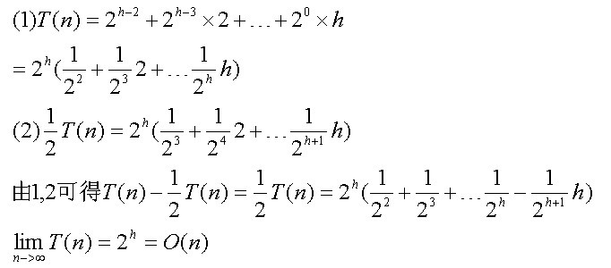

- 给定入栈序列，判断给出的出栈序列可不可能||求出所有的出栈序列||给定树的结点，求有多少种树？

# 卡特兰数

```
对于每一个数来说，必须进栈一次、出栈一次。我们把进栈设为状态‘1’，出栈设为状态‘0’。n个数的所有状态对应n个1和n个0组成的2n位二进制数。由于等待入栈的操作数按照1‥n的顺序排列、入栈的操作数b大于等于出栈的操作数a(a≤b)，因此输出序列的总数目=由左而右扫描由n个1和n个0组成的2n位二进制数，1的累计数不小于0的累计数的方案种数。

在2n位二进制数中填入n个1的方案数为c(2n,n),不填1的其余n位自动填0。从中减去不符合要求（由左而右扫描，0的累计数大于1的累计数）的方案数即为所求。

不符合要求的数的特征是由左而右扫描时，必然在某一奇数位2m+1位上首先出现m+1个0的累计数和m个1的累计数，此后的2(n-m)-1位上有n-m个 1和n-m-1个0。如若把后面这2(n-m)-1位上的0和1互换，使之成为n-m个0和n-m-1个1，结果得1个由n+1个0和n-1个1组成的2n位数，即一个不合要求的数对应于一个由n+1个0和n-1个1组成的排列。

反过来，任何一个由n+1个0和n-1个1组成的2n位二进制数，由于0的个数多2个，2n为偶数，故必在某一个奇数位上出现0的累计数超过1的累计数。同样在后面部分0和1互换，使之成为由n个0和n个1组成的2n位数，即n+1个0和n-1个1组成的2n位数必对应一个不符合要求的数。

因而不合要求的2n位数与n+1个0，n－1个1组成的排列一一对应。

显然，不符合要求的方案数为c(2n,n+1)。由此得出输出序列的总数目=c(2n,n)-c(2n,n-1)=c(2n,n)/(n+1)=h(n)。

还让我们用C++写了当时
```

# 数据结构：

```
基本策略：
1.Leetcode刷题，根据Leetcode给出的题库
2.一天 计网||数据库||多线程编程||Spring相关 换着来 一天一个专题
3.博客也不要拉下，阿里大神的算法博客，多整理笔记，精神高度集中其他课就不看了
4.最后开始看面试70题，面试100题之类的查漏补缺

```


## 编程常用容器类：

- Vector Vector就是队列 可以这么说

  ```Java
  Vector vq= new Vector();
  vq.addElement(months[i]+" ");
  vq.removeElement(vq.firstElement());//先进先出
  ```

  

- List集合去重

  https://www.cnblogs.com/cainiao-Shun666/p/7911142.html

- HashMap如何遍历

  https://blog.csdn.net/gary0917/article/details/79783713

- Java中 List Integer 和int int[]的转换

  <https://blog.csdn.net/zx000003/article/details/82691578>

- 栈Stack

  ```
  Stack底层 用数组，可变数组，链表都可以实现
  ```

## 字符串subString()

- substring(int beginIndex)

  是截取扔掉前beginIndex个 留下beginIndex后的字符

- substring(int beginIndex,int endIndex)

  是截取beginIndex到endIndex中间这么多个

# 数组与链表：单/双向链表，跳舞链  

### 跳表 ✅


​

	


跳表是在链表的基础上，针对链表查询速度很慢，而提出的构建多级查询链表的一种数据结构。

并且跳表实际上成了一种有序表，并且这种层次结构相当于给链表加索引，加速了查询

如果比当前值大又比后一值小，就深入下一层

其结构如下：


​	其中 -1 表示 INT_MIN， 链表的最小值，1 表示 INT_MAX，链表的最大值。

跳表具有如下性质：

- 由很多层结构组成
- 每一层都是一个有序的链表
- 最底层(Level 1)的链表包含所有元素
- 如果一个元素出现在 Level i 的链表中，则它在 Level i 之下的链表也都会出现。
- 每个节点包含两个指针，一个指向同一链表中的下一个元素，一个指向下面一层的元素。

跳表是Redis的一种数据结构，但是如何加速查询的？

#### 有序表是如何搜索的？


例子：查找元素 117

(1) 比较 21， 比 21 大，往后面找

(2) 比较 37,   比 37大，比链表最大值小，从 37 的下面一层开始找

(3) 比较 71,  比 71 大，比链表最大值小，从 71 的下面一层开始找

(4) 比较 85， 比 85 大，从后面找

(5) 比较 117， 等于 117， 找到了节点。

其实就是相当于建立了索引


# 栈与队列

### 栈的实现原理

##### 顺序栈

##### 链式栈

其实是对链表的简化，只在表头进行插入和删除 push pop 

push的时候，将新结点的next指向前一个结点，pop的时候取出栈顶结点的next 并设为新栈顶，然后将原栈顶结点释放掉。

递归其实就一个天然栈

### 队列的实现原理

队列也是分


##### 顺序队列

顺序队列有移动队列问题，移动队列即随着队首元素出队，front会一直后移，产生空间碎片，因此顺序队列的实现需要是一个循环数组，即首尾空间相连，如上图所示，牺牲一个存储单元，满了以后n+1种状态，

##### 链式队列 

都是对链表的简单修改

# 树与图：最近公共祖先、并查集

### 完全二叉树

​	若设二叉树的深度为h，除第 h 层外，其它各层 (1～h-1) 的结点数都达到最大个数，第 h 层所有的结点都连续集中在最左边，这就是完全二叉树。如下图所示：


### 堆（最大堆、最小堆）

堆的底层结构为完全二叉树，因此常使用数组来存储。//从数组怎么复原完全二叉树

### 最大堆

##### 定义

​	根结点的键值是所有堆结点键值中最大者，且每个结点的值都比其孩子的值大。

##### 存储特点

​	最大堆通常都是一棵完全二叉树，因此我们使用数组的形式来存储最大堆的值，从1号单元开始存储，因此父结点跟子结点的关系就是两倍的关系。

​	即：heap[father * 2] = heap[leftChild];  heap[father * 2 + 1] = heap[rightChild];

##### 最大堆的初始化

1. 方法一：插入法

   从空堆开始，依次插入每一个结点，直到所有的结点全部插入到堆为止。 
   时间：O(n*log(n)) 

2. 方法二：调整法

   ​	序列对应一个完全二叉树；从最后一个分支结点（n div 2）开始，到根（1）为止，依次对每个分支结点进行调整（下沉），以便形成以每个分支结点为根的堆，当最后对树根结点进行调整后，整个树就变成了一个堆。 
   ​	时间：O(n) 

   ​	对如图的序列，要使其成为堆，我们从最后一个分支结点(10/2)，其值为72开始，依次对每个分支节点53，18，36，45进行调整(下沉)：

   

   

   

   注释：如何获取相应数组序列？

   方法是依次将堆的根节点的小数记下，然后删除根节点，如此反复直到堆为空。上面提到了删除操作，每次删除之后都是要调整堆让堆的性质不变，即根节点必为最大值或最小值

   代码如下：

   ```java
      /*根据树的性质建堆，树节点前一半一定是分支节点，即有孩子的，所以我们从这里开始调整出初始堆*/  
        public static void adjust(List<Integer> heap){
           for (int i = heap.size() / 2; i > 0; i--)  
               adjust(heap,i, heap.size()-1);  
           //很明显这一步是倒着来的，从后往前对堆进行排序，调整父结点
           System.out.println("=================================================");
           System.out.println("调整后的初始堆：");
             print(heap);
         }
       /** 
        * 调整堆，使其满足堆得定义 
        * @param i 
        * @param n 
        */  
       public static void adjust(List<Integer> heap,int i, int n) {  
          
           int child;  
           for (; i <= n / 2; ) {  
               child = i * 2;  
               if(child+1<=n&&heap.get(child)<heap.get(child+1))  
                   child+=1;/*使child指向值较大的孩子*/  
               if(heap.get(i)< heap.get(child)){  
                   swap(heap,i, child);  
                   /*交换后，以child为根的子树不一定满足堆定义，所以从child处开始调整*/  
                   i = child;  
                  
               }  else break;
           }  
       }  
   public static void adjust(List<Integer> heap,int i,int n){
       int child;
       
       for(;i<=n/2;){
           //只要i小于n/2这个循环就会持续进行，也就是说调整前面的非叶子结点，如果该叶子结点仍是非叶子结点，循环会继续，直到
           child=i*2;
           if(child+1<=n&&heap.get(child)<heap.get(child+1))
               //child=i*2是左孩子，child+1位右孩子，看看右孩子在不在
               child+=1;
           if(heap.get(i)<heap.get(child)){
               swap(heap,i,child);
               i=child;
           }else
               break; //如果下沉到 非叶子结点就不需要交换了，那么就说明到地方了        
       }
   }
   public void swap(List<Integer> heap ,int i ,int child){
       int temp=heap.get(i);
       heap.set(i,heap.get(child));
       heap.set(child,temp);
   }
   ```

总结：

##### 补充：插入时间复杂度证明

- 取n/2前面的结点，因为根据完全二叉树的性质，只有前面个n/2是非叶子结点

- 对前n/2个结点调用 adjust()函数，取子结点中最大值与当前值比较，如果大就交换，

  如果交换后，当前结点依旧在前n/2就循环调整，不用递归调用。

- 这样对前n/2个结点每一个都这么操作，所以创建的时间复杂度是O(n)

  

  

##### 最大堆的插入

​	由于需要维持完全二叉树的形态，需要先将要插入的结点x放在最底层的最右边，插入后满足完全二叉树的特点。 然后把 x 依次向上调整到合适位置满足堆的性质，例如下图中插入80，先将80放在最后，然后两次上浮到合适位置。

​	时间：O(logn)。 流程图如下：


​	代码实现如下：

```java
 		//向最大堆中插入元素, heap:存放堆元素的数组
    public static void insert(List<Integer> heap, int value) { 
       //在数组的尾部添加
        if(heap.size()==0)
          heap.add(0);//数组下标为0的位置不放元素
        //为什么数组下标位0的位置不放元素？
        heap.add(value); 
        //开始上升操作 
       // heapUp2(heap, heap.size() - 1); 
        heapUp(heap, heap.size() - 1); 
 
    } 
 
    //上升，让插入的数和父节点的数值比较，当大于父节点的时候就和父节点的值相交换 
    public static void heapUp(List<Integer> heap, int index) { 
 
        //注意由于数值是从下标为1开始，当index = 1的时候，已经是根节点了 
        if (index > 1) { 
            //求出父亲的节点 
            int parent = index / 2; //
 
            //获取相应位置的数值 
            int parentValue = (Integer) heap.get(parent); 
            int indexValue = (Integer) heap.get(index); 
            //如果父亲节点比index的数值小，就交换二者的数值 
            if (parentValue < indexValue) { 
                //交换数值 
                swap(heap, parent, index); 
                //递归调用 
                heapUp(heap, parent); //把parent传递进去，做一个交换
            } 
 
        } 
    } 
```

##### 补充：为什么堆数组0不放置元素？

我觉得是因为 在插入上浮操作的时候，需要用到parent=n/2这个操作，对于1来说 1/2 不可能得到0，所以 根结点设置为0是不可达的。

总结：

- 插入过程就更简单了，只要是涉及一个上浮操作，

  主要是用index/2求父结点，如果比父结点大 就交换，否则就终止

  而上浮操作是递归调用的，一直到parent=1 即根结点

##### 最大堆的删除

​	操作原理是：当删除节点的数值时，原来的位置就会出现一个孔,填充这个孔的方法就是， 把最后的叶子的值赋给该孔并下调到合适位置，最后把该叶子删除。 

​	如图中要删除72,先用堆中最后一个元素来35替换72,再将35下沉到合适位置,最后将叶子节点删除。


​	代码实现如下：

删除的时候，要判断存不存在左右儿子，都不存在，或者存在一个左儿子，或者两个都在。

```java
	 /**
     * 删除堆中位置是index处的节点
     * 操作原理是：当删除节点的数值时，原来的位置就会出现一个孔
     * 填充这个孔的方法就是，把最后的叶子的值赋给该孔，最后把该叶子删除
     * @param heap 
     */ 
    public static void delete(List<Integer> heap,int index) { 
        //把最后的一个叶子的数值赋值给index位置 
        heap.set(index, heap.get(heap.size() - 1)); 
        //下沉操作 
        //heapDown2(heap, index); 
        heapDown(heap, index); 
        //把最后一个位置的数字删除 
        heap.remove(heap.size() - 1); 
    } 
    /**
     * 递归实现
     * 删除堆中一个数据的时候，根据堆的性质，应该把相应的位置下移，才能保持住堆性质不变
     * @param heap 保持堆元素的数组
     * @param index 被删除的那个节点的位置
     */ 
    public static void heapDown(List<Integer> heap, int index) { 
        //因为第一个位置存储的是空值，不在考虑之内 
        int n = heap.size() - 2; 
 
        //记录最大的那个儿子节点的位置 
        int child = -1; 
 
        //2*index>n说明该节点没有左右儿子节点了，那么就返回 
        if (2 * index > n) { 
            return; 
        } //如果左右儿子都存在 
        else if (2 * index < n) { 
 
            //定义左儿子节点 
            child = 2 * index; 
            //如果左儿子小于右儿子的数值，取右儿子的下标 
            if ((Integer) heap.get(child) < (Integer) heap.get(child + 1)) { 
                child++; 
            } //下沉操作，取两个儿子中较大的那个
 
        }//如果只有一个儿子（左儿子节点） 
        else if (2 * index == n) { 
            child = 2 * index; 
        } 
 
        if ((Integer) heap.get(child) > (Integer) heap.get(index)) { 
            //交换堆中的child，和index位置的值 
            swap(heap, child, index); 
 
            //完成交换后递归调用，继续下降 
            heapDown(heap, child); 
        } 
    } 
```

总结：

- 删除操作比插入操作复杂一点，删除操作主要是要分子结点的个数做判别

  2*index求子结点

  没有子结点 2*index>n

  一个子结点 2*index=n

  两个子结点 2*index<n

  然后父结点与最大子结点进行比较，如果小就交换，

  最后递归调用这个式子

##### 最大堆排序

```java
		//对一个最大堆heap排序
    public static void heapSort(List<Integer> heap) {  
       
        for (int i = heap.size()-1; i > 0; i--) {  
         /*把根节点跟最后一个元素交换位置，调整剩下的n-1个节点，即可排好序*/  
            swap(heap,1, i);  
            adjust(heap,1, i - 1);  
        }  
    }
```

补充：swap的代码如下：

```java
    //把堆中的a,b位置的值互换   
    public static void swap(List<Integer> heap, int a, int b) {   
        //临时存储child位置的值   
        int temp = (Integer) heap.get(a);   
   
        //把index的值赋给child的位置   
        heap.set(a, heap.get(b));   
   
        //把原来的child位置的数值赋值给index位置   
        heap.set(b, temp);   
    }   
```

##### 堆排序

```java
public void heapSort(List<Intger> heap){
    //adjust(heap,1,heap.size()-1); 不需要，不需要先调整一次
    //反正本来就是无序的
    
    for(int i=heap.size()-1;i>0;i--){
        swap(heap,1,i);
        adjust(heap,1,i);
    }
}

public void adjust(List<Intger> heap, int start,int end){
    
    int i;
    for(;i<end/2;){
        i=start*2;
        if(i+1<end&&heap.get(i)<heap.get(i+1))
            i++;
        if(heap.get(start)<heap.get(i)){
            swap(heap,start,i);
        	start=i;
        }
        else
            break;       
    }
}
```


##### 用堆解决TopK问题

对啊 用堆解决TopK问题是真的 用小根堆，维持一个K大的堆，即最小堆解最大值问题 ，和堆顶元素（最小）比较，如果比堆顶大，就移除堆顶，并把当前元素放在堆顶然后下沉？

用堆解决TopK小的问题，反而用大根堆，维持一个K大的堆，正好相反，和堆顶元素比较，如果比堆顶小，就移除堆顶元素，然后把当前元素放在堆顶然后下沉，再重新计算堆最大的元素。

##### 堆与优先队列(PriorityQueue)的关系


### 二叉搜索树BST

#### 二叉搜索树的创建，插入

```java
public class BSTree<T extends Comparable<T>> {

    private BSTNode<T> mRoot;    // 根结点

    public class BSTNode<T extends Comparable<T>> {
        T key;                // 关键字(键值)
        BSTNode<T> left;      // 左孩子
        BSTNode<T> right;     // 右孩子
        BSTNode<T> parent;    // 父结点

        public BSTNode(T key, BSTNode<T> parent, BSTNode<T> left, BSTNode<T> right) {
            this.key = key;
            this.parent = parent;
            this.left = left;
            this.right = right;
        }
    }

        ......
}

//查找最大值和最小值
private BSTNode<T> maximum(BSTNode<T> tree) {
    if (tree == null)
        return null;

    while(tree.right != null)
        tree = tree.right;
    return tree;
}

public T maximum() {
    BSTNode<T> p = maximum(mRoot);
    if (p != null)
        return p.key;
    return null;
}

private BSTNode<T> minimum(BSTNode<T> tree) {
    if (tree == null)
        return null;

    while(tree.left != null)
        tree = tree.left;
    return tree;
}
public T minimum() {
    BSTNode<T> p = minimum(mRoot);
    if (p != null)
        return p.key;

    return null;
}

//插入，插入没什么好说的，其实就是二分查找的变形，建树顺序不一样，虽然是一样的数据，但是数的结构也不一样
private void insert(BSTree<T> bst, BSTNode<T> z) {
    int cmp;
    BSTNode<T> y = null;
    BSTNode<T> x = bst.mRoot;

    // 查找z的插入位置
    while (x != null) {
        y = x;
        cmp = z.key.compareTo(x.key);
        if (cmp < 0)
            x = x.left;
        else
            x = x.right;
    }
	//找到插入位置，每次保存一个父结点
    z.parent = y;
    if (y==null)
        bst.mRoot = z;
    else {
        cmp = z.key.compareTo(y.key);
        if (cmp < 0)
            y.left = z;
        else
            y.right = z;
    }
}
```


#### 二叉搜索树的删除

1. 删除点p左右子树都为空 叶子结点，删除掉就可以了
2. 删除点p左右子树一棵非空，用非空子树代替p就可以了
3. 删除点p的左右子树都非空，可以使用p的后继结点s代替p，后继结点一定是个叶子结点，或者单枝，然后仿照1，2把后继结点删除就好了。


#### 二叉查找树的前驱后继

TreeMap中也有类似查找节点后继结点的函数。

或者说中序遍历的下一个结点(剑指offer第八题)

如果右子树不为空，则下一个结点右孩子结点的（第一个左孩子结点）循环，如果不存在下一个就是 右孩子结点

如果右子树为空，且父结点不为空，那么下一个结点，就是第一个向左走的祖先，注意是祖先，不是祖先的左结点，也就是父结点😂

```
while(Parent!=null&&current==Parent.right){
    current=Parent;
    Parent=Parent.parent;
}
```

**查找前驱结点**

```java
//普遍来说
对于二叉树
if(x.left!=null){
current=x.left;
while(current.right!=null){
current=current.right;
}
return current;
}
//x没有左孩子
//那么判断x是什么，如果x是一个右孩子，则x的前驱为它的父结点
//如果x是一个左孩子 那么查找x最低的父结点，并且这个父结点要有右孩子
//最低父结点的意思是 
// 如果x存在左孩子，则"x的前驱结点"为 "以其左孩子为根的子树的最大结点"。
//但是这样就找到根了，不知道对不对
BSTNode<T> y = x.parent;
    while ((y!=null) && (x==y.left)) {
        x = y;
        y = y.parent;
    }

    if (x.left != null)
        return maximum(x.left);

```


##### 平衡二叉搜索树

​	平衡二叉搜索树（Self-balancing binary search tree）又被称为AVL树（有别于AVL算法），且具有以下性质：它是一 棵空树或它的左右两个子树的高度差的绝对值不超过1，并且左右两个子树都是一棵平衡二叉树。


二叉排序树和二叉平衡树二叉搜索树 都是一种数据结构
平衡二叉树的常用算法有红黑树，AVL树等我们可以看到，其高度一般都良好地维持在O(log2n)，大大降低了操作的时间复杂度。
最小二叉平衡树的节点的公式如下：
F(n)=F(n-1)+F(n-2)+1
真的和斐波那契数列差不多！
但是频繁旋转会使插入和删除牺牲掉O(logN)左右的时间，不过相对二叉查找树来说，时间上稳定了很多。
AVL是第一种被发明的自平衡二叉查找树

### 2-3树

#### 属性

插入，检索，删除 都是logn的时间复杂度

- 一个结点包含一个或者两个关键码
- 每个内部结点由有两个子结点或者三个子结点
- 所有叶结点都在同一层，所以树的高度总是平衡的

#### 检索与插入

检索，和BST的检索差不多，就是拿值和父结点的关键码进行比较，2结点很简单，一个关键字，和BST一样，大了去右子树，小了左子树，3结点（3结点有两个关键码）就是在2结点的基础上加了一个在两个关键码之间的操作

2-3树和B树一样，也不向下增长，主要操作就是裂项，向父亲结点传值

当有三个关键码的时候，最小的分给新的左结点，最大的分给新的右结点，然后中间的关键码被提升到父亲结点，如果父结点也有3个关键码了，就递归这个过程。

### B-树 ✅

插入，检索，删除 都是logn的时间复杂度

- B树(B-Tree) 也是一种用于查找的自平衡树，但是不是一种二叉树，多叉的。
  这种数据结构能够让查找数据、循序存取、插入数据及删除的动作，都在对数时间内完成。
- B-树为系统最优化大块数据的读和写操作。
- B-tree算法减少定位记录时所经历的中间过程，从而加快存取速度。这种数据结构常被应用在数据库和文件系统的实作上。

#### 属性

- B树总是高度平衡的，所有叶结点都在同一层
- 更新和检索操作只影响一些磁盘块，IO请求较少，这个在BTree索引中已经见识过了
- B树把相关记录（其实就是一个结点，如果B树的阶层够高）放在同一个磁盘块里，从而利用了局部性原理来减少IO时间
- B树保证一定比例的结点是满的，这样能改进空间利用率，同时在检索和更新操作期间，减少所需读取的磁盘块数目

```
在B-树中查找给定关键字的方法是，首先把根结点取来，在根结点所包含的关键字K1,…,Kn查找给定的关键字（可用顺序查找或二分查找法），若找到等于给定值的关键字，则查找成功；否则，一定可以确定要查找的关键字在Ki与Ki+1之间，Pi为指向子树根节点的指针，取出子树节点的磁盘块，再用二分查找的方式遍历整个子结点。此时取指针Pi所指的结点继续查找，直至找到，或指针Pi为空时查找失败。

B-树作为一种多路搜索树（并不是二叉的）：

　　1) 定义任意非叶子结点最多只有M个儿子；且M>2；
　　2) 根结点的儿子数为[2, M]；
　　3) 除根结点以外的非叶子结点的儿子数为[M/2, M]；
　　4) 每个结点存放至少M/2-1（取上整）和至多M-1个关键字；（至少2个关键字）
　　5) 非叶子结点的关键字个数=指向儿子的指针个数-1；
　　6) 非叶子结点的关键字：K[1], K[2], …, K[M-1]；且K[i] < K[i+1]；
　　7) 非叶子结点的指针：P[1], P[2], …, P[M]；其中P[1]指向关键字小于K[1]的子树，P[M]指向关键字大于K[M-1]的子树，其它P[i]指向关键字属于(K[i-1], K[i])的子树；
　　8) 所有叶子结点位于同一层；
　　
　　首先 定义任意非叶子结点最多只有M个儿子；且M>2；根结点的儿子数为[2,M]；
　　非根结点的非叶子结点的儿子数为[M/2,M]
　　对于叶子结点，每个结点存放至少M/2-1 和至多M个关键字
   如下图为一个M=3的B树示例：
  
因此B-树的搜索，有可能在非叶子结点结束，而B+树则不是如此
```


#### B-Tree的创建和插入

树的高度都是被拔高的，一开始创建的时候只有根结点一个，当元素大于M的时候，根结点会分裂成两半并把中间结点拔高放入父结点，或生成父结点，如果父结点也满了大于M，则又回将父结点分裂成两部分，中间关键码拔高成新的结点。

因此从创建和插入过程可以看到

#### B-Tree结点删除

1. 关键字在叶子结点内直接删除

2. 关键字在内部结点x内

   如果结点 x 中前于 k 的子节点 y 至少包含 M/2个关键字（不是M/2-1最小值），则找出 k 在以 y 为根的子树中的前驱 k’（子树中最“大”的关键字）。递归的删除 k’，并在 x 中用 k’ 代替 k 。

   把前一个结点最大的子关键字找出来替换掉k 同时这一过程是递归的，因为子结点也可能有

   如果y只有M/2-1个关键字，那就找k后面的z子结点，把z最小的关键字k'拿出来替换掉k，同时这一过程也是递归的

   如果前后y 和 z都只有 最小的结点数，那就把k，z都合并到y中，然后x失去了k关键字 和 z的指针，现在可以对y进行递归操作了。

   

#### 属性

1. 根结点 [2,M]个孩子

2. 非叶子结点[M/2,M]个孩子，M>2

3. 孩子和关键字之间的关系是 关键字=孩子数-1 3个关键字可以有4个指向孩子的指针

4. 每个结点关键字[M/2-1,M]个关键字，达到M这个结点就可以被说是满了
5. 2-3树可以说是 3阶B-Tree


### B+树

```
B+树是B树的变体，也是一种多路搜索树：

　　1) 其定义基本与B-树相同，除了：
　　2) 非叶子结点的子树指针与关键字个数相同；
　　3) 非叶子结点的子树指针P[i]，指向关键字值属于[K[i], K[i+1])的子树（B-树是开区间）；
　　4) 为所有叶子结点增加一个链指针；
　　5) 所有关键字都在叶子结点出现；

　　下图为M=3的B+树的示意图：
　　B+树的搜索与B树也基本相同，区别是B+树只有达到叶子结点才命中（B树可以在非叶子结点命中），其性能也等价于在关键字全集做一次二分查找；

　　B+的性质：
　　1.所有关键字都出现在叶子结点的链表中（稠密索引），且链表中的关键字恰好是有序的；
　　2.不可能在非叶子结点命中；//搜索最后结果都是在叶子结点，所以，无论搜没搜索中走的都是根到叶子结点的一个路径长度
　　3.非叶子结点相当于是叶子结点的索引（稀疏索引），叶子结点相当于是存储（关键字）数据的数据层；

　　4.更适合文件索引系统。
```

现在我们再来看B+树的创建，插入，删除过程以及属性

#### B+树的创建

#### B- B+区别小结

B树：二叉树，每个结点只存储一个关键字，等于则命中，小于走左结点，大于走右结点；

B-树：多路搜索树，每个结点存储M/2到M个关键字，非叶子结点存储指向关键字范围的子结点；

所有关键字在整颗树中出现，且只出现一次，非叶子结点可以命中；

B+树：在B-树基础上，为叶子结点增加链表指针，所有关键字都在叶子结点中出现，非叶子结点作为叶子结点的索引；B+树总是到叶子结点才命中；

B*树：在B+树基础上，为非叶子结点也增加链表指针，将结点的最低利用率从1/2提高到2/3；

### 字典树 Trie Tree

- 字典树或者说前缀树用到的数据结构，ListNode []children,对于每一个结点都有这个。是层层嵌套的数组，因为字母只有26个，和之前用数组对字符串出现的单词进行计数的思想一样，这样用数组来存，树的深度为字符长度，并且单个字母只用一次，节省空间开销。共同前缀的单词，但是做搜索可以，做遍历就有点难

### [红黑树](https://www.cnblogs.com/CarpenterLee/p/5503882.html)

##### 红黑树与2-3树

​	红黑树与2-3树十分类似。红黑树中**红色节点其实就是2-3树中的3-节点最左侧的元素。该节点表示其应该与其父亲节点合在一起，等价于2-3树中的一个3-节点**。正因为该原因，在红黑树中添加元素时，新元素永远是红色节点

（与2-3树中添加新元素原理对应：向2-3树中添加一个元素，如果新元素添加进2-节点，那就直接形成一个3-节点，如果新元素添加进3-节点，则暂时形成一个4-节点，再对该节点进行变形处理）。

##### 红黑树的五大性质

1. 每个节点不是红色就是黑色；

2. 根节点是黑色的；//因为红色结点和ta的父结点共同构成一个2-3节点中的3结点

3. 每一个叶子节点（最后的空节点）是黑色的；

4. 如果一个节点是红色，那么他的孩子节点都是黑色的；

   **红色后不能再跟红色，不然那不成4结点了么**

5. 从任意一个节点到叶子节点，所经过的黑色节点是一样的；

##### 左旋

​	前文说到当查找树的结构发生改变时，红黑树的条件可能被破坏，需要通过调整使得查找树重新满足红黑树的条件。调整可以分为两类：一类是颜色调整，即改变某个节点的颜色；另一类是结构调整，集改变检索树的结构关系。结构调整过程包含两个基本操作：**左旋（Rotate Left），右旋（RotateRight）**。

​	**左旋即将旋转中心节点的左孩子节点给自己的父节点，当做右孩子节点，父节点成为自己新的左孩子节点。**


​	源代码实现：

```java
public class RBTree<T extends Comparable<T>> {

    private RBTNode<T> mRoot;    // 根结点

    private static final boolean RED   = false;
    private static final boolean BLACK = true;

    public class RBTNode<T extends Comparable<T>> {
        boolean color;        // 颜色
        T key;                // 关键字(键值)
        RBTNode<T> left;    // 左孩子
        RBTNode<T> right;    // 右孩子
        RBTNode<T> parent;    // 父结点

        public RBTNode(T key, boolean color, RBTNode<T> parent, RBTNode<T> left, RBTNode<T> right) {
            this.key = key;
            this.color = color;
            this.parent = parent;
            this.left = left;
            this.right = right;
        }

    }
    //内部类，结点构成由左右孩子的指针，指向父结点的指针，以及关键字和颜色组成

    ...
}
//结点定义

//Rotate Left
private void rotateLeft(Entry<K,V> p) {
    if (p != null) {
        Entry<K,V> r = p.right;
        p.right = r.left;
        if (r.left != null)
            r.left.parent = p;
        r.parent = p.parent;
        if (p.parent == null)
            root = r;
        else if (p.parent.left == p)
            p.parent.left = r;
        else
            p.parent.right = r;
        r.left = p;
        p.parent = r;
    }
}

```

##### 右旋

​	**右旋即将父结点的左孩子结点的 右孩子节点给自己的父节点，当做左孩子节点，父节点成为自己新的右孩子节点。**


```java
//Rotate Right
private void rotateRight(Entry<K,V> p) {
    if (p != null) {
        Entry<K,V> l = p.left;
        p.left = l.right;
        if (l.right != null) l.right.parent = p;
        l.parent = p.parent;
        if (p.parent == null)
            root = l;
        else if (p.parent.right == p)
            p.parent.right = l;
        else p.parent.left = l;
        l.right = p;
        p.parent = l;
    }
}
```

### 新建

##### 创建实例

创建的总体流程图如下：


1. put(10, "10")

   首先是put(10, "10")，由于此时TreeMap中没有任何节点，因此10为根且根节点为黑色节点，put(10, "10")之后的数据结构为：

   

2. put(85, "85")

   ​	接着是put(85, "85")，这一步也不难，85比10大，因此在10的右节点上，默认新插入节点为红色节点。

   ​	这是由于红黑树要求从根节点到叶子所有叶子节点上经过的黑色节点个数是相同的，因此如果插入的节点着色为黑色，那必然有可能导致某条路径上的黑色节点数量大于其他路径上的黑色节点数量，**因此默认插入的节点必须是红色的**。

   一个根结点肯定是一个2结点，新插入的元素要把2结点变为3结点，所以是红色

   

   

3. put(15, "15")

   ​	这次添加的是put(15, "15")，15比10大且比85小，因此15最终应当是85的左子节点，默认插入的是红色节点，因此首先将15作为红色节点插入85的左子节点后的结构应是下图左一：

   叔父结点：父亲结点的兄弟结点叫叔父结点，同时由于红黑树是二叉的，基于BST，所以 叔父只有一个或者没有

   

   ​	在这里先补充一下左子树内侧插入、左子树外侧插入以及右子树内侧插入、右子树外侧插入的概念：

   - 左子树内侧插入：新插入的节点为左子树的右孩子节点(相对于root，新插入节点在内侧)；
   - 左子树外侧插入：新插入的节点为左子树的左孩子节点(相对于root，新插入的节点在外侧)；
   - 右子树内侧插入：新插入的节点为右子树的左孩子节点(相对于root，新插入节点在内侧)；
   - 右子树外侧插入：新插入的节点为右子树的右孩子节点(相对于root，新插入的节点在外侧)。

   ​	回到上面的流程，显然这里违反了红黑树的性质即连续出现了两个红色节点，**且不存在叔父节点为红色的情况**（或者为空 或者为黑色），因此此时必须进行旋转。可以看到这是**右子树内侧插入**，需要进行两次旋转操作（**所有内侧插入都需要进行两次旋转、外侧插入都需要经过一次旋转**）：

   1. 以新插入节点 （也可以这么理解把，就是15）为旋转中心进行一次右旋操作(将旋转中心的右孩子节点给自己的父亲节点，当做左孩子节点，父节点成为旋转中心节点的新的右孩子节点。)
   2. 新插入节点本身染为黑色，父亲和祖父 祖父节点着色为红色
   3. 再以新插入节点为中心进行一次左旋操作(将旋转中心节点的左孩子节点给自己的父亲节点，当做右孩子节点，父亲节点成为旋转中心节点的新的左孩子节点)

4. put(70, "70")

   ​	put(70, "70")就很简单了，70是85的左子节点，**由于70的父节点以及叔父节点都是红色节点，因此直接将70的父节点85、将70的叔父节点10着色为黑色即可，70这个节点着色为红色**，即满足红黑树的特性，插入70之后的结构图为：

   

5. put(20, "20")

   可以看出此处为**左子树外侧插入**，（右子树外侧插入，左旋，父节点为红色，且不存在叔父节点也为红色的情况，需要按照子树外侧插入的规则来进行旋转，此处即为以新插入节点的父节点为旋转中心，进行右旋操作，具体操作流程为：

   **1. 先把父亲结点染成黑色，把祖父结点染成红色**

   **2. 以新插入节点的父节点为旋转中心，将旋转中心的右孩子节点给旋转中心的父节点，当做左孩子节点，父节点成为旋转中心节点的新的右孩子节点：**

   

   

6. put(60, "60")

   如果叔父结点存在且是

   这里出现了连续两个红色节点，且新插入节点的叔父节点也为红色，所以只需要进行一次颜色变换再重复判断是否依然存在颜色错误问题即可，调整后如下：

   

   

7. put(30, "30")

   put(30, "30")，节点30应当为节点60的左子节点，因此插入节点30之后是下图左一：

   

   此时违背了红黑树不能有两个连续红色节点的性质，且新插入节点不存在叔父节点也为红色，判断新插入节点为右子树内侧插入，需要经历右旋->颜色变换->左旋操作，具体操作如下：

   - 右旋：以新插入节点（值为30）为中心，将自己的右孩子节点（为空）给自己的父亲节点（值为60），当做左孩子节点，父亲节点成为了自己的新的右孩子节点；
   - 颜色变换：新插入节点（值为30）变为黑色，父节点（此处为调整后的父节点，即值为20的节点）和右孩子节点（值为60）变为红色；**父节点和右孩子结点为红色，其实就是 父亲和祖父为红色**
   - 左旋：以新插入节点（值为30）为中心，进行一次左旋操作，将自己的左孩子节点（为空）给自己的父亲节点（值为20）当做右孩子节点，父亲节点（值为20）成了自己的新的左孩子节点。

   调整后的结构如上面右图所示。

8. put(50, "50")

   ​	put(50, "50")，节点50应当为节点60的左子节点，因此插入节点30之后，且新插入节点的父节点和叔父节点都为红色节点，因此在插入时直接进行颜色变换，父节点和叔父节点变为黑色，祖父节点变为红色，如下第一张图所示：

   

   ​	由图一可以观察到，树中存在连续红色节点的情况，需要进行调整，此处相当于在70节点处新插入了一个左子树，为右子树内侧插入，需要经过 右旋->颜色变换->左旋操作，具体操作流程如下：

   - 右旋：以新插入节点（值为30）为中心，将自己的右子树给自己的父节点(值为70)，当做左子树，父节点成为自己新的右孩子节点。调整后如上图二所示；
   - 颜色变换：新插入节点(值为30)变为黑色，父节点(值为15)和右孩子节点（值为70）变为红色。调整后如图三所示（此时先不用管根节点成了红色，先把右子树内侧插入的流程走完，这样就会自动将根节点调整过来）； 染色 假装右子树内侧插入的结点染为黑色，原先的父结点和祖父结点染为红色
   - 左旋：以新插入节点（值为30）为中心，将自己的左子树（左子树根节点值为20）给自己的父节点（值为15），当做父节点的右子树，父节点成了自己的新的左孩子节点，调整后的结构如图四所示。

##### 创建流程核心总结

**如以上流程所示，红黑树的完整建立流程就已经搞定。核心需要注意的地方有如下几个：**

1. **按照遍历规则（二分查找法）找到新插入节点的位置，且新插入的节点必定为红色，如果是根节点，则直接调整为黑色；**
2. **如果新插入节点的父节点为红色，则代表发生冲突，需要调整，调整规则如下：**
   - **若父节点与叔父节点同时为红色，则直接将父节点与叔父节点设置成黑色，将祖父节点设置成红色。**
   - **若只有父节点为红色，则需要判断当前节点插入为内侧插入还是外侧插入，如果是内侧插入，则必须进行以插入节点为中心的 右旋->颜色变换（新插入节点变成黑色，右旋操作后新插入节点的父节点变成红色）->左旋 操作；如果是外侧插入，则只需要进行以插入节点的父节点为中心的右旋操作；**
3. **解决新插入节点的颜色冲突后，重新检查树中是否因为刚刚的颜色调整产生了新的颜色冲突，若有冲突，则继续执行步骤2(将发生冲突的地方视为新插入了节点)**

创建总结：

x：创建新插入结点x，并且对x进行染色 为红色

判断1:判断x是不是根结点，x的父结点是不是红色

判断2:再判断x是不是左子树插入，其实左右子树一样

判断3:再判断x的叔父结点是不是红色，如果是红色 只染色就好了

​	父亲结点染为黑色，叔父结点染为黑色，然后祖父结点染为红色。

​	**这一步还不需要判断是不是左右子树内侧 或者外侧插入**

​	并且为了防止染了祖父为红色后出现连续两个红色结点的情况，还需要从头到尾对祖父结点进行判断，

​	如果发现祖父存在连续两个红色，就把祖父结点当作新的插入 重新执行旋转和染色操作

​	**进行修正**

判断4:如果叔父结点不是红色 那么就判断是左子树外侧插入，还是内侧插入，如果是外侧插入

​	 如果是外侧插入，就父亲染黑色，祖父染红色，然后右旋转

​	如果是内侧插入，就先左旋，然后父亲和祖父染红色，现在的父亲和右孩子结点，染红色，自己染黑色

​	再右旋，右旋和左旋操作就不再多说了

最后：左子树和右子树其实是对称的，主要区别还是在内外插入的时候

​	如果是右子树内侧插入，会先右旋，染色然后左旋 而左子树内侧插入会先左旋，染色再右旋

​	如果是右子树外侧插入，会直接染色，左旋，父亲为黑，祖父为红，然后如果是左子树外侧插入，

​	会直接染色，右旋，就这么点方向的区别，这样新建操作就OK了


### 查找和插入

TreeMap中的key是按照红黑树的方式存的，由于红黑色总是高度平衡的，从根结点出发，到每个叶子结点，所走的黑色路径长度是相同的，所以 无论插入 查询 删除 时间复杂度都为logn

##### get()

​	即二分查找法，此处不再赘述。


##### put()

​	与创建流程类似，此处不再赘述，可以通过以下的put流程检测自己是否真的理解之前的创建操作。


##### [remove()](https://www.cnblogs.com/CarpenterLee/p/5525688.html)

​	由于删除操作会改变红黑树的结构，有可能破坏红黑树的约束，即从根节点到叶子节点所经过的黑色节点数目不一致，因此有可能要进行调整。

​	只有删除黑色结点的时候，才会触发调整函数，因为删除red结点不会破坏红黑树的任何约束，删除黑色结点，会导致违反到任一叶子结点所经过的黑色结点相同这一项。


相较于插入操作，红黑树的删除操作则要更为复杂一些。删除操作首先要确定待删除节点有几个孩子，如果有两个孩子，不能直接删除该节点。而是要先找到该节点的前驱（该节点左子树中最大的节点）或者后继（该节点右子树中最小的节点），然后将前驱或者后继的值复制到要删除的节点中，**最后再将前驱或后继删除**。由于前驱和后继至多只有一个孩子节点，这样我们就把原来要删除的节点有两个孩子的问题转化为只有一个孩子节点的问题，问题被简化了一些。**我们并不关心最终被删除的节点是否是我们开始想要删除的那个节点，只要节点里的值最终被删除就行了，至于树结构如何变化，这个并不重要。**

如果删除操作遇到不一致的情况，那么就仿照从头到尾调整的过程

**首先deleteEntry()**

1. 删除结点的左右子结点均为空，则将其直接删除即可；

2. 删除结点的左右子结点其中一方为空，则将存在的那一方的子结点替代掉删除结点即可。

3. 删除结点的左右子结点均不为空，首先选择该结点的替代结点（可以是其左子树中的最大值，也可以是其右子树中的最小值，可以肯定的是替代结点必然最多只有一个子结点），接着将替代结点的值copy 再将替代结点删除，删掉后的结果

   就变成一个平衡问题了

   则分为好几种情况（下面的结点为替代替代结点后的结点）：

   1. 结点为新的根，此时只是将所有的路径中都去除一个黑色结点，所以依然保持平衡；
   2. 结点的兄弟结点为红色；
   3. 结点的兄弟结点为黑色，同时其子结点也均为黑色；
   4. 结点的兄弟结点为黑色，同时兄弟结点的左子结点为红色，右子结点为黑色；
   5. 结点的兄弟结点为黑色，同时兄弟结点的右子结点为红色，左子结点为红色；

##### 找到替代结点

补充说明下，情景 3 的后继结点是大于删除结点的最小结点，也是删除结点的右子树中最左结点。

那么可以拿前继结点(删除结点的左子树最左结点)替代吗?可以的。但习惯上大多都是拿后继结点来替代，后文的讲解也是用后继结点来替代。

所以 情景3总能转换为情景2，所以我们只需要讨论要删除的结点


##### 替代后的平衡

然后fixAfterDeletion()

**情况一：**

> N 是新的根。在这种情形下，我们就做完了。我们从所有路径去除了一个黑色节点，而新根是黑色的，所以性质都保持着。

上面是维基百科中关于红黑树删除的情况一说明，由于没有配图，看的有点晕。经过思考，我觉得可能会是下面这种情形：

要删除的节点 X 是根节点，且左右孩子节点均为空节点，此时将节点 X 用空节点替换完成删除操作。


**情况二：**

S 为红色，其他节点为黑色。这种情况下可以对 N 的父节点进行左旋操作，然后互换 P 与 S 颜色。但这并未结束，经过节点 P 和 N 的路径删除前有3个黑色节点（`P -> X -> N`），现在只剩两个了（`P -> N`）。比未经过 N 的路径少一个黑色节点，性质5仍不满足，还需要继续调整。不过此时可以按照情况四、五、六进行调整。


**情况三：**

N 的父节点，兄弟节点 S 和 S 的孩子节点均为黑色。这种情况下可以简单的把 S 染成红色，所有经过 S 的路径比之前少了一个黑色节点，这样经过 N 的路径和经过 S 的路径黑色节点数量一致了。但经过 P 的路径比不经过 P 的路径少一个黑色节点，此时需要从情况一开始对 P 进行平衡处理。

**情况四：**

N 的父节点是红色，S 和 S 孩子为黑色。这种情况比较简单，我们只需交换 P 和 S 颜色即可。这样所有通过 N 的路径上增加了一个黑色节点，所有通过 S 的节点的路径必然也通过 P 节点，由于 P 与 S 只是互换颜色，并不影响这些路径。


这里需要特别说明一下，上图中的节点 N 并非是新插入的节点。当 P 为红色时，P 有两个孩子节点，且孩子节点均为黑色，这样从 G 出发到各叶子节点路径上的黑色节点数量才能保持一致。既然 P 已经有两个孩子了，所以 N 不是新插入的节点。情况四是由以 N 为根节点的子树中插入了新节点，经过调整后，导致 N 被变为红色，进而导致了情况四的出现。考虑下面这种情况（PR 节点就是上图的 N 节点）：


### 二叉树的序列化与反序列化

```java
public class Codec {

    public String serialize(TreeNode root) {
        if (root == null) {
            return null;
        }
        // 利用二叉树的层次遍历方式进行序列化
        StringBuilder res = new StringBuilder();
        LinkedList<TreeNode> queue = new LinkedList<>();
        queue.add(root);
        while (!queue.isEmpty()) {
            TreeNode node = queue.remove();
            if (node != null) {
                res.append(node.val).append(",");
                queue.add(node.left);
                queue.add(node.right);
            } else {
                res.append("null,");
            }
        }
        return res.toString();
    }

    public TreeNode deserialize(String data) {
        if (data == null || data.length() == 0) {
            return null;
        }
        String[] dataArr = data.split(",");
        // 层次遍历逆向还原二叉树
        int index = 0;
        TreeNode root = toNode(dataArr[index]);
        LinkedList<TreeNode> queue = new LinkedList<>();
        queue.add(root);
        while (index < dataArr.length - 2 && !queue.isEmpty()) {
            TreeNode cur = queue.remove();
            // 添加左子节点
            TreeNode leftNode = toNode(dataArr[++index]);
            cur.left = leftNode;
            // 队列中的节点用于为其赋值孩子节点，若该节点本身为 null，
            // 没有孩子节点，便不再添加到队列中，下同理
            if (leftNode != null) {
                queue.add(leftNode);
            }
            // 添加右子节点
            TreeNode rightNode = toNode(dataArr[++index]);
            cur.right = rightNode;
            if (rightNode != null) {
                queue.add(rightNode);
            }
        }
        return root;
    }

    private TreeNode toNode(String val) {
        if (!"null".equals(val)) {
            return new TreeNode(Integer.parseInt(val));
        } else {
            return null;
        }
    }
}
```


# 哈希表

### 引入

Leetcode387，字符串中的第一个唯一字符：

给定一个字符串，找到它的第一个不重复的字符，并返回它的索引。如果不存在，则返回-1。

**案例**

```
s = "leetcode"
返回0

s = "loveleetcode"
返回2
```


### 简介

​	哈希表（Hash table，也叫散列表），是根据关键码值(Key value)而直接进行访问的数据结构。也就是说，它通过把关键码值映射到表中一个位置来访问记录，以加快查找的速度。这个映射函数叫做**哈希函数（散列函数）**，存放记录的数组叫做**哈希表（散列表）**。

​	哈希表中主要关心两个问题：第一、哈希函数的设计（保证数据尽量均匀的分布），第二、对哈希冲突（hash函数对两个不同的数据项产生了相同的索引值）的处理。

​	哈希表充分体现了算法设计领域的经典思想：空间换时间。哈希表是时间和空间上的平衡。


### JAVA中的HashCode

​	Java中Object自带的hashCode()方法是将对象的地址值映射成一个整型。

### 什么是哈希算法，哈希思想

```
对象的存储位置（或者索引）与对象的关键属性之间形成一个特定的对应关系f(k)
k关键属性 f(k) 地址空间的一个值，或者再构成一层索引，f()就是哈希函数
```

hash算法，本身可以用作信息安全领域和数据结构领域，一个用作加密，比如MD5，你下载的任何副本的数字指纹只要和官方给出的数据指纹一致，就可以知道这是未经篡改的。例如著名的MD5

### 选定哈希函数

```
选定哈希函数通常要考虑
1.计算时间
2.关键字的长度
3.Hash表的大小，//尽量减少哈希冲突出现的几率
4.关键字的分布情况，//聚集的话，很容易出现hash冲突
5.记录的查找频率
```

### 常用哈希函数

```
1.直接寻址法 关键字和地址一一对应 这样空间复杂度太高
2.数字分析法：找出关键字的规律，尽可能用差异数据去构造Hash地址 比如在HashMap中就是（hashcode&num.length-1）
3.平方取中法：先求平均值，然后按需要取平方值的中间几位作为哈希地址。这是因为：平方后中间几位和关键字中每一位都相关，故不同关键字会以较高的概率产生不同的哈希地址。
4.折叠法：将关键字分割成位数相同的几部分（最后一部分位数可以不同），然后取这几部分的叠加和（去除进位）作为散列地址。数位叠加可以有移位叠加和间界叠加两种方法。
5.随机数法
6.除留取余法 取关键字被某个不大于Hash表 长m 的数p 除后所得的余数为Hash地址 。
特点：这是最简单也是最常用的Hash函数构造方法。可以直接取模，也可以在平法法、折叠法之后再取模。
值得注意的是，在使用除留取余法 时，对p 的选择很重要，如果p 选的不好会容易产生同义词 。由经验得知：p 最好选择不大于表长m的一个质数 、或者不包含小于20的质因数的合数。 这个的确是最常用的哈希函数构造法。
```

### 哈希冲突的解决

其实哈希地址就像是一个个的桶，难免有两个key的哈希地址一样放在同一个桶里

```
第一个方法：拉链法或者说链地址法
对每个hash地址对应的数组位置接一条链表，这个时候数组大小也会很关键，数组太小，哈希地址太少，链表就会很长，而链表查找大家都知道是O(n)

第二个方法：再哈希法 用不同的哈希函数再算一遍
均是不同的哈希函数，即在同义词产生地址冲突时计算另一个哈希函数地址，直到冲突不再发生，这种方法不易产生聚集 ，但增加了计算时间；

第三个方法：公共溢出区法
可以建立一个公共溢出区，用来存放有冲突的Key 。比如设立另一个哈希表，专门用来存放出现冲突的同义词。如果在数组相应位置用equal没有找到，就到溢出区去找。

还有另一种常用的解决方法：线性探测法
线性探测法是开放寻址法解决哈希冲突的一种方法，基本原理为，使用大小为M的数组来保存N个键值对，
开放寻址法中最简单的是线性探测法：当碰撞发生时即一个键的散列值被另外一个键占用时，直接检查散列表中的下一个位置即将索引值加1，这样的线性探测会出现三种结果：
1.命中，该位置的键和被查找的键相同
2.未命中，键为空
3.继续查找，该位置和键被查找的键不同。
但是线性探测法存在问题是，虽然简单，但是会导致同类哈希聚集，在存入的时候存在冲突，在查找的时候冲突依然存在。
```


### 哈希函数

​	哈希函数设计的原则：

- 一致性：如果a == b，那么hash(a) == hash(b)，反过来则不一定成立
- 高效性：计算高效简便
- 均匀性：哈希值均匀分布

##### 对整型索引的处理

- 小范围整数：

  小范围正整数直接使用，如asc码；

  小范围负整数进行偏移，如 -100~100 -> 0~200

- 长整数

  如身份证号：341120200001010432

  常用方法：

  - 取模，比如，取后四位，等同于 mod 10000，结果为0432。但该方法存在陷阱，如取后六位时，结果为010432，但实际01为出生日期，范围为01~31，就限制了取值范围，会导致分布不均匀。需要具体问题具体分析。另外，对身份证号直接采用取模方法时，没有利用所有的有用信息(增加了哈希冲突的概率)。

    一个简单的解决方案：模一个素数。如下所示：

    

    此处针对不同的数据规模，素数选何值比较合适：http://planetmath.org/goodhashtableprimes

##### 对浮点数索引的处理

​	浮点数在计算机中都是根据32位或者64位的二进制表示，只不过计算机将其解析成了浮点数，我们可以将其直接当做整数进行解析处理。

##### 对字符串索引的处理

​	转成整数处理

##### 对复合类型的处理

​	转成整数处理

### 哈希查找与分析

- 我们可以看到，哈希表存储和查找数据的时候分为两步，第一步为将键通过哈希函数映射为数组中的索引， 这个过程可以认为是只需要常数时间的。第二步是，如果出现哈希值冲突，如何解决，前面介绍了拉链法和线性探测法下面就这两种方法进行讨论：

- 对于拉链法，查找的效率在于链表的长度，一般的我们应该保证长度在M/8~M/2之间，如果链表的长度大于M/2，我们可以扩充链表长度。如果长度在0~M/8时，我们可以缩小链表。

- 对于线性探测法，也是如此，但是动态调整数组的大小需要对所有的值从新进行重新散列并插入新的表中。

- 不管是拉链法还是散列法，这种动态调整链表或者数组的大小以提高查询效率的同时，还应该考虑动态改变链表或者数组大小的成本。散列表长度加倍的插入需要进行大量的探测， 这种均摊成本在很多时候需要考虑。


##### 补充：hash碰撞攻击 

hash表退化为单链表从而消耗cpu资源 造成hash攻击

##### 为什么重写Equals()方法 一定要重写hashcode()方法？

重写Equals方法代表两个实例相等，如果不重写在使用HashMap或者HashSet的时候就会出现问题，因为用equals的实例存进去一个值，用另一个相等实例却取不出来，返回null，很明显不符合euqals的含义，所以

equals的实例，一定有相同的hashcode()，但是拥有相同的hashcode()，不一定是equals的实例，